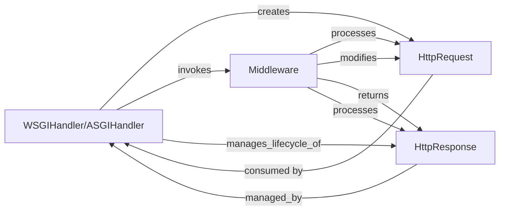

## Details

The Django request-response cycle is orchestrated by the `WSGIHandler/ASGIHandler`, which serves as the initial entry point for all web requests. Upon receiving a raw request, the handler creates an `HttpRequest` object, encapsulating all request details. This `HttpRequest` then traverses a chain of `Middleware` components, each of which can process and potentially modify the request before it reaches the view layer. After the view (or a middleware) generates an `HttpResponse`, this response object is then passed back through the `Middleware` chain in reverse order, allowing middleware components to further process or modify the response before the `WSGIHandler/ASGIHandler` ultimately sends it back to the client. This structured flow ensures consistent handling and extensibility for various cross-cutting concerns.

### WSGIHandler/ASGIHandler
These handlers serve as the primary entry points for synchronous (WSGI) and asynchronous (ASGI) web requests, respectively. They act as the "front controllers" of the Django application, adapting raw server requests into Django's internal `HttpRequest` format and orchestrating the overall request processing flow, including middleware application and view invocation.

**Related Classes/Methods**:

- <a href="https://github.com/django/django//blob/django/core/handlers/wsgi.py#L113-L144" target="_blank" rel="noopener noreferrer">`WSGIHandler`:113-144</a>
- <a href="https://github.com/django/django//blob/django/core/handlers/asgi.py#L139-L380" target="_blank" rel="noopener noreferrer">`ASGIHandler`:139-380</a>

### HttpRequest
This component encapsulates all data and metadata associated with an incoming HTTP request. It provides a standardized interface for accessing request headers, body content, GET/POST parameters, cookies, session data, and user information throughout the request lifecycle, making this information readily available to middleware and views.

**Related Classes/Methods**:

- <a href="https://github.com/django/django//blob/django/http/request.py#L53-L488" target="_blank" rel="noopener noreferrer">`HttpRequest`:53-488</a>

### HttpResponse
This component represents the HTTP response that Django constructs and sends back to the client. It allows setting the response content, HTTP status code, headers, and cookies. Views and middleware typically return or modify instances of `HttpResponse` to define the client's response.

**Related Classes/Methods**:

- <a href="https://github.com/django/django//blob/django/http/response.py#L366-L436" target="_blank" rel="noopener noreferrer">`HttpResponse`:366-436</a>

### Middleware
Middleware forms a configurable chain that intercepts and processes both incoming requests and outgoing responses. Each middleware can perform specific tasks such as session management, user authentication, message handling, or site-specific context injection, either before the request reaches the view or after the view has generated a response.

**Related Classes/Methods**:

- <a href="https://github.com/django/django//blob/django/contrib/sessions/middleware.py#L12-L77" target="_blank" rel="noopener noreferrer">`Middleware`:12-77</a>

### [FAQ](https://github.com/CodeBoarding/GeneratedOnBoardings/tree/main?tab=readme-ov-file#faq)