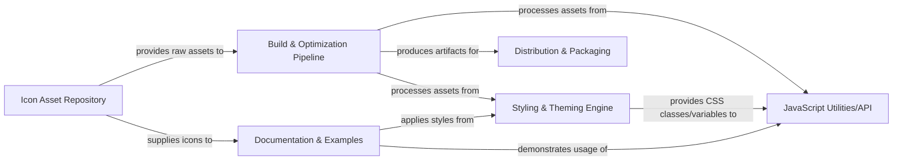

## Details

This project is a standalone front-end icon toolkit designed to provide a comprehensive solution for managing, building, and distributing icon assets. It encompasses the entire lifecycle from raw asset storage to final package distribution and documentation. The architecture is structured around a clear flow of assets, starting from source icons, through a build process, and culminating in consumable packages and user-facing documentation.

### Icon Asset Repository
Stores and manages the raw SVG source files and potentially font icon definitions. This is the foundational source for all icon assets.

**Related Classes/Methods**:

### Build & Optimization Pipeline
Processes raw icon assets (SVGs, font files) and associated styles/scripts. This includes tasks like SVG optimization, minification, sprite generation, web font generation, and transpilation/bundling of JavaScript. This component acts as the "request/response" mechanism for transforming source assets into distributable artifacts.

**Related Classes/Methods**:

### Styling & Theming Engine
Manages the CSS/SCSS stylesheets for icon presentation, sizing, coloring, and theming. It defines how icons are visually rendered and allows for customization.

**Related Classes/Methods**:

### JavaScript Utilities/API
Provides a programmatic interface for integrating and manipulating icons within web applications. This might include functions for dynamic icon loading, SVG injection, or component wrappers for various frameworks.

**Related Classes/Methods**:

### Documentation & Examples
A static site or application that showcases all available icons, provides usage instructions, code examples, and guidelines for integration. This is the primary user-facing "response" to a user's "request" for information about the toolkit.

**Related Classes/Methods**:

- <a href="https://github.com/django/django/blob/main/docs/" target="_blank" rel="noopener noreferrer">`FileRef: docs/`</a>

### Distribution & Packaging
Handles the final packaging of the compiled assets (icons, CSS, JS) into formats suitable for distribution, typically via NPM packages or CDN. This ensures the toolkit is easily consumable by other projects.

**Related Classes/Methods**:

- <a href="https://github.com/django/django/blob/main/package.json" target="_blank" rel="noopener noreferrer">`FileRef: package.json`</a>

### [FAQ](https://github.com/CodeBoarding/GeneratedOnBoardings/tree/main?tab=readme-ov-file#faq)