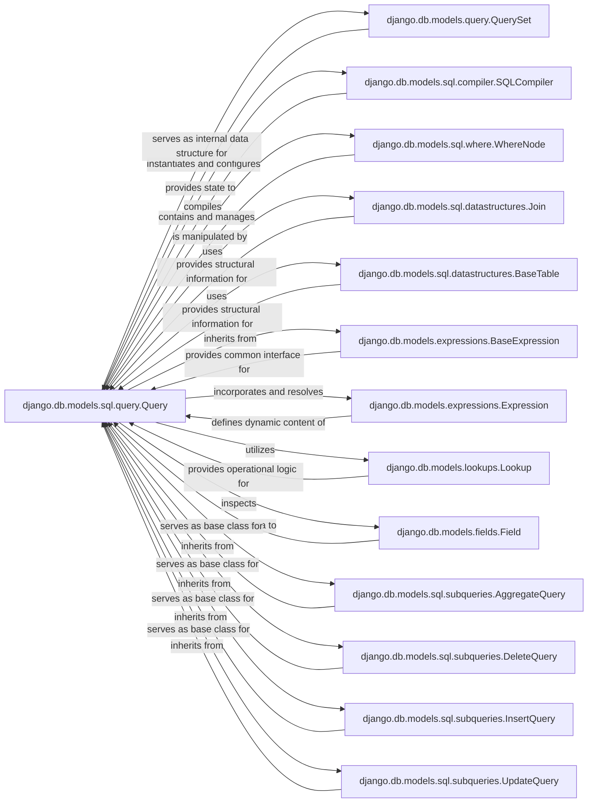

## Component Details

The SQL Query component, primarily embodied by django.db.models.sql.query.Query, serves as the core internal representation of a database query within Django's ORM. It acts as the central orchestrator for constructing SQL statements based on the operations defined by a QuerySet. Its fundamental role is to manage and assemble all the necessary clauses of an SQL query, including SELECT, WHERE, ORDER BY, GROUP BY, and JOIN conditions, before handing off this structured representation to a compiler for final SQL generation.

### django.db.models.sql.query.Query
An internal representation of a database query. It's responsible for constructing the SQL statements based on the operations requested by a QuerySet. It handles clauses like SELECT, WHERE, ORDER BY, GROUP BY, and JOIN.

**Related Classes/Methods**: _None_

### django.db.models.query.QuerySet
The primary public interface for building queries in Django. It provides methods like filter(), order_by(), annotate(), etc., which internally manipulate and configure an instance of Query.

**Related Classes/Methods**: _None_

### django.db.models.sql.compiler.SQLCompiler
Responsible for translating the Query object's abstract internal representation into the concrete SQL string and its corresponding parameters, ready for execution by the database backend.

**Related Classes/Methods**: _None_

### django.db.models.sql.where.WhereNode
Manages the complex logic of the WHERE clause within an SQL query. It handles the combination of conditions using AND/OR connectors and negation.

**Related Classes/Methods**: _None_

### django.db.models.sql.datastructures.Join
These classes represent and manage the various aspects of SQL JOIN clauses and table aliases within a query. Join specifically defines the relationship and type of join.

**Related Classes/Methods**: _None_

### django.db.models.sql.datastructures.BaseTable
Handles the initial table reference within a query.

**Related Classes/Methods**: _None_

### django.db.models.expressions.BaseExpression
The foundational abstract base class for all expression objects within Django's ORM. Query itself inherits from this class, allowing it to be treated as an expression in more complex query contexts (e.g., subqueries).

**Related Classes/Methods**: _None_

### django.db.models.expressions.Expression
Represents various parts of an SQL statement that can be evaluated by the database, such as references to columns (Col), literal values (Value), or more complex programmatic constructs like F objects (for database-side operations) and Q objects (for complex WHERE clauses).

**Related Classes/Methods**: _None_

### django.db.models.lookups.Lookup
Defines how comparisons and operations are performed within the WHERE clause (e.g., exact, gt, contains, isnull). These are the building blocks for filter conditions.

**Related Classes/Methods**: _None_

### django.db.models.fields.Field
Represents a column in a database table, as defined in a Django model (e.g., CharField, IntegerField, ForeignKey). It holds metadata about the column.

**Related Classes/Methods**: _None_

### django.db.models.sql.subqueries.AggregateQuery
Specialized subclass of Query that extends its base functionality to handle aggregate functions.

**Related Classes/Methods**: _None_

### django.db.models.sql.subqueries.DeleteQuery
Specialized subclass of Query that extends its base functionality to handle data deletion.

**Related Classes/Methods**: _None_

### django.db.models.sql.subqueries.InsertQuery
Specialized subclass of Query that extends its base functionality to handle data insertion.

**Related Classes/Methods**: _None_

### django.db.models.sql.subqueries.UpdateQuery
Specialized subclass of Query that extends its base functionality to handle data updates.

**Related Classes/Methods**: _None_

### [FAQ](https://github.com/CodeBoarding/GeneratedOnBoardings/tree/main?tab=readme-ov-file#faq)