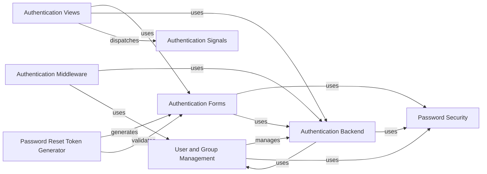

## Component Details

This graph illustrates the architecture of the Security & User Management subsystem, detailing how user authentication, authorization, password handling, and permission management are structured and interact. It covers core components like user and group management, authentication backends, password security, and the integration points through forms, views, middleware, and signals, ensuring secure access and user lifecycle management within the application.

### User and Group Management
Manages the creation, retrieval, and modification of user and group objects, including their associated permissions.

**Related Classes/Methods**:

- <a href="https://github.com/django/django/blob/master/django/contrib/auth/models.py#L516-L525" target="_blank" rel="noopener noreferrer">`django.contrib.auth.models.User` (516:525)</a>
- <a href="https://github.com/django/django/blob/master/django/contrib/auth/models.py#L101-L136" target="_blank" rel="noopener noreferrer">`django.contrib.auth.models.Group` (101:136)</a>
- <a href="https://github.com/django/django/blob/master/django/contrib/auth/models.py#L38-L84" target="_blank" rel="noopener noreferrer">`django.contrib.auth.models.Permission` (38:84)</a>

### Authentication Backend
Provides a pluggable system for authenticating users against various sources, such as databases or external systems.

**Related Classes/Methods**:

- <a href="https://github.com/django/django/blob/master/django/contrib/auth/backends.py#L9-L50" target="_blank" rel="noopener noreferrer">`django.contrib.auth.backends.BaseBackend` (9:50)</a>
- <a href="https://github.com/django/django/blob/master/django/contrib/auth/backends.py#L53-L241" target="_blank" rel="noopener noreferrer">`django.contrib.auth.backends.ModelBackend` (53:241)</a>

### Password Security
Handles password hashing, verification, and validation to ensure secure storage and usage of user passwords.

**Related Classes/Methods**:

- <a href="https://github.com/django/django/blob/master/django/contrib/auth/hashers.py#L93-L112" target="_blank" rel="noopener noreferrer">`django.contrib.auth.hashers.make_password` (93:112)</a>
- <a href="https://github.com/django/django/blob/master/django/contrib/auth/hashers.py#L71-L82" target="_blank" rel="noopener noreferrer">`django.contrib.auth.hashers.check_password` (71:82)</a>
- <a href="https://github.com/django/django/blob/master/django/contrib/auth/password_validation.py#L40-L56" target="_blank" rel="noopener noreferrer">`django.contrib.auth.password_validation.validate_password` (40:56)</a>

### Authentication Forms
Provides forms for user authentication, registration, and password management, including validation and error handling.

**Related Classes/Methods**:

- <a href="https://github.com/django/django/blob/master/django/contrib/auth/forms.py#L301-L380" target="_blank" rel="noopener noreferrer">`django.contrib.auth.forms.AuthenticationForm` (301:380)</a>
- <a href="https://github.com/django/django/blob/master/django/contrib/auth/forms.py#L250-L268" target="_blank" rel="noopener noreferrer">`django.contrib.auth.forms.UserCreationForm` (250:268)</a>
- <a href="https://github.com/django/django/blob/master/django/contrib/auth/forms.py#L510-L543" target="_blank" rel="noopener noreferrer">`django.contrib.auth.forms.PasswordChangeForm` (510:543)</a>
- <a href="https://github.com/django/django/blob/master/django/contrib/auth/forms.py#L383-L484" target="_blank" rel="noopener noreferrer">`django.contrib.auth.forms.PasswordResetForm` (383:484)</a>

### Authentication Views
Implements views for handling user login, logout, password changes, and password resets, integrating with forms and authentication backends.

**Related Classes/Methods**:

- <a href="https://github.com/django/django/blob/master/django/contrib/auth/views.py#L65-L121" target="_blank" rel="noopener noreferrer">`django.contrib.auth.views.LoginView` (65:121)</a>
- <a href="https://github.com/django/django/blob/master/django/contrib/auth/views.py#L124-L168" target="_blank" rel="noopener noreferrer">`django.contrib.auth.views.LogoutView` (124:168)</a>
- <a href="https://github.com/django/django/blob/master/django/contrib/auth/views.py#L353-L375" target="_blank" rel="noopener noreferrer">`django.contrib.auth.views.PasswordChangeView` (353:375)</a>
- <a href="https://github.com/django/django/blob/master/django/contrib/auth/views.py#L214-L242" target="_blank" rel="noopener noreferrer">`django.contrib.auth.views.PasswordResetView` (214:242)</a>

### Authentication Middleware
Integrates the authentication system into Django's request-response cycle, making user information available in requests.

**Related Classes/Methods**:

- <a href="https://github.com/django/django/blob/master/django/contrib/auth/middleware.py#L29-L40" target="_blank" rel="noopener noreferrer">`django.contrib.auth.middleware.AuthenticationMiddleware` (29:40)</a>

### Authentication Signals
Provides signals that are dispatched during various authentication events, allowing other components to react to user logins, logouts, and failed login attempts.

**Related Classes/Methods**:

- `django.contrib.auth.signals.user_logged_in` (full file reference)
- `django.contrib.auth.signals.user_logged_out` (full file reference)
- `django.contrib.auth.signals.user_login_failed` (full file reference)

### Password Reset Token Generator
Generates and validates one-time tokens used for password reset functionality.

**Related Classes/Methods**:

- <a href="https://github.com/django/django/blob/master/django/contrib/auth/tokens.py#L7-L128" target="_blank" rel="noopener noreferrer">`django.contrib.auth.tokens.PasswordResetTokenGenerator` (7:128)</a>

### [FAQ](https://github.com/CodeBoarding/GeneratedOnBoardings/tree/main?tab=readme-ov-file#faq)