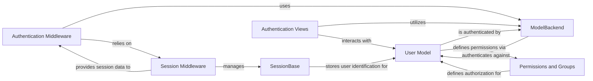

## Details

The Security & User Management subsystem in Django is a critical part of the framework, providing robust mechanisms for user authentication, authorization, and session management. It adheres to the Web Application Framework patterns by separating concerns into distinct, interacting components, primarily residing within django.contrib.auth and django.contrib.sessions.

### User Model
The core model representing a user in the application. It stores essential user information and provides methods for password management, permission checking, and user-related queries.

**Related Classes/Methods**:

- <a href="https://github.com/django/django//blob/django/contrib/auth/models.py#L517-L526" target="_blank" rel="noopener noreferrer">`django.contrib.auth.models.User`:517-526</a>

### ModelBackend
A pluggable authentication backend responsible for authenticating users against the User Model. It verifies provided credentials and returns the authenticated User object if successful.

**Related Classes/Methods**:

- <a href="https://github.com/django/django//blob/django/contrib/auth/backends.py#L54-L242" target="_blank" rel="noopener noreferrer">`django.contrib.auth.backends.ModelBackend`:54-242</a>

### SessionBase
An abstract base class defining the interface for Django's session management system, outlining how session data is stored, retrieved, and expired.

**Related Classes/Methods**:

- <a href="https://github.com/django/django//blob/django/contrib/sessions/base_session.py" target="_blank" rel="noopener noreferrer">`django.contrib.sessions.base_session.SessionBase`</a>

### Authentication Views
User-facing components that handle authentication processes such as login, logout, password change, and password reset. They render forms, process user input, and interact with authentication backends.

**Related Classes/Methods**:

- <a href="https://github.com/django/django//blob/django/contrib/auth/views.py" target="_blank" rel="noopener noreferrer">`django.contrib.auth.views`</a>

### Authentication Middleware
Processes incoming requests to associate a user with the request object, ensuring authenticated users remain logged in across requests by checking session data.

**Related Classes/Methods**:

- <a href="https://github.com/django/django//blob/django/contrib/auth/middleware.py#L30-L41" target="_blank" rel="noopener noreferrer">`django.contrib.auth.middleware.AuthenticationMiddleware`:30-41</a>

### Session Middleware
Enables session support in Django, managing the reading and writing of session data to the chosen session backend and making it available via request.session.

**Related Classes/Methods**:

- <a href="https://github.com/django/django//blob/django/contrib/sessions/middleware.py#L12-L77" target="_blank" rel="noopener noreferrer">`django.contrib.sessions.middleware.SessionMiddleware`:12-77</a>

### Permissions and Groups
Models that define the authorization system, representing specific actions (Permission) and collections of permissions for users (Group).

**Related Classes/Methods**:

- <a href="https://github.com/django/django//blob/django/contrib/auth/models.py#L39-L85" target="_blank" rel="noopener noreferrer">`django.contrib.auth.models.Permission`:39-85</a>
- <a href="https://github.com/django/django//blob/django/contrib/auth/models.py#L102-L137" target="_blank" rel="noopener noreferrer">`django.contrib.auth.models.Group`:102-137</a>

### [FAQ](https://github.com/CodeBoarding/GeneratedOnBoardings/tree/main?tab=readme-ov-file#faq)