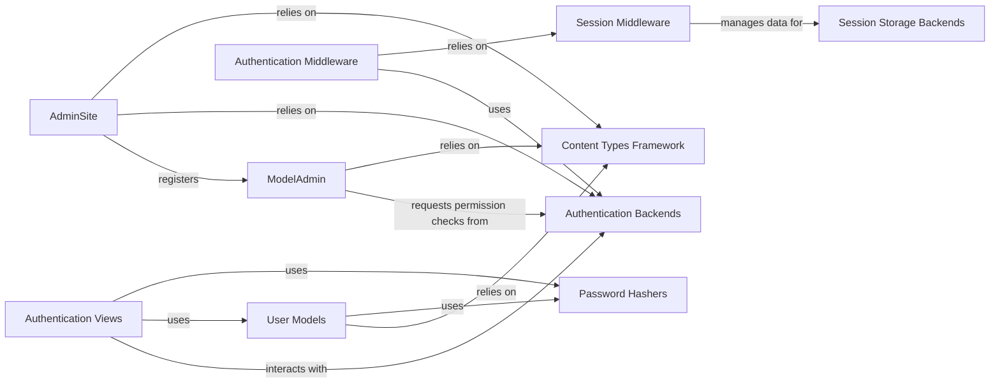

## Component Details

This component is the backbone for managing user identities, access control, and administrative functions within a Django application. It ensures that only authenticated and authorized users can access specific resources and provides a powerful interface for data management.

### User Models
Defines the fundamental structure for user accounts and their associated permissions. It provides abstract base classes that allow for custom user models while inheriting Django's built-in authentication features.

**Related Classes/Methods**:

- <a href="https://github.com/django/django/blob/master/django/contrib/auth/models.py#L1-L1" target="_blank" rel="noopener noreferrer">`django.contrib.auth.models` (1:1)</a>

### Authentication Backends
Responsible for verifying user credentials (e.g., username and password) against a data source and retrieving user objects and their permissions. It acts as the pluggable interface for different authentication mechanisms.

**Related Classes/Methods**:

- <a href="https://github.com/django/django/blob/master/django/contrib/auth/backends.py#L1-L1" target="_blank" rel="noopener noreferrer">`django.contrib.auth.backends` (1:1)</a>

### Password Hashers
Provides secure, one-way hashing algorithms for storing user passwords. This prevents plaintext password storage, significantly enhancing security by protecting against data breaches.

**Related Classes/Methods**:

- <a href="https://github.com/django/django/blob/master/django/contrib/auth/hashers.py#L1-L1" target="_blank" rel="noopener noreferrer">`django.contrib.auth.hashers` (1:1)</a>

### Authentication Middleware
Processes incoming requests to associate an authenticated user object with the request. It handles the session-based user loading and ensures that `request.user` is available in views.

**Related Classes/Methods**:

- <a href="https://github.com/django/django/blob/master/django/contrib/auth/middleware.py#L1-L1" target="_blank" rel="noopener noreferrer">`django.contrib.auth.middleware` (1:1)</a>

### Authentication Views
Implements the user-facing logic for common authentication actions such as login, logout, password change, and password reset. These views handle form processing, interaction with authentication backends, and rendering of templates.

**Related Classes/Methods**:

- <a href="https://github.com/django/django/blob/master/django/contrib/auth/views.py#L1-L1" target="_blank" rel="noopener noreferrer">`django.contrib.auth.views` (1:1)</a>

### Session Middleware
Enables session management across requests. It loads and saves session data, allowing the application to maintain state for individual users (e.g., storing the authenticated user's ID).

**Related Classes/Methods**:

- <a href="https://github.com/django/django/blob/master/django/contrib/sessions/middleware.py#L1-L1" target="_blank" rel="noopener noreferrer">`django.contrib.sessions.middleware` (1:1)</a>

### Session Storage Backends
Defines how session data is physically stored and retrieved. Django provides various backends (e.g., database, cache, file, signed cookies) to suit different deployment needs.

**Related Classes/Methods**:

- <a href="https://github.com/django/django/blob/master/django/contrib/sessions/backends/base.py#L1-L1" target="_blank" rel="noopener noreferrer">`django.contrib.sessions.backends.base` (1:1)</a>
- <a href="https://github.com/django/django/blob/master/django/contrib/sessions/backends/db.py#L1-L1" target="_blank" rel="noopener noreferrer">`django.contrib.sessions.backends.db` (1:1)</a>
- <a href="https://github.com/django/django/blob/master/django/contrib/sessions/backends/cache.py#L1-L1" target="_blank" rel="noopener noreferrer">`django.contrib.sessions.backends.cache` (1:1)</a>

### AdminSite
The central hub for Django's automatically generated administrative interface. It registers models with their `ModelAdmin` configurations and handles the overall routing and context for the admin site.

**Related Classes/Methods**:

- <a href="https://github.com/django/django/blob/master/django/contrib/admin/sites.py#L1-L1" target="_blank" rel="noopener noreferrer">`django.contrib.admin.sites` (1:1)</a>

### ModelAdmin
Configures how a specific Django model is displayed, edited, and managed within the Django Admin interface. It integrates with the permission system to control access to model operations.

**Related Classes/Methods**:

- <a href="https://github.com/django/django/blob/master/django/contrib/admin/options.py#L1-L1" target="_blank" rel="noopener noreferrer">`django.contrib.admin.options` (1:1)</a>

### Content Types Framework
Provides a generic interface for working with installed models, allowing for "generic" relationships to any model. It is crucial for Django's permission system, which links permissions to specific content types (models).

**Related Classes/Methods**:

- <a href="https://github.com/django/django/blob/master/django/contrib/contenttypes/models.py#L1-L1" target="_blank" rel="noopener noreferrer">`django.contrib.contenttypes.models` (1:1)</a>

### [FAQ](https://github.com/CodeBoarding/GeneratedOnBoardings/tree/main?tab=readme-ov-file#faq)