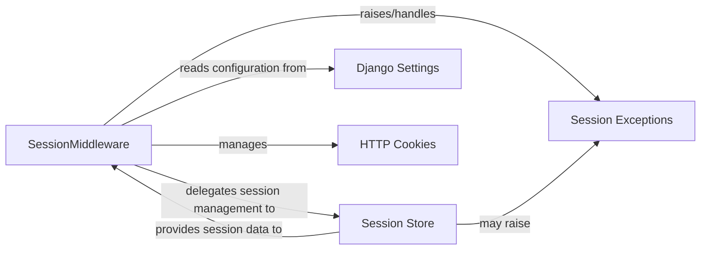

## Component Details

This analysis focuses on the `Session Middleware` subsystem, detailing its core components, their responsibilities, and their interactions within the Django request-response cycle. These components are fundamental because they collectively enable the stateful management of user sessions, which is crucial for features like user authentication, shopping carts, and personalized user experiences.

### SessionMiddleware
The central middleware class that intercepts incoming HTTP requests and outgoing responses. Its primary responsibility is to load existing session data from the configured session store at the beginning of a request and save any modified session data back to the store at the end. It attaches the session data as a dictionary-like object to `request.session`.

**Related Classes/Methods**:

- <a href="https://github.com/django/django/blob/master/django/contrib/sessions/middleware.py#L11-L76" target="_blank" rel="noopener noreferrer">`django.contrib.sessions.middleware.SessionMiddleware` (11:76)</a>

### Session Store
An abstract interface (`SessionBase`) and its concrete implementations (e.g., database, file, cache, signed cookies) responsible for the actual persistence, retrieval, and deletion of session data. `SessionMiddleware` relies on a specific `SessionStore` implementation to manage the session's lifecycle.

**Related Classes/Methods**:

- <a href="https://github.com/django/django/blob/master/django/contrib/sessions/backends/base.py#L34-L522" target="_blank" rel="noopener noreferrer">`django.contrib.sessions.backends.base.SessionBase` (34:522)</a>
- <a href="https://github.com/django/django/blob/master/django/contrib/sessions/backends/db.py#L0-L0" target="_blank" rel="noopener noreferrer">`django.contrib.sessions.backends.db` (0:0)</a>
- <a href="https://github.com/django/django/blob/master/django/contrib/sessions/backends/file.py#L0-L0" target="_blank" rel="noopener noreferrer">`django.contrib.sessions.backends.file` (0:0)</a>

### Django Settings
The configuration system that dictates the behavior of the `SessionMiddleware` and the choice of `Session Store`. Key settings include `SESSION_ENGINE` (which determines the `SessionStore` implementation), `SESSION_COOKIE_NAME`, `SESSION_COOKIE_AGE`, `SESSION_SAVE_EVERY_REQUEST`, and others that control cookie attributes and session expiration.

**Related Classes/Methods**:

- <a href="https://github.com/django/django/blob/master/django/template/backends/django.py#L0-L0" target="_blank" rel="noopener noreferrer">`django.conf.settings` (0:0)</a>

### HTTP Cookies
The mechanism used to transmit the session key between the client (browser) and the server. The `SessionMiddleware` reads the session key from the incoming request's cookies and sets/deletes the session cookie in the outgoing response.

**Related Classes/Methods**: _None_

### Session Exceptions
Custom exception classes (e.g., `InvalidSessionKey`, `SessionInterrupted`, `SuspiciousSession`) used to signal specific errors during session operations. `SessionMiddleware` specifically handles `UpdateError` (which can lead to `SessionInterrupted`) to manage concurrent session modifications.

**Related Classes/Methods**:

- <a href="https://github.com/django/django/blob/master/django/contrib/sessions/exceptions.py#L0-L0" target="_blank" rel="noopener noreferrer">`django.contrib.sessions.exceptions` (0:0)</a>

### [FAQ](https://github.com/CodeBoarding/GeneratedOnBoardings/tree/main?tab=readme-ov-file#faq)