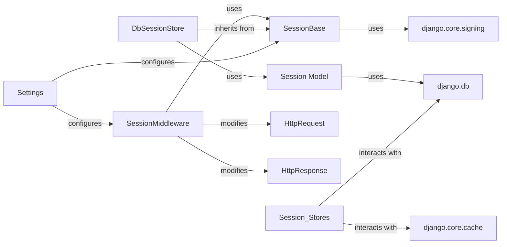

## Component Details

The `Session Stores` subsystem in Django is fundamental for managing user sessions, providing a flexible and extensible mechanism for storing and retrieving session data across different backends. The chosen components are central to this functionality, covering the abstract interface, concrete implementations, interaction with the request/response cycle, configuration, and underlying data storage mechanisms.

### SessionBase
The abstract base class that defines the common API and core functionalities for all Django session storage backends. It provides methods for session key generation, data encoding/decoding (using `django.core.signing`), and managing session expiry. All concrete session store implementations inherit from this class, ensuring a consistent interface for session management.

**Related Classes/Methods**:

- `SessionBase` (1:1)

### DbSessionStore
A concrete implementation of `SessionBase` responsible for storing session data persistently in the application's configured database. It translates the abstract session operations into database interactions, performing CRUD (Create, Read, Update, Delete) operations on `Session Model` instances.

**Related Classes/Methods**:

- `DbSessionStore` (1:1)

### Session Model
The Django ORM model specifically designed to represent and store session data in the database when `DbSessionStore` or `CachedDbSessionStore` is utilized. It defines the database table structure (e.g., `session_key`, `session_data`, `expire_date`) for session records.

**Related Classes/Methods**:

- <a href="https://github.com/django/django/blob/master/django/contrib/sessions/models.py#L7-L34" target="_blank" rel="noopener noreferrer">`django.contrib.sessions.models.Session` (7:34)</a>

### SessionMiddleware
A crucial Django middleware that orchestrates the session lifecycle during each request-response cycle. It's responsible for loading the appropriate session store backend based on `Settings`, retrieving session data from the store, attaching it to the `HttpRequest` object, and saving/updating modified session data back to the store before the `HttpResponse` is sent. It also handles setting and deleting session cookies.

**Related Classes/Methods**:

- `SessionMiddleware` (1:1)

### HttpRequest
Represents an incoming HTTP request from a client. The `SessionMiddleware` attaches the session object (managed by the `Session Stores` component) to this object, making session data easily accessible to Django views and other middleware for application logic.

**Related Classes/Methods**:

- <a href="https://github.com/django/django/blob/master/django/template/backends/django.py#L1-L1" target="_blank" rel="noopener noreferrer">`django.http.HttpRequest` (1:1)</a>

### HttpResponse
Represents an outgoing HTTP response sent back to the client. The `SessionMiddleware` modifies this object to set or delete session cookies, which are essential for maintaining session state across multiple requests from the same user.

**Related Classes/Methods**:

- <a href="https://github.com/django/django/blob/master/django/template/backends/django.py#L1-L1" target="_blank" rel="noopener noreferrer">`django.http.HttpResponse` (1:1)</a>

### Settings
Django's global configuration system. It plays a critical role in the `Session Stores` component by dictating which specific session store implementation (`SESSION_ENGINE`) Django should use (e.g., `django.contrib.sessions.backends.db`). It also provides other session-related configurations like `SESSION_COOKIE_AGE`.

**Related Classes/Methods**:

- <a href="https://github.com/django/django/blob/master/django/template/backends/django.py#L1-L1" target="_blank" rel="noopener noreferrer">`django.conf.settings` (1:1)</a>

### django.core.signing
Django's cryptographic signing utilities. This component is used by `SessionBase` to securely encode and decode session data, ensuring its integrity and preventing tampering, especially crucial for session backends that store data client-side (like `SignedCookieSessionStore`) or when session data needs to be protected.

**Related Classes/Methods**:

- <a href="https://github.com/django/django/blob/master/django/core/signing.py#L1-L1" target="_blank" rel="noopener noreferrer">`django.core.signing` (1:1)</a>

### django.db
Django's database abstraction layer. This fundamental component is utilized by `DbSessionStore` and the `Session Model` for all interactions with the underlying database, including executing queries, managing transactions, and handling database connections for session data persistence.

**Related Classes/Methods**:

- <a href="https://github.com/django/django/blob/master/django/template/backends/django.py#L1-L1" target="_blank" rel="noopener noreferrer">`django.db` (1:1)</a>

### django.core.cache
Django's caching framework. While `DbSessionStore` is database-centric, other session store implementations like `CacheSessionStore` and `CachedDbSessionStore` heavily rely on this component for storing session data in various cache backends (e.g., Memcached, Redis), offering performance benefits by reducing database load.

**Related Classes/Methods**:

- <a href="https://github.com/django/django/blob/master/django/template/backends/django.py#L1-L1" target="_blank" rel="noopener noreferrer">`django.core.cache` (1:1)</a>

### [FAQ](https://github.com/CodeBoarding/GeneratedOnBoardings/tree/main?tab=readme-ov-file#faq)