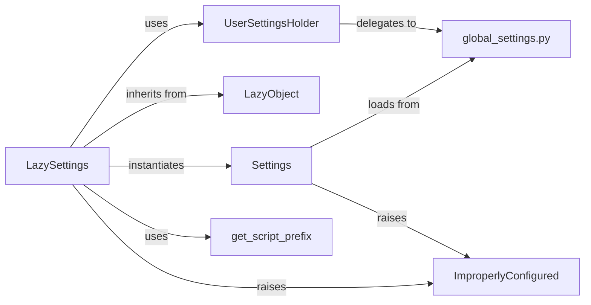

## Component Details

This subsystem is responsible for managing Django's configuration settings, providing a flexible and efficient way to load, access, and override project-specific and default settings. The core idea revolves around lazy loading, ensuring that settings are only initialized when they are first accessed.

### LazySettings
This class acts as the primary interface for accessing Django's settings. It's a proxy object that delays the actual loading of settings until an attribute (a setting) is first accessed. This lazy loading mechanism is crucial for Django's startup process, preventing circular dependencies and allowing for flexible configuration. It determines the settings module from the `DJANGO_SETTINGS_MODULE` environment variable and instantiates the `Settings` object. It also handles special processing for `MEDIA_URL` and `STATIC_URL` and allows for programmatic configuration via its `configure()` method.

**Related Classes/Methods**:

- <a href="https://github.com/django/django/blob/master/django/template/backends/django.py#L1-L1" target="_blank" rel="noopener noreferrer">`django.conf.LazySettings` (1:1)</a>
- <a href="https://github.com/django/django/blob/master/django/template/backends/django.py#L1-L1" target="_blank" rel="noopener noreferrer">`django.conf.Settings` (1:1)</a>
- `django.conf.LazySettings.configure` (1:1)

### Settings
This concrete class holds the actual Django settings. Once `LazySettings` is triggered (e.g., by accessing a setting), it instantiates `Settings`. This class is responsible for loading default settings from `global_settings.py` and then overriding them with values from the user-defined settings module (specified by `DJANGO_SETTINGS_MODULE`). It performs validation for certain settings (e.g., ensuring `INSTALLED_APPS` is a list or tuple) and raises `ImproperlyConfigured` for invalid configurations.

**Related Classes/Methods**:

- <a href="https://github.com/django/django/blob/master/django/template/backends/django.py#L1-L1" target="_blank" rel="noopener noreferrer">`django.conf.Settings` (1:1)</a>
- <a href="https://github.com/django/django/blob/master/django/conf/global_settings.py#L1-L1" target="_blank" rel="noopener noreferrer">`django.conf.global_settings` (1:1)</a>
- <a href="https://github.com/django/django/blob/master/django/core/exceptions.py#L1-L1" target="_blank" rel="noopener noreferrer">`django.core.exceptions.ImproperlyConfigured` (1:1)</a>

### LazyObject
A foundational utility class that provides the mechanism for delayed object initialization. `LazySettings` inherits from this class to achieve its lazy loading behavior. It intercepts attribute access and method calls, triggering the `_setup()` method (implemented by subclasses like `LazySettings`) to initialize the wrapped object only when necessary.

**Related Classes/Methods**:

- <a href="https://github.com/django/django/blob/master/django/utils/functional.py#L258-L371" target="_blank" rel="noopener noreferrer">`django.utils.functional.LazyObject` (258:371)</a>
- <a href="https://github.com/django/django/blob/master/django/utils/functional.py#L304-L310" target="_blank" rel="noopener noreferrer">`django.utils.functional.LazyObject._setup` (304:310)</a>

### UserSettingsHolder
A temporary container for user-defined settings. It's primarily used when `LazySettings` is configured programmatically via its `configure()` method, for instance, during testing or in specific deployment scenarios where settings are not loaded from a module. It allows for overriding or setting specific values before the full settings are loaded, and delegates to a default settings object (typically `global_settings`) for unset values.

**Related Classes/Methods**:

- <a href="https://github.com/django/django/blob/master/django/template/backends/django.py#L1-L1" target="_blank" rel="noopener noreferrer">`django.conf.UserSettingsHolder` (1:1)</a>
- `django.conf.LazySettings.configure` (1:1)
- <a href="https://github.com/django/django/blob/master/django/conf/global_settings.py#L1-L1" target="_blank" rel="noopener noreferrer">`django.conf.global_settings` (1:1)</a>

### ImproperlyConfigured
A specific exception raised by Django when the project's settings are invalid or incomplete. This exception signals a critical configuration issue that prevents the application from starting or functioning correctly. It's part of Django's core exception handling and is raised by both `LazySettings` (e.g., if `DJANGO_SETTINGS_MODULE` is missing) and `Settings` (e.g., for type validation errors).

**Related Classes/Methods**:

- <a href="https://github.com/django/django/blob/master/django/core/exceptions.py#L1-L1" target="_blank" rel="noopener noreferrer">`django.core.exceptions.ImproperlyConfigured` (1:1)</a>

### global_settings.py
This module contains all of Django's default settings. It serves as the baseline for any Django project's configuration. The `Settings` class loads these default values, and `UserSettingsHolder` can also use it as a fallback for unspecified settings. User-defined settings modules typically import from or override values defined in `global_settings.py`.

**Related Classes/Methods**:

- <a href="https://github.com/django/django/blob/master/django/conf/global_settings.py#L1-L1" target="_blank" rel="noopener noreferrer">`django.conf.global_settings` (1:1)</a>

### get_script_prefix
A utility function that determines the base URL path for the current script. `LazySettings` uses this function to dynamically prepend the script prefix to `MEDIA_URL` and `STATIC_URL` if they are relative paths, ensuring correct URL resolution in various deployment environments (e.g., when Django is served under a subpath).

**Related Classes/Methods**:

- <a href="https://github.com/django/django/blob/master/django/urls/base.py#L128-L134" target="_blank" rel="noopener noreferrer">`django.urls.base.get_script_prefix` (128:134)</a>

### [FAQ](https://github.com/CodeBoarding/GeneratedOnBoardings/tree/main?tab=readme-ov-file#faq)