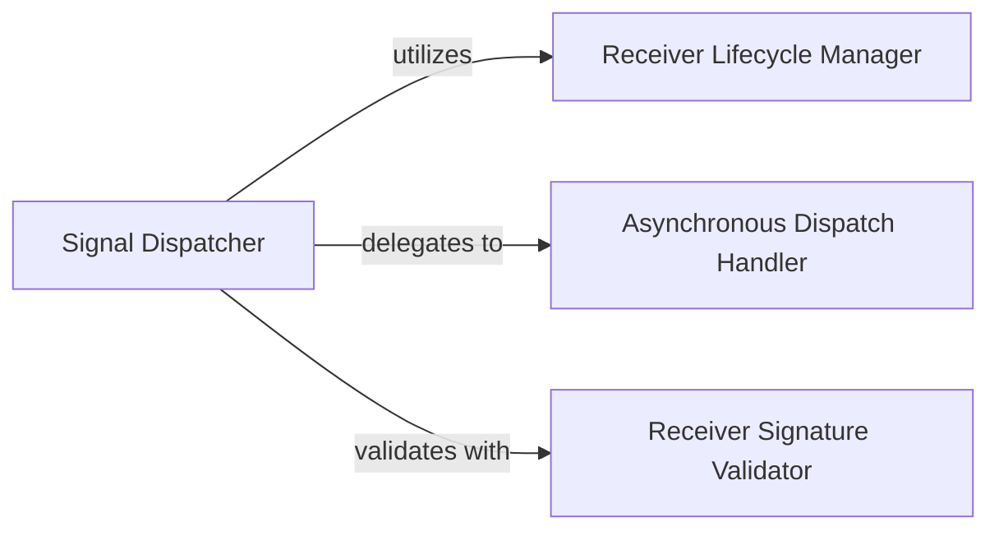

## Component Details

The `Signals (Event Dispatcher) System` in Django is built around a publish-subscribe pattern, enabling decoupled communication between different parts of an application. Its core functionality is encapsulated within the `django.dispatch.dispatcher` module, with key support from `django.utils.inspect`.

### Signal Dispatcher
This is the central orchestrator of the Django signals system, embodied by the `django.dispatch.dispatcher.Signal` class. It defines the interface for creating, connecting, and dispatching signals. Its primary responsibilities include maintaining a registry of connected receivers, ensuring thread-safe operations through internal locking, and efficiently dispatching events to both synchronous and asynchronous listeners. It also manages a cache of receivers per sender to optimize dispatch performance.

**Related Classes/Methods**:

- <a href="https://github.com/django/django/blob/master/django/dispatch/dispatcher.py#L24-L487" target="_blank" rel="noopener noreferrer">`django.dispatch.dispatcher.Signal` (24:487)</a>
- `Signal.connect` (0:0)
- `Signal.disconnect` (0:0)
- `Signal.send` (0:0)
- `Signal.asend` (0:0)
- `Signal.send_robust` (0:0)
- `Signal.asend_robust` (0:0)
- `Signal.receivers` (0:0)
- `Signal.lock` (0:0)
- `Signal.sender_receivers_cache` (0:0)

### Receiver Lifecycle Manager
This component is responsible for the internal management and lifecycle of connected receivers and senders. It generates unique, stable identifiers for these objects (`_make_id`), handles the use of weak references to prevent memory leaks (by allowing garbage collection of receivers/senders that are no longer referenced elsewhere), and actively cleans up "dead" weak references from the internal list of receivers (`_clear_dead_receivers`, `_flag_dead_receivers`). It also filters for live receivers before dispatch (`_live_receivers`).

**Related Classes/Methods**:

- <a href="https://github.com/django/django/blob/master/django/dispatch/dispatcher.py#L12-L15" target="_blank" rel="noopener noreferrer">`django.dispatch.dispatcher._make_id` (12:15)</a>
- <a href="https://github.com/django/django/blob/master/django/dispatch/dispatcher.py#L418-L429" target="_blank" rel="noopener noreferrer">`django.dispatch.dispatcher.Signal._clear_dead_receivers` (418:429)</a>
- <a href="https://github.com/django/django/blob/master/django/dispatch/dispatcher.py#L480-L487" target="_blank" rel="noopener noreferrer">`django.dispatch.dispatcher.Signal._flag_dead_receivers` (480:487)</a>
- <a href="https://github.com/django/django/blob/master/django/dispatch/dispatcher.py#L431-L478" target="_blank" rel="noopener noreferrer">`django.dispatch.dispatcher.Signal._live_receivers` (431:478)</a>

### Asynchronous Dispatch Handler
This component manages the complexities of integrating synchronous and asynchronous receivers within the signal dispatch process. It intelligently groups and executes synchronous receivers, wrapping them for asynchronous compatibility when necessary (`sync_to_async`), and concurrently executes asynchronous receivers using `asyncio.gather`. This ensures that signals can be effectively dispatched in both synchronous and asynchronous contexts without blocking the event loop.

**Related Classes/Methods**:

- <a href="https://github.com/django/django/blob/master/django/dispatch/dispatcher.py#L171-L215" target="_blank" rel="noopener noreferrer">`django.dispatch.dispatcher.Signal.send` (171:215)</a>
- <a href="https://github.com/django/django/blob/master/django/dispatch/dispatcher.py#L217-L273" target="_blank" rel="noopener noreferrer">`django.dispatch.dispatcher.Signal.asend` (217:273)</a>
- <a href="https://github.com/django/django/blob/master/django/dispatch/dispatcher.py#L283-L344" target="_blank" rel="noopener noreferrer">`django.dispatch.dispatcher.Signal.send_robust` (283:344)</a>
- <a href="https://github.com/django/django/blob/master/django/dispatch/dispatcher.py#L346-L416" target="_blank" rel="noopener noreferrer">`django.dispatch.dispatcher.Signal.asend_robust` (346:416)</a>
- <a href="https://github.com/django/django/blob/master/django/utils/asyncio.py#L0-L0" target="_blank" rel="noopener noreferrer">`asyncio.gather` (0:0)</a>
- `async_to_sync` (0:0)
- `sync_to_async` (0:0)

### Receiver Signature Validator
This utility component is responsible for validating the signature of receiver functions during the connection process. Specifically, it checks if a receiver function is capable of accepting arbitrary keyword arguments (`**kwargs`), which is a requirement for Django signal receivers. This validation prevents runtime `TypeError` exceptions that would occur if a signal attempted to pass keyword arguments to a receiver that doesn't support them.

**Related Classes/Methods**:

- <a href="https://github.com/django/django/blob/master/django/utils/inspect.py#L56-L58" target="_blank" rel="noopener noreferrer">`django.utils.inspect.func_accepts_kwargs` (56:58)</a>

### [FAQ](https://github.com/CodeBoarding/GeneratedOnBoardings/tree/main?tab=readme-ov-file#faq)