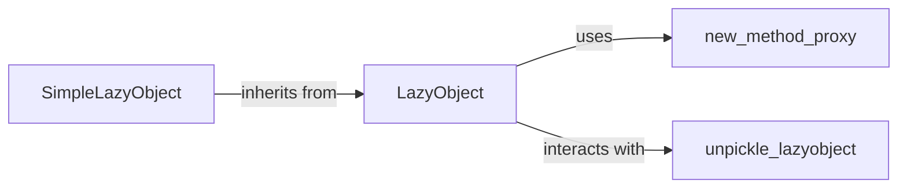

## Component Details

The `SimpleLazyObject` component in Django provides a flexible and straightforward mechanism for creating "lazy" objects. It defers the instantiation of an object until it is first accessed, which can significantly improve performance and reduce resource consumption, especially in scenarios where an object might not always be needed.

### LazyObject
This is an abstract base class (`django.utils.functional.LazyObject`) that defines the core mechanism for lazy object instantiation in Django. It acts as a proxy, intercepting attribute access and method calls, and ensuring that the actual wrapped object is initialized via its `_setup()` method only when needed. It handles common operations like pickling, copying, and basic introspection by delegating them to the wrapped object.

**Related Classes/Methods**:

- <a href="https://github.com/django/django/blob/master/django/utils/functional.py#L258-L371" target="_blank" rel="noopener noreferrer">`django.utils.functional.LazyObject` (258:371)</a>

### SimpleLazyObject
A concrete subclass of `LazyObject` (`django.utils.functional.SimpleLazyObject`). It provides a simple way to create lazy objects from any callable. Its `_setup()` method directly calls the provided function to obtain the wrapped object. This makes it highly versatile for deferring the creation of various types of objects.

**Related Classes/Methods**:

- <a href="https://github.com/django/django/blob/master/django/utils/functional.py#L382-L436" target="_blank" rel="noopener noreferrer">`django.utils.functional.SimpleLazyObject` (382:436)</a>

### new_method_proxy
A utility function (`django.utils.functional.new_method_proxy`) used by `LazyObject` to create proxy methods. This function generates a wrapper that, when called, first ensures the `LazyObject`'s `_wrapped` attribute is initialized (by calling `_setup()`) and then delegates the method call to the corresponding method on the wrapped object.

**Related Classes/Methods**:

- <a href="https://github.com/django/django/blob/master/django/utils/functional.py#L247-L255" target="_blank" rel="noopener noreferrer">`django.utils.functional.new_method_proxy` (247:255)</a>

### unpickle_lazyobject
A helper function (`django.utils.functional.unpickle_lazyobject`) specifically designed to assist in the unpickling process of `LazyObject` instances. When a `LazyObject` is pickled, its `__reduce__` method ensures that the *wrapped object* is pickled. During unpickling, `unpickle_lazyobject` simply returns its argument, which is the already unpickled wrapped object.

**Related Classes/Methods**:

- <a href="https://github.com/django/django/blob/master/django/utils/functional.py#L374-L379" target="_blank" rel="noopener noreferrer">`django.utils.functional.unpickle_lazyobject` (374:379)</a>

### [FAQ](https://github.com/CodeBoarding/GeneratedOnBoardings/tree/main?tab=readme-ov-file#faq)