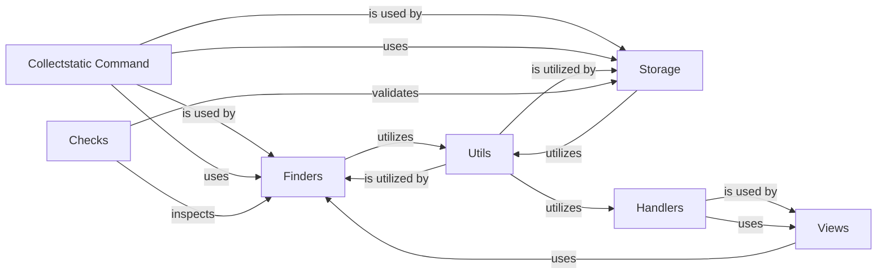

## Component Details

This component is dedicated to handling the collection, discovery, and serving of static assets (like CSS, JavaScript, and images) for Django projects. It's particularly important for efficiently managing static files in production environments and is fundamental for any web application serving static content.

### Finders
This component, primarily implemented in `django.contrib.staticfiles.finders`, is crucial for locating static files across various parts of a Django project. It provides different strategies (e.g., searching within app directories, specific file system paths, or storage backends) to discover static assets. Without finders, Django wouldn't know where to look for your static files.

**Related Classes/Methods**:

- <a href="https://github.com/django/django/blob/master/django/contrib/staticfiles/finders.py#L1-L1" target="_blank" rel="noopener noreferrer">`django.contrib.staticfiles.finders` (1:1)</a>

### Storage
Located in `django.contrib.staticfiles.storage`, this component provides specialized storage backends for static files. It extends Django's default file storage to handle static file-specific operations such as generating URLs, managing caching, and creating manifest files (for hashed filenames, crucial for cache-busting in production). This component is fundamental for efficient and reliable serving of static files, especially in production where caching and versioning are critical.

**Related Classes/Methods**:

- <a href="https://github.com/django/django/blob/master/django/contrib/staticfiles/storage.py#L1-L1" target="_blank" rel="noopener noreferrer">`django.contrib.staticfiles.storage` (1:1)</a>

### Collectstatic Command
This is a management command (`django.contrib.staticfiles.management.commands.collectstatic`) that is indispensable for deploying Django projects. Its purpose is to gather all static files from the locations discovered by the `Finders` and copy them into a single, designated directory (`STATIC_ROOT`). This consolidation is vital for web servers (like Nginx or Apache) to efficiently serve static content without needing to traverse the entire project structure.

**Related Classes/Methods**:

- <a href="https://github.com/django/django/blob/master/django/contrib/staticfiles/management/commands/collectstatic.py#L1-L1" target="_blank" rel="noopener noreferrer">`django.contrib.staticfiles.management.commands.collectstatic` (1:1)</a>

### Utils
Found in `django.contrib.staticfiles.utils`, this module provides a collection of utility functions that support various operations within the static files application. These include helpers for checking settings, retrieving files from directories, and matching patterns. While not a core functional component in itself, it provides essential building blocks and common logic used by other components, making it fundamental for the overall maintainability and correctness of the subsystem.

**Related Classes/Methods**:

- <a href="https://github.com/django/django/blob/master/django/contrib/staticfiles/utils.py#L1-L1" target="_blank" rel="noopener noreferrer">`django.contrib.staticfiles.utils` (1:1)</a>

### Checks
Implemented in `django.contrib.staticfiles.checks`, this component defines system checks specifically for static files. These checks are crucial for ensuring that the static files configuration is correct and for identifying potential issues early in the development or deployment process. It helps prevent common misconfigurations that could lead to static files not being served correctly.

**Related Classes/Methods**:

- <a href="https://github.com/django/django/blob/master/django/contrib/staticfiles/checks.py#L1-L1" target="_blank" rel="noopener noreferrer">`django.contrib.staticfiles.checks` (1:1)</a>

### Views
The `django.contrib.staticfiles.views` module provides a view function (`serve`) that is used to serve static files directly from Django in a development environment. While not recommended for production, it's fundamental for local development, allowing developers to see their static files without needing a separate web server setup.

**Related Classes/Methods**:

- <a href="https://github.com/django/django/blob/master/django/contrib/staticfiles/views.py#L1-L1" target="_blank" rel="noopener noreferrer">`django.contrib.staticfiles.views` (1:1)</a>

### Handlers
The `django.contrib.staticfiles.handlers` module provides custom WSGI/ASGI handlers that can serve static files during development. These handlers integrate with Django's development server to automatically serve static files, simplifying the development workflow.

**Related Classes/Methods**:

- <a href="https://github.com/django/django/blob/master/django/contrib/staticfiles/handlers.py#L1-L1" target="_blank" rel="noopener noreferrer">`django.contrib.staticfiles.handlers` (1:1)</a>

### [FAQ](https://github.com/CodeBoarding/GeneratedOnBoardings/tree/main?tab=readme-ov-file#faq)