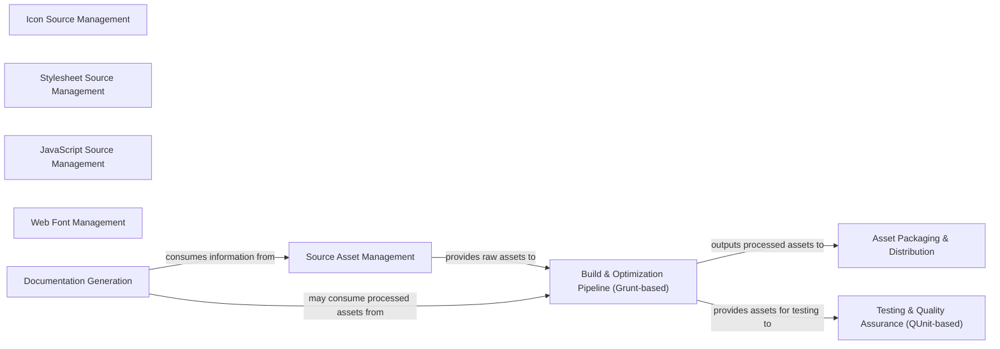

## Details

The frontend asset management subsystem within this Django project is designed to efficiently process and deliver static assets. It begins with Source Asset Management, where raw icons, stylesheets, JavaScript, and web fonts are maintained. These raw assets are then fed into the Build & Optimization Pipeline, primarily driven by Grunt, which compiles, minifies, and bundles them for production. Concurrently, the Testing & Quality Assurance component, utilizing QUnit, ensures the integrity and functionality of these assets throughout the build process. Once optimized and validated, assets are handled by Asset Packaging & Distribution for final deployment. Complementing this, Documentation Generation provides comprehensive guides and examples, drawing directly from the source assets to facilitate easy adoption and understanding of the toolkit. This integrated approach ensures a streamlined workflow from development to deployment of frontend resources.

### Source Asset Management
This component acts as the repository for all raw, un-processed frontend assets.

**Related Classes/Methods**: _None_

### Icon Source Management
Manages raw SVG icon files.

**Related Classes/Methods**:

### Stylesheet Source Management
Manages SCSS/CSS source files.

**Related Classes/Methods**:

### JavaScript Source Management
Contains JavaScript source code.

**Related Classes/Methods**:

### Web Font Management
Manages custom web font files.

**Related Classes/Methods**:

### Build & Optimization Pipeline (Grunt-based)
This component is responsible for transforming raw source files into production-ready, optimized assets. It leverages Grunt tasks to automate compilation, minification, and bundling.

**Related Classes/Methods**:

- <a href="https://github.com/django/django/blob/main/Gruntfile.js" target="_blank" rel="noopener noreferrer">`Gruntfile.js`</a>
- <a href="https://github.com/django/django/blob/main/package.json" target="_blank" rel="noopener noreferrer">`package.json`</a>

### Testing & Quality Assurance (QUnit-based)
This component ensures the quality and functionality of the frontend assets through automated testing. It utilizes QUnit for running unit and integration tests.

**Related Classes/Methods**:

- <a href="https://github.com/django/django/blob/main/Gruntfile.js" target="_blank" rel="noopener noreferrer">`Gruntfile.js`</a>
- <a href="https://github.com/django/django/blob/main/package.json" target="_blank" rel="noopener noreferrer">`package.json`</a>

### Asset Packaging & Distribution
This component handles the final steps of making processed assets available for use, including packaging and defining distribution entry points.

**Related Classes/Methods**:

- <a href="https://github.com/django/django/blob/main/Gruntfile.js" target="_blank" rel="noopener noreferrer">`Gruntfile.js`</a>
- <a href="https://github.com/django/django/blob/main/package.json" target="_blank" rel="noopener noreferrer">`package.json`</a>

### Documentation Generation
This component is responsible for creating comprehensive documentation that explains how to use the icons, styles, and JavaScript utilities, ensuring the toolkit is easily understandable and adoptable.

**Related Classes/Methods**:

### [FAQ](https://github.com/CodeBoarding/GeneratedOnBoardings/tree/main?tab=readme-ov-file#faq)