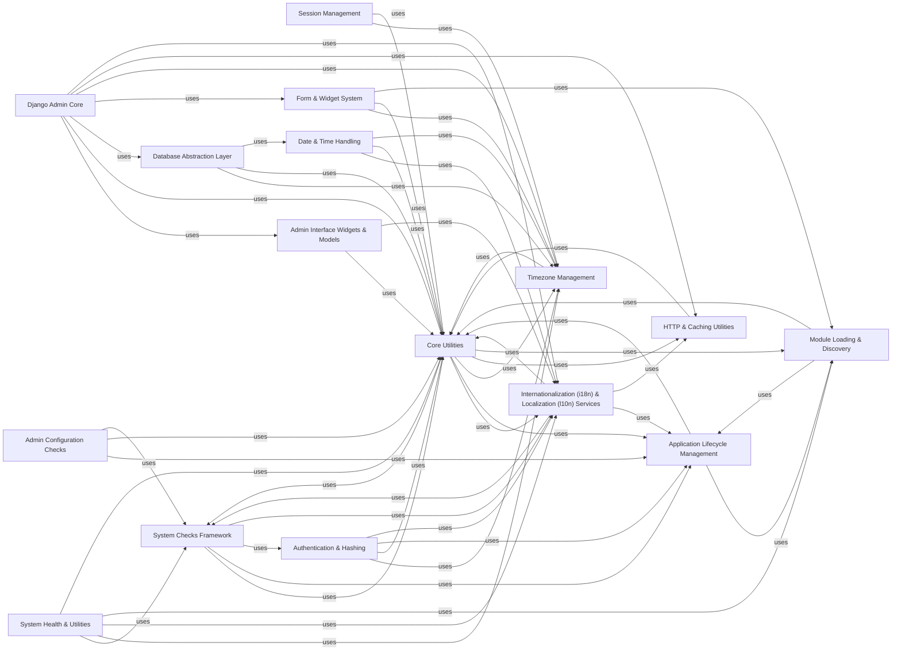

## Component Details

This graph provides a comprehensive overview of key subsystems within a Django project, detailing their individual responsibilities and interdependencies. It illustrates how components like Application Lifecycle Management, Session Management, and the Django Admin Core interact with foundational services such as Database Abstraction, Internationalization, Timezone Management, and various Core Utilities. The graph highlights the modular architecture of Django, where specialized components like System Health & Utilities leverage lower-level utilities and frameworks to ensure system integrity, proper configuration, and efficient operation.

### System Health & Utilities
Encompasses a framework for performing system-wide checks to identify common problems and misconfigurations, including security checks, and a collection of general-purpose utility functions used throughout Django for tasks like timezones, internationalization, and module loading.

**Related Classes/Methods**:

- <a href="https://github.com/django/django/blob/master/django/core/checks/registry.py#L29-L112" target="_blank" rel="noopener noreferrer">`django.core.checks.registry.CheckRegistry` (29:112)</a>
- <a href="https://github.com/django/django/blob/master/django/core/checks/security/base.py#L216-L223" target="_blank" rel="noopener noreferrer">`django.core.checks.security.base.check_secret_key` (216:223)</a>
- <a href="https://github.com/django/django/blob/master/django/utils/timezone.py#L200-L204" target="_blank" rel="noopener noreferrer">`django.utils.timezone.now` (200:204)</a>
- `django.utils.translation.gettext` (full file reference)
- <a href="https://github.com/django/django/blob/master/django/utils/module_loading.py#L19-L35" target="_blank" rel="noopener noreferrer">`django.utils.module_loading.import_string` (19:35)</a>

### Application Lifecycle Management
This component is responsible for managing the lifecycle of Django applications, including their registration, loading, and discovery of submodules. It ensures that applications are properly initialized and ready for use within the Django project.

**Related Classes/Methods**:

- <a href="https://github.com/django/django/blob/master/django/apps/config.py#L100-L222" target="_blank" rel="noopener noreferrer">`django.apps.config.AppConfig:create` (100:222)</a>
- <a href="https://github.com/django/django/blob/master/django/utils/module_loading.py#L74-L89" target="_blank" rel="noopener noreferrer">`django.utils.module_loading.module_has_submodule` (74:89)</a>
- <a href="https://github.com/django/django/blob/master/django/utils/module_loading.py#L19-L35" target="_blank" rel="noopener noreferrer">`django.utils.module_loading.import_string` (19:35)</a>
- <a href="https://github.com/django/django/blob/master/django/core/exceptions.py#L123-L126" target="_blank" rel="noopener noreferrer">`django.core.exceptions.ImproperlyConfigured` (123:126)</a>
- <a href="https://github.com/django/django/blob/master/django/contrib/admin/apps.py#L15-L17" target="_blank" rel="noopener noreferrer">`django.contrib.admin.apps.SimpleAdminConfig:ready` (15:17)</a>
- <a href="https://github.com/django/django/blob/master/django/contrib/auth/apps.py#L18-L31" target="_blank" rel="noopener noreferrer">`django.contrib.auth.apps.AuthConfig:ready` (18:31)</a>
- <a href="https://github.com/django/django/blob/master/django/contrib/staticfiles/apps.py#L12-L14" target="_blank" rel="noopener noreferrer">`django.contrib.staticfiles.apps.StaticFilesConfig:ready` (12:14)</a>
- <a href="https://github.com/django/django/blob/master/django/apps/registry.py#L242-L249" target="_blank" rel="noopener noreferrer">`django.apps.registry.Apps.is_installed` (242:249)</a>
- <a href="https://github.com/django/django/blob/master/django/apps/registry.py#L145-L148" target="_blank" rel="noopener noreferrer">`django.apps.registry.Apps.get_app_configs` (145:148)</a>
- <a href="https://github.com/django/django/blob/master/django/urls/resolvers.py#L108-L111" target="_blank" rel="noopener noreferrer">`django.urls.resolvers.get_resolver` (108:111)</a>
- <a href="https://github.com/django/django/blob/master/django/dispatch/dispatcher.py#L172-L216" target="_blank" rel="noopener noreferrer">`django.dispatch.dispatcher.Signal.send` (172:216)</a>
- <a href="https://github.com/django/django/blob/master/django/utils/autoreload.py#L328-L343" target="_blank" rel="noopener noreferrer">`django.utils.autoreload.BaseReloader:run` (328:343)</a>
- <a href="https://github.com/django/django/blob/master/django/utils/autoreload.py#L310-L326" target="_blank" rel="noopener noreferrer">`django.utils.autoreload.BaseReloader.wait_for_apps_ready` (310:326)</a>
- <a href="https://github.com/django/django/blob/master/django/utils/autoreload.py#L588-L607" target="_blank" rel="noopener noreferrer">`django.utils.autoreload.WatchmanReloader:tick` (588:607)</a>
- <a href="https://github.com/django/django/blob/master/django/utils/autoreload.py#L561-L567" target="_blank" rel="noopener noreferrer">`django.utils.autoreload.WatchmanReloader.update_watches` (561:567)</a>
- <a href="https://github.com/django/django/blob/master/django/utils/autoreload.py#L613-L619" target="_blank" rel="noopener noreferrer">`django.utils.autoreload.WatchmanReloader.check_server_status` (613:619)</a>
- <a href="https://github.com/django/django/blob/master/django/utils/autoreload.py#L569-L582" target="_blank" rel="noopener noreferrer">`django.utils.autoreload.WatchmanReloader._check_subscription` (569:582)</a>
- <a href="https://github.com/django/django/blob/master/django/utils/autoreload.py#L662-L675" target="_blank" rel="noopener noreferrer">`django.utils.autoreload:run_with_reloader` (662:675)</a>
- <a href="https://github.com/django/django/blob/master/django/utils/autoreload.py#L639-L645" target="_blank" rel="noopener noreferrer">`django.utils.autoreload.get_reloader` (639:645)</a>
- <a href="https://github.com/django/django/blob/master/django/utils/autoreload.py#L648-L659" target="_blank" rel="noopener noreferrer">`django.utils.autoreload.start_django` (648:659)</a>
- <a href="https://github.com/django/django/blob/master/django/utils/autoreload.py#L269-L275" target="_blank" rel="noopener noreferrer">`django.utils.autoreload.restart_with_reloader` (269:275)</a>

### Session Management
This component handles the creation, retrieval, and expiration of user sessions, primarily interacting with the database backend for session storage.

**Related Classes/Methods**:

- <a href="https://github.com/django/django/blob/master/django/contrib/sessions/backends/db.py#L32-L41" target="_blank" rel="noopener noreferrer">`django.contrib.sessions.backends.db.SessionStore:_get_session_from_db` (32:41)</a>
- <a href="https://github.com/django/django/blob/master/django/contrib/sessions/backends/db.py#L43-L52" target="_blank" rel="noopener noreferrer">`django.contrib.sessions.backends.db.SessionStore:_aget_session_from_db` (43:52)</a>
- <a href="https://github.com/django/django/blob/master/django/contrib/sessions/backends/db.py#L191-L192" target="_blank" rel="noopener noreferrer">`django.contrib.sessions.backends.db.SessionStore:clear_expired` (191:192)</a>
- <a href="https://github.com/django/django/blob/master/django/contrib/sessions/backends/db.py#L195-L198" target="_blank" rel="noopener noreferrer">`django.contrib.sessions.backends.db.SessionStore:aclear_expired` (195:198)</a>
- <a href="https://github.com/django/django/blob/master/django/contrib/sessions/backends/db.py#L21-L26" target="_blank" rel="noopener noreferrer">`django.contrib.sessions.backends.db.SessionStore.get_model_class` (21:26)</a>
- <a href="https://github.com/django/django/blob/master/django/contrib/sessions/backends/base.py#L268-L293" target="_blank" rel="noopener noreferrer">`django.contrib.sessions.backends.base.SessionBase:get_expiry_age` (268:293)</a>
- <a href="https://github.com/django/django/blob/master/django/contrib/sessions/backends/base.py#L295-L312" target="_blank" rel="noopener noreferrer">`django.contrib.sessions.backends.base.SessionBase:aget_expiry_age` (295:312)</a>
- <a href="https://github.com/django/django/blob/master/django/contrib/sessions/backends/base.py#L314-L335" target="_blank" rel="noopener noreferrer">`django.contrib.sessions.backends.base.SessionBase:get_expiry_date` (314:335)</a>
- <a href="https://github.com/django/django/blob/master/django/contrib/sessions/backends/base.py#L337-L352" target="_blank" rel="noopener noreferrer">`django.contrib.sessions.backends.base.SessionBase:aget_expiry_date` (337:352)</a>
- <a href="https://github.com/django/django/blob/master/django/contrib/sessions/backends/base.py#L354-L380" target="_blank" rel="noopener noreferrer">`django.contrib.sessions.backends.base.SessionBase:set_expiry` (354:380)</a>
- <a href="https://github.com/django/django/blob/master/django/contrib/sessions/backends/base.py#L382-L394" target="_blank" rel="noopener noreferrer">`django.contrib.sessions.backends.base.SessionBase:aset_expiry` (382:394)</a>
- <a href="https://github.com/django/django/blob/master/django/contrib/sessions/backends/base.py#L45-L49" target="_blank" rel="noopener noreferrer">`django.contrib.sessions.backends.base.SessionBase:__init__` (45:49)</a>
- <a href="https://github.com/django/django/blob/master/django/contrib/sessions/backends/base.py#L73-L74" target="_blank" rel="noopener noreferrer">`django.contrib.sessions.backends.base.SessionBase.get` (73:74)</a>
- <a href="https://github.com/django/django/blob/master/django/contrib/sessions/backends/base.py#L76-L77" target="_blank" rel="noopener noreferrer">`django.contrib.sessions.backends.base.SessionBase.aget` (76:77)</a>
- <a href="https://github.com/django/django/blob/master/django/contrib/sessions/backends/base.py#L265-L266" target="_blank" rel="noopener noreferrer">`django.contrib.sessions.backends.base.SessionBase.get_session_cookie_age` (265:266)</a>
- <a href="https://github.com/django/django/blob/master/django/contrib/sessions/backends/base.py#L84-L87" target="_blank" rel="noopener noreferrer">`django.contrib.sessions.backends.base.SessionBase.apop` (84:87)</a>

### Django Admin Core
This component provides the core functionality for the Django administration interface, managing how models are displayed, added, changed, and deleted. It includes views for handling forms, lists, and object history, as well as action processing.

**Related Classes/Methods**:

- <a href="https://github.com/django/django/blob/master/django/contrib/admin/options.py#L231-L248" target="_blank" rel="noopener noreferrer">`django.contrib.admin.options.BaseModelAdmin:formfield_for_choice_field` (231:248)</a>
- <a href="https://github.com/django/django/blob/master/django/contrib/admin/options.py#L268-L298" target="_blank" rel="noopener noreferrer">`django.contrib.admin.options.BaseModelAdmin:formfield_for_foreignkey` (268:298)</a>
- <a href="https://github.com/django/django/blob/master/django/contrib/admin/options.py#L300-L348" target="_blank" rel="noopener noreferrer">`django.contrib.admin.options.BaseModelAdmin:formfield_for_manytomany` (300:348)</a>
- <a href="https://github.com/django/django/blob/master/django/contrib/admin/options.py#L350-L355" target="_blank" rel="noopener noreferrer">`django.contrib.admin.options.BaseModelAdmin.get_autocomplete_fields` (350:355)</a>
- <a href="https://github.com/django/django/blob/master/django/contrib/admin/options.py#L250-L266" target="_blank" rel="noopener noreferrer">`django.contrib.admin.options.BaseModelAdmin.get_field_queryset` (250:266)</a>
- <a href="https://github.com/django/django/blob/master/django/contrib/admin/options.py#L568-L581" target="_blank" rel="noopener noreferrer">`django.contrib.admin.options.BaseModelAdmin.has_change_permission` (568:581)</a>
- <a href="https://github.com/django/django/blob/master/django/contrib/admin/options.py#L559-L566" target="_blank" rel="noopener noreferrer">`django.contrib.admin.options.BaseModelAdmin.has_add_permission` (559:566)</a>
- <a href="https://github.com/django/django/blob/master/django/contrib/admin/options.py#L616-L619" target="_blank" rel="noopener noreferrer">`django.contrib.admin.options.BaseModelAdmin.has_view_or_change_permission` (616:619)</a>
- <a href="https://github.com/django/django/blob/master/django/contrib/admin/options.py#L513-L557" target="_blank" rel="noopener noreferrer">`django.contrib.admin.options.BaseModelAdmin.to_field_allowed` (513:557)</a>
- <a href="https://github.com/django/django/blob/master/django/contrib/admin/options.py#L399-L405" target="_blank" rel="noopener noreferrer">`django.contrib.admin.options.BaseModelAdmin.get_fieldsets` (399:405)</a>
- <a href="https://github.com/django/django/blob/master/django/contrib/admin/options.py#L417-L421" target="_blank" rel="noopener noreferrer">`django.contrib.admin.options.BaseModelAdmin.get_readonly_fields` (417:421)</a>
- <a href="https://github.com/django/django/blob/master/django/contrib/admin/options.py#L423-L427" target="_blank" rel="noopener noreferrer">`django.contrib.admin.options.BaseModelAdmin.get_prepopulated_fields` (423:427)</a>
- `django.contrib.admin.options.ModelAdmin:response_add` (full file reference)
- `django.contrib.admin.options.ModelAdmin:response_change` (full file reference)
- `django.contrib.admin.options.ModelAdmin:response_action` (full file reference)
- `django.contrib.admin.options.ModelAdmin:response_delete` (full file reference)
- `django.contrib.admin.options.ModelAdmin:_get_obj_does_not_exist_redirect` (full file reference)
- `django.contrib.admin.options.ModelAdmin:_changeform_view` (full file reference)
- `django.contrib.admin.options.ModelAdmin:changelist_view` (full file reference)
- `django.contrib.admin.options.ModelAdmin:_delete_view` (full file reference)
- `django.contrib.admin.options.ModelAdmin:history_view` (full file reference)
- `django.contrib.admin.options.ModelAdmin.get_preserved_filters` (full file reference)
- `django.contrib.admin.options.ModelAdmin._get_preserved_qsl` (full file reference)
- `django.contrib.admin.options.ModelAdmin.message_user` (full file reference)
- `django.contrib.admin.options.ModelAdmin.save_form` (full file reference)
- `django.contrib.admin.options.ModelAdmin.save_model` (full file reference)
- `django.contrib.admin.options.ModelAdmin.save_related` (full file reference)
- `django.contrib.admin.options.ModelAdmin.construct_change_message` (full file reference)
- <a href="https://github.com/django/django/blob/master/django/contrib/admin/options.py#L935-L949" target="_blank" rel="noopener noreferrer">`django.contrib.admin.options.ModelAdmin.log_addition` (935:949)</a>
- <a href="https://github.com/django/django/blob/master/django/contrib/admin/options.py#L951-L965" target="_blank" rel="noopener noreferrer">`django.contrib.admin.options.ModelAdmin.log_change` (951:965)</a>
- <a href="https://github.com/django/django/blob/master/django/contrib/admin/options.py#L874-L889" target="_blank" rel="noopener noreferrer">`django.contrib.admin.options.ModelAdmin.get_object` (874:889)</a>
- <a href="https://github.com/django/django/blob/master/django/contrib/admin/options.py#L781-L835" target="_blank" rel="noopener noreferrer">`django.contrib.admin.options.ModelAdmin.get_form` (781:835)</a>
- `django.contrib.admin.options.ModelAdmin._create_formsets` (full file reference)
- `django.contrib.admin.options.ModelAdmin.get_changeform_initial_data` (full file reference)
- `django.contrib.admin.options.ModelAdmin.render_change_form` (full file reference)
- <a href="https://github.com/django/django/blob/master/django/contrib/admin/options.py#L845-L872" target="_blank" rel="noopener noreferrer">`django.contrib.admin.options.ModelAdmin.get_changelist_instance` (845:872)</a>
- `django.contrib.admin.options.ModelAdmin.get_actions` (full file reference)
- `django.contrib.admin.options.ModelAdmin.get_action_choices` (full file reference)
- <a href="https://github.com/django/django/blob/master/django/contrib/admin/options.py#L906-L921" target="_blank" rel="noopener noreferrer">`django.contrib.admin.options.ModelAdmin.get_changelist_formset` (906:921)</a>
- `django.contrib.admin.options.ModelAdmin._get_list_editable_queryset` (full file reference)
- <a href="https://github.com/django/django/blob/master/django/contrib/admin/options.py#L967-L980" target="_blank" rel="noopener noreferrer">`django.contrib.admin.options.ModelAdmin.log_deletions` (967:980)</a>
- `django.contrib.admin.options.ModelAdmin.delete_model` (full file reference)
- `django.contrib.admin.options.ModelAdmin.render_delete_form` (full file reference)
- `django.contrib.admin.options.ModelAdmin.get_inline_formsets` (full file reference)
- `django.contrib.admin.options.ModelAdmin.get_deleted_objects` (full file reference)
- `django.contrib.admin.options.InlineModelAdmin:get_formset` (full file reference)
- `django.contrib.admin.options.InlineModelAdmin.has_delete_permission` (full file reference)
- `django.contrib.admin.options.InlineModelAdmin.get_extra` (full file reference)
- `django.contrib.admin.options.InlineModelAdmin.get_min_num` (full file reference)
- `django.contrib.admin.options.InlineModelAdmin.get_max_num` (full file reference)
- `django.contrib.admin.options.InlineModelAdmin.has_change_permission` (full file reference)
- `django.contrib.admin.options.InlineModelAdmin.has_add_permission` (full file reference)
- `django.contrib.admin.options.InlineModelAdmin.get_formset.DeleteProtectedModelForm.hand_clean_DELETE` (full file reference)
- <a href="https://github.com/django/django/blob/master/django/contrib/admin/sites.py#L415-L450" target="_blank" rel="noopener noreferrer">`django.contrib.admin.sites.AdminSite:login` (415:450)</a>
- <a href="https://github.com/django/django/blob/master/django/contrib/admin/sites.py#L579-L601" target="_blank" rel="noopener noreferrer">`django.contrib.admin.sites.AdminSite:app_index` (579:601)</a>
- <a href="https://github.com/django/django/blob/master/django/contrib/admin/sites.py#L203-L208" target="_blank" rel="noopener noreferrer">`django.contrib.admin.sites.AdminSite.has_permission` (203:208)</a>
- <a href="https://github.com/django/django/blob/master/django/contrib/admin/sites.py#L327-L348" target="_blank" rel="noopener noreferrer">`django.contrib.admin.sites.AdminSite.each_context` (327:348)</a>
- <a href="https://github.com/django/django/blob/master/django/contrib/admin/actions.py#L19-L94" target="_blank" rel="noopener noreferrer">`django.contrib.admin.actions:delete_selected` (19:94)</a>
- <a href="https://github.com/django/django/blob/master/django/contrib/admin/options.py#L95-L96" target="_blank" rel="noopener noreferrer">`django.contrib.admin.options.get_ul_class` (95:96)</a>
- <a href="https://github.com/django/django/blob/master/django/contrib/admin/options.py#L87-L92" target="_blank" rel="noopener noreferrer">`django.contrib.admin.options.get_content_type_for_model` (87:92)</a>
- <a href="https://github.com/django/django/blob/master/django/contrib/admin/templatetags/admin_urls.py#L22-L70" target="_blank" rel="noopener noreferrer">`django.contrib.admin.templatetags.admin_urls.add_preserved_filters` (22:70)</a>
- <a href="https://github.com/django/django/blob/master/django/contrib/admin/utils.py#L89-L96" target="_blank" rel="noopener noreferrer">`django.contrib.admin.utils.quote` (89:96)</a>
- <a href="https://github.com/django/django/blob/master/django/contrib/admin/utils.py#L99-L101" target="_blank" rel="noopener noreferrer">`django.contrib.admin.utils.unquote` (99:101)</a>
- <a href="https://github.com/django/django/blob/master/django/contrib/admin/utils.py#L117-L122" target="_blank" rel="noopener noreferrer">`django.contrib.admin.utils.flatten_fieldsets` (117:122)</a>
- <a href="https://github.com/django/django/blob/master/django/contrib/admin/utils.py#L271-L286" target="_blank" rel="noopener noreferrer">`django.contrib.admin.utils.model_ngettext` (271:286)</a>
- <a href="https://github.com/django/django/blob/master/django/contrib/admin/utils.py#L185-L249" target="_blank" rel="noopener noreferrer">`django.contrib.admin.utils.NestedObjects` (185:249)</a>
- <a href="https://github.com/django/django/blob/master/django/contrib/admin/utils.py#L195-L211" target="_blank" rel="noopener noreferrer">`django.contrib.admin.utils.NestedObjects.collect` (195:211)</a>
- <a href="https://github.com/django/django/blob/master/django/contrib/admin/helpers.py#L30-L37" target="_blank" rel="noopener noreferrer">`django.contrib.admin.helpers.ActionForm` (30:37)</a>
- <a href="https://github.com/django/django/blob/master/django/contrib/admin/helpers.py#L40-L97" target="_blank" rel="noopener noreferrer">`django.contrib.admin.helpers.AdminForm` (40:97)</a>
- <a href="https://github.com/django/django/blob/master/django/contrib/admin/helpers.py#L551-L562" target="_blank" rel="noopener noreferrer">`django.contrib.admin.helpers.AdminErrorList` (551:562)</a>
- <a href="https://github.com/django/django/blob/master/django/contrib/admin/views/main.py#L524-L585" target="_blank" rel="noopener noreferrer">`django.contrib.admin.views.main.ChangeList.get_queryset` (524:585)</a>
- <a href="https://github.com/django/django/blob/master/django/contrib/admin/exceptions.py#L10-L13" target="_blank" rel="noopener noreferrer">`django.contrib.admin.exceptions.DisallowedModelAdminToField` (10:13)</a>

### Admin Interface Widgets & Models
This component defines the specific widgets used in the Django Admin forms and the LogEntry model for tracking administrative actions.

**Related Classes/Methods**:

- <a href="https://github.com/django/django/blob/master/django/contrib/admin/widgets.py#L97-L101" target="_blank" rel="noopener noreferrer">`django.contrib.admin.widgets.AdminSplitDateTime:get_context` (97:101)</a>
- <a href="https://github.com/django/django/blob/master/django/contrib/admin/widgets.py#L146-L178" target="_blank" rel="noopener noreferrer">`django.contrib.admin.widgets.ForeignKeyRawIdWidget:get_context` (146:178)</a>
- <a href="https://github.com/django/django/blob/master/django/contrib/admin/widgets.py#L186-L191" target="_blank" rel="noopener noreferrer">`django.contrib.admin.widgets.ForeignKeyRawIdWidget.url_parameters` (186:191)</a>
- <a href="https://github.com/django/django/blob/master/django/contrib/admin/widgets.py#L193-L213" target="_blank" rel="noopener noreferrer">`django.contrib.admin.widgets.ForeignKeyRawIdWidget.label_and_url_for_value` (193:213)</a>
- <a href="https://github.com/django/django/blob/master/django/contrib/admin/widgets.py#L386-L399" target="_blank" rel="noopener noreferrer">`django.contrib.admin.widgets.AdminURLFieldWidget:get_context` (386:399)</a>
- <a href="https://github.com/django/django/blob/master/django/contrib/admin/widgets.py#L598-L599" target="_blank" rel="noopener noreferrer">`django.contrib.admin.widgets.AutocompleteSelect` (598:599)</a>
- <a href="https://github.com/django/django/blob/master/django/contrib/admin/widgets.py#L132-L213" target="_blank" rel="noopener noreferrer">`django.contrib.admin.widgets.ForeignKeyRawIdWidget` (132:213)</a>
- <a href="https://github.com/django/django/blob/master/django/contrib/admin/widgets.py#L104-L105" target="_blank" rel="noopener noreferrer">`django.contrib.admin.widgets.AdminRadioSelect` (104:105)</a>
- <a href="https://github.com/django/django/blob/master/django/contrib/admin/widgets.py#L602-L603" target="_blank" rel="noopener noreferrer">`django.contrib.admin.widgets.AutocompleteSelectMultiple` (602:603)</a>
- <a href="https://github.com/django/django/blob/master/django/contrib/admin/widgets.py#L216-L243" target="_blank" rel="noopener noreferrer">`django.contrib.admin.widgets.ManyToManyRawIdWidget` (216:243)</a>
- <a href="https://github.com/django/django/blob/master/django/contrib/admin/widgets.py#L22-L49" target="_blank" rel="noopener noreferrer">`django.contrib.admin.widgets.FilteredSelectMultiple` (22:49)</a>
- <a href="https://github.com/django/django/blob/master/django/contrib/admin/models.py#L96-L107" target="_blank" rel="noopener noreferrer">`django.contrib.admin.models.LogEntry:__str__` (96:107)</a>
- <a href="https://github.com/django/django/blob/master/django/contrib/admin/models.py#L118-L180" target="_blank" rel="noopener noreferrer">`django.contrib.admin.models.LogEntry:get_change_message` (118:180)</a>
- <a href="https://github.com/django/django/blob/master/django/contrib/admin/models.py#L109-L110" target="_blank" rel="noopener noreferrer">`django.contrib.admin.models.LogEntry.is_addition` (109:110)</a>
- <a href="https://github.com/django/django/blob/master/django/contrib/admin/models.py#L112-L113" target="_blank" rel="noopener noreferrer">`django.contrib.admin.models.LogEntry.is_change` (112:113)</a>
- <a href="https://github.com/django/django/blob/master/django/contrib/admin/models.py#L115-L116" target="_blank" rel="noopener noreferrer">`django.contrib.admin.models.LogEntry.is_deletion` (115:116)</a>
- <a href="https://github.com/django/django/blob/master/django/contrib/admin/filters.py#L465-L527" target="_blank" rel="noopener noreferrer">`django.contrib.admin.filters.DateFieldListFilter:__init__` (465:527)</a>
- <a href="https://github.com/django/django/blob/master/django/contrib/admin/filters.py#L176-L186" target="_blank" rel="noopener noreferrer">`django.contrib.admin.filters.FieldListFilter.__init__` (176:186)</a>

### Admin Configuration Checks
This component provides a set of checks to validate the configuration of the Django Admin, ensuring proper setup and preventing common errors.

**Related Classes/Methods**:

- `django.contrib.admin.checks:check_dependencies` (full file reference)
- `django.contrib.admin.checks._contains_subclass` (full file reference)
- `django.contrib.admin.checks.BaseModelAdminChecks:_check_autocomplete_fields_item` (full file reference)
- `django.contrib.admin.checks.BaseModelAdminChecks:_check_fields` (full file reference)
- `django.contrib.admin.checks.BaseModelAdminChecks:_check_fieldsets_item` (full file reference)
- `django.contrib.admin.checks.BaseModelAdminChecks:_check_field_spec_item` (full file reference)
- `django.contrib.admin.checks.BaseModelAdminChecks:_check_exclude` (full file reference)
- `django.contrib.admin.checks.BaseModelAdminChecks:_check_filter_item` (full file reference)
- `django.contrib.admin.checks.BaseModelAdminChecks:_check_radio_fields_key` (full file reference)
- `django.contrib.admin.checks.BaseModelAdminChecks:_check_radio_fields_value` (full file reference)
- `django.contrib.admin.checks.BaseModelAdminChecks:_check_view_on_site_url` (full file reference)
- `django.contrib.admin.checks.BaseModelAdminChecks:_check_prepopulated_fields_key` (full file reference)
- `django.contrib.admin.checks.BaseModelAdminChecks:_check_prepopulated_fields_value_item` (full file reference)
- `django.contrib.admin.checks.BaseModelAdminChecks:_check_ordering_item` (full file reference)
- `django.contrib.admin.checks.BaseModelAdminChecks:_check_readonly_fields_item` (full file reference)
- `django.contrib.admin.checks.ModelAdminChecks:_check_inlines_item` (full file reference)
- `django.contrib.admin.checks.ModelAdminChecks:_check_list_display_item` (full file reference)
- `django.contrib.admin.checks.ModelAdminChecks:_check_list_display_links_item` (full file reference)
- `django.contrib.admin.checks.ModelAdminChecks:_check_list_filter_item` (full file reference)
- `django.contrib.admin.checks.ModelAdminChecks:_check_list_editable_item` (full file reference)
- `django.contrib.admin.checks.ModelAdminChecks:_check_date_hierarchy` (full file reference)
- `django.contrib.admin.checks.ModelAdminChecks:_check_actions` (full file reference)
- `django.contrib.admin.checks.InlineModelAdminChecks:_check_exclude_of_parent_model` (full file reference)
- `django.contrib.admin.checks.InlineModelAdminChecks:_check_relation` (full file reference)
- `django.contrib.admin.checks:must_be` (full file reference)
- `django.contrib.admin.checks:must_inherit_from` (full file reference)
- `django.contrib.admin.checks:refer_to_missing_field` (full file reference)

### Authentication & Hashing
This component manages user authentication, including the storage and verification of user credentials, and provides various password hashing algorithms for secure storage.

**Related Classes/Methods**:

- <a href="https://github.com/django/django/blob/master/django/contrib/auth/models.py#L18-L24" target="_blank" rel="noopener noreferrer">`django.contrib.auth.models:update_last_login` (18:24)</a>
- `django.contrib.auth.get_user_model` (full file reference)
- <a href="https://github.com/django/django/blob/master/django/contrib/auth/hashers.py#L346-L353" target="_blank" rel="noopener noreferrer">`django.contrib.auth.hashers.PBKDF2PasswordHasher:safe_summary` (346:353)</a>
- <a href="https://github.com/django/django/blob/master/django/contrib/auth/hashers.py#L439-L450" target="_blank" rel="noopener noreferrer">`django.contrib.auth.hashers.Argon2PasswordHasher:safe_summary` (439:450)</a>
- <a href="https://github.com/django/django/blob/master/django/contrib/auth/hashers.py#L529-L536" target="_blank" rel="noopener noreferrer">`django.contrib.auth.hashers.BCryptSHA256PasswordHasher:safe_summary` (529:536)</a>
- <a href="https://github.com/django/django/blob/master/django/contrib/auth/hashers.py#L624-L633" target="_blank" rel="noopener noreferrer">`django.contrib.auth.hashers.ScryptPasswordHasher:safe_summary` (624:633)</a>
- <a href="https://github.com/django/django/blob/master/django/contrib/auth/hashers.py#L675-L681" target="_blank" rel="noopener noreferrer">`django.contrib.auth.hashers.MD5PasswordHasher:safe_summary` (675:681)</a>
- <a href="https://github.com/django/django/blob/master/django/contrib/auth/hashers.py#L189-L196" target="_blank" rel="noopener noreferrer">`django.contrib.auth.hashers.mask_hash` (189:196)</a>
- <a href="https://github.com/django/django/blob/master/django/contrib/auth/checks.py#L28-L121" target="_blank" rel="noopener noreferrer">`django.contrib.auth.checks:check_user_model` (28:121)</a>
- <a href="https://github.com/django/django/blob/master/django/contrib/auth/checks.py#L124-L237" target="_blank" rel="noopener noreferrer">`django.contrib.auth.checks:check_models_permissions` (124:237)</a>
- `django.contrib.auth.management._get_builtin_permissions` (full file reference)

### Form & Widget System
This component provides the core framework for Django forms, including the definition of various field types, input widgets, and utilities for data compression and timezone conversion within forms.

**Related Classes/Methods**:

- `django.forms.widgets.Widget:format_value` (full file reference)
- `django.forms.widgets.DateTimeBaseInput:format_value` (full file reference)
- `django.forms.widgets.SplitDateTimeWidget:decompress` (full file reference)
- `django.forms.widgets.SelectDateWidget:format_value` (full file reference)
- <a href="https://github.com/django/django/blob/master/django/forms/fields.py#L332-L347" target="_blank" rel="noopener noreferrer">`django.forms.fields.IntegerField:to_python` (332:347)</a>
- <a href="https://github.com/django/django/blob/master/django/forms/fields.py#L366-L380" target="_blank" rel="noopener noreferrer">`django.forms.fields.FloatField:to_python` (366:380)</a>
- <a href="https://github.com/django/django/blob/master/django/forms/fields.py#L418-L433" target="_blank" rel="noopener noreferrer">`django.forms.fields.DecimalField:to_python` (418:433)</a>
- <a href="https://github.com/django/django/blob/master/django/forms/fields.py#L536-L539" target="_blank" rel="noopener noreferrer">`django.forms.fields.DateTimeField:prepare_value` (536:539)</a>
- <a href="https://github.com/django/django/blob/master/django/forms/fields.py#L541-L559" target="_blank" rel="noopener noreferrer">`django.forms.fields.DateTimeField:to_python` (541:559)</a>
- <a href="https://github.com/django/django/blob/master/django/forms/fields.py#L571-L574" target="_blank" rel="noopener noreferrer">`django.forms.fields.DurationField:prepare_value` (571:574)</a>
- <a href="https://github.com/django/django/blob/master/django/forms/fields.py#L576-L593" target="_blank" rel="noopener noreferrer">`django.forms.fields.DurationField:to_python` (576:593)</a>
- `django.forms.fields.SplitDateTimeField:compress` (full file reference)
- <a href="https://github.com/django/django/blob/master/django/forms/fields.py#L179-L180" target="_blank" rel="noopener noreferrer">`django.forms.fields.Field.to_python` (179:180)</a>
- <a href="https://github.com/django/django/blob/master/django/forms/fields.py#L465-L473" target="_blank" rel="noopener noreferrer">`django.forms.fields.BaseTemporalField.to_python` (465:473)</a>
- <a href="https://github.com/django/django/blob/master/django/forms/utils.py#L215-L236" target="_blank" rel="noopener noreferrer">`django.forms.utils:from_current_timezone` (215:236)</a>
- <a href="https://github.com/django/django/blob/master/django/forms/utils.py#L239-L246" target="_blank" rel="noopener noreferrer">`django.forms.utils:to_current_timezone` (239:246)</a>
- `django.forms.models.modelform_defines_fields` (full file reference)
- `django.forms.models.inlineformset_factory` (full file reference)
- <a href="https://github.com/django/django/blob/master/django/forms/formsets.py#L581-L584" target="_blank" rel="noopener noreferrer">`django.forms.formsets.all_valid` (581:584)</a>
- <a href="https://github.com/django/django/blob/master/django/forms/forms.py#L204-L206" target="_blank" rel="noopener noreferrer">`django.forms.forms.BaseForm.is_valid` (204:206)</a>

### Internationalization (i18n) & Localization (l10n) Services
This component provides comprehensive support for internationalization and localization, enabling Django applications to display content in multiple languages and adapt to regional formats. It includes translation utilities, template tags, and views for managing language settings.

**Related Classes/Methods**:

- <a href="https://github.com/django/django/blob/master/django/templatetags/i18n.py#L17-L21" target="_blank" rel="noopener noreferrer">`django.templatetags.i18n.GetAvailableLanguagesNode:render` (17:21)</a>
- <a href="https://github.com/django/django/blob/master/django/templatetags/i18n.py#L29-L32" target="_blank" rel="noopener noreferrer">`django.templatetags.i18n.GetLanguageInfoNode:render` (29:32)</a>
- <a href="https://github.com/django/django/blob/master/django/templatetags/i18n.py#L40-L46" target="_blank" rel="noopener noreferrer">`django.templatetags.i18n.GetLanguageInfoListNode:get_language_info` (40:46)</a>
- <a href="https://github.com/django/django/blob/master/django/templatetags/i18n.py#L58-L60" target="_blank" rel="noopener noreferrer">`django.templatetags.i18n.GetCurrentLanguageNode:render` (58:60)</a>
- <a href="https://github.com/django/django/blob/master/django/templatetags/i18n.py#L67-L69" target="_blank" rel="noopener noreferrer">`django.templatetags.i18n.GetCurrentLanguageBidiNode:render` (67:69)</a>
- <a href="https://github.com/django/django/blob/master/django/templatetags/i18n.py#L84-L101" target="_blank" rel="noopener noreferrer">`django.templatetags.i18n.TranslateNode:render` (84:101)</a>
- <a href="https://github.com/django/django/blob/master/django/templatetags/i18n.py#L148-L204" target="_blank" rel="noopener noreferrer">`django.templatetags.i18n.BlockTranslateNode:render` (148:204)</a>
- <a href="https://github.com/django/django/blob/master/django/templatetags/i18n.py#L134-L146" target="_blank" rel="noopener noreferrer">`django.templatetags.i18n.BlockTranslateNode.render_token_list` (134:146)</a>
- `django.templatetags.i18n.BlockTranslateNode.render.render_value` (full file reference)
- <a href="https://github.com/django/django/blob/master/django/templatetags/i18n.py#L293-L294" target="_blank" rel="noopener noreferrer">`django.templatetags.i18n:language_name` (293:294)</a>
- <a href="https://github.com/django/django/blob/master/django/templatetags/i18n.py#L298-L300" target="_blank" rel="noopener noreferrer">`django.templatetags.i18n:language_name_translated` (298:300)</a>
- <a href="https://github.com/django/django/blob/master/django/templatetags/i18n.py#L304-L305" target="_blank" rel="noopener noreferrer">`django.templatetags.i18n:language_name_local` (304:305)</a>
- <a href="https://github.com/django/django/blob/master/django/templatetags/i18n.py#L309-L310" target="_blank" rel="noopener noreferrer">`django.templatetags.i18n:language_bidi` (309:310)</a>
- <a href="https://github.com/django/django/blob/master/django/utils/translation/trans_real.py#L141-L185" target="_blank" rel="noopener noreferrer">`django.utils.translation.trans_real.DjangoTranslation:__init__` (141:185)</a>
- <a href="https://github.com/django/django/blob/master/django/utils/translation/trans_real.py#L205-L210" target="_blank" rel="noopener noreferrer">`django.utils.translation.trans_real.DjangoTranslation._init_translation_catalog` (205:210)</a>
- <a href="https://github.com/django/django/blob/master/django/utils/translation/trans_real.py#L190-L203" target="_blank" rel="noopener noreferrer">`django.utils.translation.trans_real.DjangoTranslation._new_gnu_trans` (190:203)</a>
- <a href="https://github.com/django/django/blob/master/django/utils/translation/trans_real.py#L251-L263" target="_blank" rel="noopener noreferrer">`django.utils.translation.trans_real.DjangoTranslation.merge` (251:263)</a>
- <a href="https://github.com/django/django/blob/master/django/utils/translation/trans_real.py#L212-L226" target="_blank" rel="noopener noreferrer">`django.utils.translation.trans_real.DjangoTranslation._add_installed_apps_translations` (212:226)</a>
- <a href="https://github.com/django/django/blob/master/django/utils/translation/trans_real.py#L228-L232" target="_blank" rel="noopener noreferrer">`django.utils.translation.trans_real.DjangoTranslation._add_local_translations` (228:232)</a>
- <a href="https://github.com/django/django/blob/master/django/utils/translation/trans_real.py#L234-L249" target="_blank" rel="noopener noreferrer">`django.utils.translation.trans_real.DjangoTranslation._add_fallback` (234:249)</a>
- <a href="https://github.com/django/django/blob/master/django/utils/translation/trans_real.py#L73-L126" target="_blank" rel="noopener noreferrer">`django.utils.translation.trans_real.TranslationCatalog` (73:126)</a>
- <a href="https://github.com/django/django/blob/master/django/utils/translation/trans_real.py#L295-L302" target="_blank" rel="noopener noreferrer">`django.utils.translation.trans_real:activate` (295:302)</a>
- <a href="https://github.com/django/django/blob/master/django/utils/translation/trans_real.py#L336-L348" target="_blank" rel="noopener noreferrer">`django.utils.translation.trans_real:get_language_bidi` (336:348)</a>
- <a href="https://github.com/django/django/blob/master/django/utils/translation/trans_real.py#L367-L390" target="_blank" rel="noopener noreferrer">`django.utils.translation.trans_real:gettext` (367:390)</a>
- <a href="https://github.com/django/django/blob/master/django/utils/translation/trans_real.py#L393-L401" target="_blank" rel="noopener noreferrer">`django.utils.translation.trans_real:pgettext` (393:401)</a>
- <a href="https://github.com/django/django/blob/master/django/utils/translation/trans_real.py#L425-L430" target="_blank" rel="noopener noreferrer">`django.utils.translation.trans_real:ngettext` (425:430)</a>
- <a href="https://github.com/django/django/blob/master/django/utils/translation/trans_real.py#L433-L443" target="_blank" rel="noopener noreferrer">`django.utils.translation.trans_real:npgettext` (433:443)</a>
- <a href="https://github.com/django/django/blob/master/django/utils/translation/trans_real.py#L462-L478" target="_blank" rel="noopener noreferrer">`django.utils.translation.trans_real:check_for_language` (462:478)</a>
- <a href="https://github.com/django/django/blob/master/django/utils/translation/trans_real.py#L491-L539" target="_blank" rel="noopener noreferrer">`django.utils.translation.trans_real:get_supported_language_variant` (491:539)</a>
- <a href="https://github.com/django/django/blob/master/django/utils/translation/trans_real.py#L542-L556" target="_blank" rel="noopener noreferrer">`django.utils.translation.trans_real:get_language_from_path` (542:556)</a>
- <a href="https://github.com/django/django/blob/master/django/utils/translation/trans_real.py#L559-L603" target="_blank" rel="noopener noreferrer">`django.utils.translation.trans_real:get_language_from_request` (559:603)</a>
- <a href="https://github.com/django/django/blob/master/django/utils/translation/trans_real.py#L631-L652" target="_blank" rel="noopener noreferrer">`django.utils.translation.trans_real:parse_accept_lang_header` (631:652)</a>
- <a href="https://github.com/django/django/blob/master/django/utils/translation/trans_real.py#L286-L292" target="_blank" rel="noopener noreferrer">`django.utils.translation.trans_real.translation` (286:292)</a>
- <a href="https://github.com/django/django/blob/master/django/utils/translation/trans_real.py#L446-L458" target="_blank" rel="noopener noreferrer">`django.utils.translation.trans_real.all_locale_paths` (446:458)</a>
- <a href="https://github.com/django/django/blob/master/django/utils/translation/trans_null.py#L24-L25" target="_blank" rel="noopener noreferrer">`django.utils.translation.trans_null:pgettext` (24:25)</a>
- <a href="https://github.com/django/django/blob/master/django/utils/translation/trans_null.py#L28-L29" target="_blank" rel="noopener noreferrer">`django.utils.translation.trans_null:npgettext` (28:29)</a>
- `django.utils.translation.override:__enter__` (full file reference)
- `django.utils.translation.override:__exit__` (full file reference)
- `django.utils.translation:get_language_info` (full file reference)
- `django.utils.translation:to_language` (full file reference)
- `django.utils.translation:to_locale` (full file reference)
- `django.utils.translation:get_language` (full file reference)
- `django.utils.translation:activate` (full file reference)
- `django.utils.translation:deactivate_all` (full file reference)
- `django.utils.translation:deactivate` (full file reference)
- `django.utils.translation.lazy_number.NumberAwareString._get_number_value` (full file reference)
- `django.utils.translation.lazy_number.NumberAwareString._translate` (full file reference)
- `django.utils.translation.lazy_number.NumberAwareString` (full file reference)
- <a href="https://github.com/django/django/blob/master/django/views/i18n.py#L30-L74" target="_blank" rel="noopener noreferrer">`django.views.i18n:set_language` (30:74)</a>
- <a href="https://github.com/django/django/blob/master/django/views/i18n.py#L114-L124" target="_blank" rel="noopener noreferrer">`django.views.i18n.JavaScriptCatalog:get` (114:124)</a>
- <a href="https://github.com/django/django/blob/master/django/views/i18n.py#L126-L140" target="_blank" rel="noopener noreferrer">`django.views.i18n.JavaScriptCatalog:get_paths` (126:140)</a>
- <a href="https://github.com/django/django/blob/master/django/views/i18n.py#L205-L210" target="_blank" rel="noopener noreferrer">`django.views.i18n.JavaScriptCatalog:get_context_data` (205:210)</a>
- <a href="https://github.com/django/django/blob/master/django/views/i18n.py#L212-L229" target="_blank" rel="noopener noreferrer">`django.views.i18n.JavaScriptCatalog:render_to_response` (212:229)</a>
- <a href="https://github.com/django/django/blob/master/django/views/i18n.py#L178-L203" target="_blank" rel="noopener noreferrer">`django.views.i18n.JavaScriptCatalog:get_catalog` (178:203)</a>
- <a href="https://github.com/django/django/blob/master/django/views/i18n.py#L165-L176" target="_blank" rel="noopener noreferrer">`django.views.i18n.JavaScriptCatalog:get_plural` (165:176)</a>
- <a href="https://github.com/django/django/blob/master/django/views/i18n.py#L77-L95" target="_blank" rel="noopener noreferrer">`django.views.i18n:get_formats` (77:95)</a>
- <a href="https://github.com/django/django/blob/master/django/core/checks/translation.py#L30-L35" target="_blank" rel="noopener noreferrer">`django.core.checks.translation:check_setting_language_code` (30:35)</a>
- <a href="https://github.com/django/django/blob/master/django/core/checks/translation.py#L39-L45" target="_blank" rel="noopener noreferrer">`django.core.checks.translation:check_setting_languages` (39:45)</a>
- <a href="https://github.com/django/django/blob/master/django/core/checks/translation.py#L49-L55" target="_blank" rel="noopener noreferrer">`django.core.checks.translation:check_setting_languages_bidi` (49:55)</a>
- <a href="https://github.com/django/django/blob/master/django/core/checks/translation.py#L59-L66" target="_blank" rel="noopener noreferrer">`django.core.checks.translation:check_language_settings_consistent` (59:66)</a>

### Date & Time Handling
This component provides utilities for handling dates, times, and time differences, including formatting and generic views for date-based filtering. It complements the Timezone Management component by offering broader date/time manipulation capabilities.

**Related Classes/Methods**:

- <a href="https://github.com/django/django/blob/master/django/utils/dateformat.py#L71-L75" target="_blank" rel="noopener noreferrer">`django.utils.dateformat.TimeFormat:a` (71:75)</a>
- <a href="https://github.com/django/django/blob/master/django/utils/dateformat.py#L77-L81" target="_blank" rel="noopener noreferrer">`django.utils.dateformat.TimeFormat:A` (77:81)</a>
- <a href="https://github.com/django/django/blob/master/django/utils/dateformat.py#L145-L156" target="_blank" rel="noopener noreferrer">`django.utils.dateformat.TimeFormat:P` (145:156)</a>
- <a href="https://github.com/django/django/blob/master/django/utils/dateformat.py#L99-L108" target="_blank" rel="noopener noreferrer">`django.utils.dateformat.TimeFormat.f` (99:108)</a>
- <a href="https://github.com/django/django/blob/master/django/utils/dateformat.py#L263-L272" target="_blank" rel="noopener noreferrer">`django.utils.dateformat.DateFormat:r` (263:272)</a>
- <a href="https://github.com/django/django/blob/master/django/utils/dateformat.py#L322-L325" target="_blank" rel="noopener noreferrer">`django.utils.dateformat.format` (322:325)</a>
- <a href="https://github.com/django/django/blob/master/django/utils/dateformat.py#L328-L331" target="_blank" rel="noopener noreferrer">`django.utils.dateformat.time_format` (328:331)</a>
- <a href="https://github.com/django/django/blob/master/django/templatetags/tz.py#L20-L26" target="_blank" rel="noopener noreferrer">`django.templatetags.tz:localtime` (20:26)</a>
- <a href="https://github.com/django/django/blob/master/django/templatetags/tz.py#L38-L84" target="_blank" rel="noopener noreferrer">`django.templatetags.tz:do_timezone` (38:84)</a>
- <a href="https://github.com/django/django/blob/master/django/templatetags/tz.py#L130-L132" target="_blank" rel="noopener noreferrer">`django.templatetags.tz.GetCurrentTimezoneNode:render` (130:132)</a>
- <a href="https://github.com/django/django/blob/master/django/templatetags/tz.py#L12-L13" target="_blank" rel="noopener noreferrer">`django.templatetags.tz.datetimeobject` (12:13)</a>
- <a href="https://github.com/django/django/blob/master/django/views/generic/dates.py#L269-L280" target="_blank" rel="noopener noreferrer">`django.views.generic.dates.DateMixin:_make_date_lookup_arg` (269:280)</a>
- <a href="https://github.com/django/django/blob/master/django/views/generic/dates.py#L332-L359" target="_blank" rel="noopener noreferrer">`django.views.generic.dates.BaseDateListView:get_dated_queryset` (332:359)</a>
- <a href="https://github.com/django/django/blob/master/django/views/generic/dates.py#L728-L815" target="_blank" rel="noopener noreferrer">`django.views.generic.dates:_get_next_prev` (728:815)</a>
- <a href="https://github.com/django/django/blob/master/django/views/generic/dates.py#L818-L823" target="_blank" rel="noopener noreferrer">`django.views.generic.dates:timezone_today` (818:823)</a>

### Database Abstraction Layer
This component provides an abstraction layer for interacting with various database backends (PostgreSQL, SQLite, Oracle, MySQL). It handles database-specific operations, query construction, and conversion of Python objects to database-compatible values.

**Related Classes/Methods**:

- <a href="https://github.com/django/django/blob/master/django/db/backends/postgresql/operations.py#L107-L112" target="_blank" rel="noopener noreferrer">`django.db.backends.postgresql.operations.DatabaseOperations:_prepare_tzname_delta` (107:112)</a>
- <a href="https://github.com/django/django/blob/master/django/db/backends/postgresql/operations.py#L114-L118" target="_blank" rel="noopener noreferrer">`django.db.backends.postgresql.operations.DatabaseOperations:_convert_sql_to_tz` (114:118)</a>
- <a href="https://github.com/django/django/blob/master/django/db/backends/postgresql/base.py#L344-L349" target="_blank" rel="noopener noreferrer">`django.db.backends.postgresql.base.DatabaseWrapper:ensure_timezone` (344:349)</a>
- <a href="https://github.com/django/django/blob/master/django/db/backends/postgresql/base.py#L351-L358" target="_blank" rel="noopener noreferrer">`django.db.backends.postgresql.base.DatabaseWrapper:_configure_timezone` (351:358)</a>
- <a href="https://github.com/django/django/blob/master/django/db/backends/postgresql/base.py#L368-L379" target="_blank" rel="noopener noreferrer">`django.db.backends.postgresql.base.DatabaseWrapper:_configure_connection` (368:379)</a>
- <a href="https://github.com/django/django/blob/master/django/db/backends/postgresql/base.py#L225-L228" target="_blank" rel="noopener noreferrer">`django.db.backends.postgresql.base.DatabaseWrapper.close_pool` (225:228)</a>
- <a href="https://github.com/django/django/blob/master/django/db/backends/postgresql/base.py#L360-L366" target="_blank" rel="noopener noreferrer">`django.db.backends.postgresql.base.DatabaseWrapper._configure_role` (360:366)</a>
- <a href="https://github.com/django/django/blob/master/django/db/backends/postgresql/operations.py#L204-L205" target="_blank" rel="noopener noreferrer">`django.db.backends.postgresql.operations.DatabaseOperations.set_time_zone_sql` (204:205)</a>
- <a href="https://github.com/django/django/blob/master/django/db/backends/sqlite3/operations.py#L103-L108" target="_blank" rel="noopener noreferrer">`django.db.backends.sqlite3.operations.DatabaseOperations:date_trunc_sql` (103:108)</a>
- <a href="https://github.com/django/django/blob/master/django/db/backends/sqlite3/operations.py#L110-L115" target="_blank" rel="noopener noreferrer">`django.db.backends.sqlite3.operations.DatabaseOperations:time_trunc_sql` (110:115)</a>
- <a href="https://github.com/django/django/blob/master/django/db/backends/sqlite3/operations.py#L122-L126" target="_blank" rel="noopener noreferrer">`django.db.backends.sqlite3.operations.DatabaseOperations:datetime_cast_date_sql` (122:126)</a>
- <a href="https://github.com/django/django/blob/master/django/db/backends/sqlite3/operations.py#L128-L132" target="_blank" rel="noopener noreferrer">`django.db.backends.sqlite3.operations.DatabaseOperations:datetime_cast_time_sql` (128:132)</a>
- <a href="https://github.com/django/django/blob/master/django/db/backends/sqlite3/operations.py#L134-L139" target="_blank" rel="noopener noreferrer">`django.db.backends.sqlite3.operations.DatabaseOperations:datetime_extract_sql` (134:139)</a>
- <a href="https://github.com/django/django/blob/master/django/db/backends/sqlite3/operations.py#L141-L146" target="_blank" rel="noopener noreferrer">`django.db.backends.sqlite3.operations.DatabaseOperations:datetime_trunc_sql` (141:146)</a>
- <a href="https://github.com/django/django/blob/master/django/db/backends/sqlite3/operations.py#L272-L286" target="_blank" rel="noopener noreferrer">`django.db.backends.sqlite3.operations.DatabaseOperations:adapt_datetimefield_value` (272:286)</a>
- <a href="https://github.com/django/django/blob/master/django/db/backends/sqlite3/operations.py#L288-L296" target="_blank" rel="noopener noreferrer">`django.db.backends.sqlite3.operations.DatabaseOperations:adapt_timefield_value` (288:296)</a>
- <a href="https://github.com/django/django/blob/master/django/db/backends/sqlite3/operations.py#L315-L321" target="_blank" rel="noopener noreferrer">`django.db.backends.sqlite3.operations.DatabaseOperations:convert_datetimefield_value` (315:321)</a>
- <a href="https://github.com/django/django/blob/master/django/db/backends/sqlite3/operations.py#L329-L333" target="_blank" rel="noopener noreferrer">`django.db.backends.sqlite3.operations.DatabaseOperations:convert_timefield_value` (329:333)</a>
- <a href="https://github.com/django/django/blob/master/django/db/backends/sqlite3/operations.py#L117-L120" target="_blank" rel="noopener noreferrer">`django.db.backends.sqlite3.operations.DatabaseOperations._convert_tznames_to_sql` (117:120)</a>
- <a href="https://github.com/django/django/blob/master/django/db/backends/sqlite3/_functions.py#L107-L126" target="_blank" rel="noopener noreferrer">`django.db.backends.sqlite3._functions:_sqlite_datetime_parse` (107:126)</a>
- <a href="https://github.com/django/django/blob/master/django/db/backends/sqlite3/_functions.py#L129-L145" target="_blank" rel="noopener noreferrer">`django.db.backends.sqlite3._functions:_sqlite_date_trunc` (129:145)</a>
- <a href="https://github.com/django/django/blob/master/django/db/backends/sqlite3/_functions.py#L148-L165" target="_blank" rel="noopener noreferrer">`django.db.backends.sqlite3._functions:_sqlite_time_trunc` (148:165)</a>
- <a href="https://github.com/django/django/blob/master/django/db/backends/sqlite3/_functions.py#L168-L172" target="_blank" rel="noopener noreferrer">`django.db.backends.sqlite3._functions:_sqlite_datetime_cast_date` (168:172)</a>
- <a href="https://github.com/django/django/blob/master/django/db/backends/sqlite3/_functions.py#L175-L179" target="_blank" rel="noopener noreferrer">`django.db.backends.sqlite3._functions:_sqlite_datetime_cast_time` (175:179)</a>
- <a href="https://github.com/django/django/blob/master/django/db/backends/sqlite3/_functions.py#L182-L197" target="_blank" rel="noopener noreferrer">`django.db.backends.sqlite3._functions:_sqlite_datetime_extract` (182:197)</a>
- <a href="https://github.com/django/django/blob/master/django/db/backends/sqlite3/_functions.py#L200-L228" target="_blank" rel="noopener noreferrer">`django.db.backends.sqlite3._functions:_sqlite_datetime_trunc` (200:228)</a>
- <a href="https://github.com/django/django/blob/master/django/db/backends/oracle/operations.py#L134-L136" target="_blank" rel="noopener noreferrer">`django.db.backends.oracle.operations.DatabaseOperations:_prepare_tzname_delta` (134:136)</a>
- <a href="https://github.com/django/django/blob/master/django/db/backends/oracle/operations.py#L138-L154" target="_blank" rel="noopener noreferrer">`django.db.backends.oracle.operations.DatabaseOperations:_convert_sql_to_tz` (138:154)</a>
- <a href="https://github.com/django/django/blob/master/django/db/backends/oracle/operations.py#L590-L613" target="_blank" rel="noopener noreferrer">`django.db.backends.oracle.operations.DatabaseOperations:adapt_datetimefield_value` (590:613)</a>
- <a href="https://github.com/django/django/blob/master/django/db/backends/oracle/operations.py#L615-L628" target="_blank" rel="noopener noreferrer">`django.db.backends.oracle.operations.DatabaseOperations:adapt_timefield_value` (615:628)</a>
- <a href="https://github.com/django/django/blob/master/django/db/backends/oracle/operations.py#L270-L273" target="_blank" rel="noopener noreferrer">`django.db.backends.oracle.operations.DatabaseOperations:convert_datetimefield_value` (270:273)</a>
- <a href="https://github.com/django/django/blob/master/django/db/backends/oracle/utils.py#L53-L62" target="_blank" rel="noopener noreferrer">`django.db.backends.oracle.utils.Oracle_datetime.from_datetime` (53:62)</a>
- <a href="https://github.com/django/django/blob/master/django/db/backends/oracle/utils.py#L44-L62" target="_blank" rel="noopener noreferrer">`django.db.backends.oracle.utils.Oracle_datetime` (44:62)</a>
- <a href="https://github.com/django/django/blob/master/django/db/backends/base/operations.py#L556-L565" target="_blank" rel="noopener noreferrer">`django.db.backends.base.operations.BaseDatabaseOperations:adapt_timefield_value` (556:565)</a>
- <a href="https://github.com/django/django/blob/master/django/db/backends/base/operations.py#L605-L628" target="_blank" rel="noopener noreferrer">`django.db.backends.base.operations.BaseDatabaseOperations:year_lookup_bounds_for_datetime_field` (605:628)</a>
- <a href="https://github.com/django/django/blob/master/django/db/backends/base/operations.py#L547-L554" target="_blank" rel="noopener noreferrer">`django.db.backends.base.operations.BaseDatabaseOperations.adapt_datetimefield_value` (547:554)</a>
- <a href="https://github.com/django/django/blob/master/django/db/backends/mysql/operations.py#L88-L90" target="_blank" rel="noopener noreferrer">`django.db.backends.mysql.operations.DatabaseOperations:_prepare_tzname_delta` (88:90)</a>
- <a href="https://github.com/django/django/blob/master/django/db/backends/mysql/operations.py#L92-L99" target="_blank" rel="noopener noreferrer">`django.db.backends.mysql.operations.DatabaseOperations:_convert_sql_to_tz` (92:99)</a>
- <a href="https://github.com/django/django/blob/master/django/db/backends/mysql/operations.py#L251-L268" target="_blank" rel="noopener noreferrer">`django.db.backends.mysql.operations.DatabaseOperations:adapt_datetimefield_value` (251:268)</a>
- <a href="https://github.com/django/django/blob/master/django/db/backends/mysql/operations.py#L270-L282" target="_blank" rel="noopener noreferrer">`django.db.backends.mysql.operations.DatabaseOperations:adapt_timefield_value` (270:282)</a>
- <a href="https://github.com/django/django/blob/master/django/db/backends/mysql/operations.py#L320-L323" target="_blank" rel="noopener noreferrer">`django.db.backends.mysql.operations.DatabaseOperations:convert_datetimefield_value` (320:323)</a>
- `django.db.models.query.QuerySet:dates` (full file reference)
- `django.db.models.query.QuerySet:datetimes` (full file reference)
- `django.db.models.query.QuerySet.order_by` (full file reference)
- `django.db.models.query.QuerySet.filter` (full file reference)
- `django.db.models.query.QuerySet.distinct` (full file reference)
- `django.db.models.query.QuerySet.values_list` (full file reference)
- `django.db.models.query.QuerySet.annotate` (full file reference)
- `django.db.models.base.Model:save_base` (full file reference)
- `django.db.models.base.Model:_perform_date_checks` (full file reference)
- `django.db.models.base.Model:_is_pk_set` (full file reference)
- `django.db.models.base.Model.date_error_message` (full file reference)
- `django.db.models.base.Model._validate_force_insert` (full file reference)
- `django.db.models.base.Model._save_parents` (full file reference)
- `django.db.models.base.Model._save_table` (full file reference)
- `django.db.models.fields:_to_naive` (full file reference)
- `django.db.models.fields:_get_naive_now` (full file reference)
- `django.db.models.fields.DateField:_check_fix_default_value` (full file reference)
- `django.db.models.fields.DateField:to_python` (full file reference)
- `django.db.models.fields.DateTimeField:_check_fix_default_value` (full file reference)
- `django.db.models.fields.DateTimeField:to_python` (full file reference)
- `django.db.models.fields.DateTimeField:pre_save` (full file reference)
- `django.db.models.fields.DateTimeField:get_prep_value` (full file reference)
- `django.db.models.fields.DurationField:to_python` (full file reference)
- `django.db.models.fields.TimeField:_check_fix_default_value` (full file reference)
- `django.db.models.fields.TimeField:to_python` (full file reference)
- `django.db.models.fields.Field.has_default` (full file reference)
- `django.db.models.fields.DateTimeCheckMixin._check_if_value_fixed` (full file reference)
- <a href="https://github.com/django/django/blob/master/django/db/models/functions/datetime.py#L27-L38" target="_blank" rel="noopener noreferrer">`django.db.models.functions.datetime.TimezoneMixin:get_tzname` (27:38)</a>
- <a href="https://github.com/django/django/blob/master/django/db/models/functions/datetime.py#L53-L83" target="_blank" rel="noopener noreferrer">`django.db.models.functions.datetime.Extract:as_sql` (53:83)</a>
- <a href="https://github.com/django/django/blob/master/django/db/models/functions/datetime.py#L259-L282" target="_blank" rel="noopener noreferrer">`django.db.models.functions.datetime.TruncBase:as_sql` (259:282)</a>
- <a href="https://github.com/django/django/blob/master/django/db/models/functions/datetime.py#L345-L362" target="_blank" rel="noopener noreferrer">`django.db.models.functions.datetime.TruncBase:convert_value` (345:362)</a>
- <a href="https://github.com/django/django/blob/master/django/db/models/functions/datetime.py#L405-L409" target="_blank" rel="noopener noreferrer">`django.db.models.functions.datetime.TruncDate:as_sql` (405:409)</a>
- <a href="https://github.com/django/django/blob/master/django/db/models/functions/datetime.py#L417-L421" target="_blank" rel="noopener noreferrer">`django.db.models.functions.datetime.TruncTime:as_sql` (417:421)</a>
- <a href="https://github.com/django/django/blob/master/django/db/models/functions/datetime.py#L365-L375" target="_blank" rel="noopener noreferrer">`django.db.models.functions.datetime.Trunc` (365:375)</a>
- `django.db.models.fields.DateField` (full file reference)
- `django.db.models.fields.DateTimeField` (full file reference)
- <a href="https://github.com/django/django/blob/master/django/db/models/expressions.py#L876-L937" target="_blank" rel="noopener noreferrer">`django.db.models.expressions.F` (876:937)</a>
- `django.db.models.expressions.Cast` (full file reference)
- `django.db.models.Q.create` (full file reference)
- <a href="https://github.com/django/django/blob/master/django/db/transaction.py#L316-L323" target="_blank" rel="noopener noreferrer">`django.db.transaction.atomic` (316:323)</a>
- <a href="https://github.com/django/django/blob/master/django/db/transaction.py#L101-L126" target="_blank" rel="noopener noreferrer">`django.db.transaction.mark_for_rollback_on_error` (101:126)</a>
- `django.db.utils.ConnectionRouter._router_func._route_db` (full file reference)
- <a href="https://github.com/django/django/blob/master/django/db/backends/utils.py#L195-L206" target="_blank" rel="noopener noreferrer">`django.db.backends.utils.split_tzname_delta` (195:206)</a>
- <a href="https://github.com/django/django/blob/master/django/db/backends/utils.py#L233-L261" target="_blank" rel="noopener noreferrer">`django.db.backends.utils.typecast_timestamp` (233:261)</a>
- <a href="https://github.com/django/django/blob/master/django/db/backends/utils.py#L220-L230" target="_blank" rel="noopener noreferrer">`django.db.backends.utils.typecast_time` (220:230)</a>

### HTTP & Caching Utilities
This component provides utilities for handling HTTP-related tasks, including parsing and generating HTTP headers, managing conditional responses, and implementing caching mechanisms.

**Related Classes/Methods**:

- <a href="https://github.com/django/django/blob/master/django/utils/http.py#L45-L83" target="_blank" rel="noopener noreferrer">`django.utils.http.urlencode` (45:83)</a>
- <a href="https://github.com/django/django/blob/master/django/utils/http.py#L245-L272" target="_blank" rel="noopener noreferrer">`django.utils.http.url_has_allowed_host_and_scheme` (245:272)</a>
- <a href="https://github.com/django/django/blob/master/django/utils/http.py#L200-L211" target="_blank" rel="noopener noreferrer">`django.utils.http.parse_etags` (200:211)</a>
- <a href="https://github.com/django/django/blob/master/django/utils/http.py#L140-L147" target="_blank" rel="noopener noreferrer">`django.utils.http.parse_http_date_safe` (140:147)</a>
- <a href="https://github.com/django/django/blob/master/django/utils/http.py#L86-L97" target="_blank" rel="noopener noreferrer">`django.utils.http.http_date` (86:97)</a>
- <a href="https://github.com/django/django/blob/master/django/utils/http.py#L214-L222" target="_blank" rel="noopener noreferrer">`django.utils.http.quote_etag` (214:222)</a>
- <a href="https://github.com/django/django/blob/master/django/utils/cache.py#L164-L211" target="_blank" rel="noopener noreferrer">`django.utils.cache:get_conditional_response` (164:211)</a>
- <a href="https://github.com/django/django/blob/master/django/utils/cache.py#L270-L286" target="_blank" rel="noopener noreferrer">`django.utils.cache:patch_response_headers` (270:286)</a>
- <a href="https://github.com/django/django/blob/master/django/utils/cache.py#L289-L296" target="_blank" rel="noopener noreferrer">`django.utils.cache:add_never_cache_headers` (289:296)</a>
- <a href="https://github.com/django/django/blob/master/django/utils/cache.py#L377-L396" target="_blank" rel="noopener noreferrer">`django.utils.cache:get_cache_key` (377:396)</a>
- <a href="https://github.com/django/django/blob/master/django/utils/cache.py#L399-L437" target="_blank" rel="noopener noreferrer">`django.utils.cache:learn_cache_key` (399:437)</a>
- <a href="https://github.com/django/django/blob/master/django/utils/cache.py#L214-L232" target="_blank" rel="noopener noreferrer">`django.utils.cache._if_match_passes` (214:232)</a>
- <a href="https://github.com/django/django/blob/master/django/utils/cache.py#L127-L135" target="_blank" rel="noopener noreferrer">`django.utils.cache._precondition_failed` (127:135)</a>
- <a href="https://github.com/django/django/blob/master/django/utils/cache.py#L235-L240" target="_blank" rel="noopener noreferrer">`django.utils.cache._if_unmodified_since_passes` (235:240)</a>
- <a href="https://github.com/django/django/blob/master/django/utils/cache.py#L243-L259" target="_blank" rel="noopener noreferrer">`django.utils.cache._if_none_match_passes` (243:259)</a>
- <a href="https://github.com/django/django/blob/master/django/utils/cache.py#L138-L161" target="_blank" rel="noopener noreferrer">`django.utils.cache._not_modified` (138:161)</a>
- <a href="https://github.com/django/django/blob/master/django/utils/cache.py#L262-L267" target="_blank" rel="noopener noreferrer">`django.utils.cache._if_modified_since_passes` (262:267)</a>
- <a href="https://github.com/django/django/blob/master/django/utils/cache.py#L34-L100" target="_blank" rel="noopener noreferrer">`django.utils.cache.patch_cache_control` (34:100)</a>
- <a href="https://github.com/django/django/blob/master/django/utils/cache.py#L367-L374" target="_blank" rel="noopener noreferrer">`django.utils.cache._generate_cache_header_key` (367:374)</a>
- <a href="https://github.com/django/django/blob/master/django/utils/cache.py#L350-L364" target="_blank" rel="noopener noreferrer">`django.utils.cache._generate_cache_key` (350:364)</a>
- <a href="https://github.com/django/django/blob/master/django/views/decorators/http.py#L83-L160" target="_blank" rel="noopener noreferrer">`django.views.decorators.http:condition` (83:160)</a>
- `django.views.decorators.http.condition.decorator._pre_process_request` (full file reference)
- `django.views.decorators.http.condition.decorator._post_process_request` (full file reference)
- <a href="https://github.com/django/django/blob/master/django/http/response.py#L655-L657" target="_blank" rel="noopener noreferrer">`django.http.response.HttpResponseRedirect` (655:657)</a>
- <a href="https://github.com/django/django/blob/master/django/http/response.py#L365-L435" target="_blank" rel="noopener noreferrer">`django.http.response.HttpResponse` (365:435)</a>
- <a href="https://github.com/django/django/blob/master/django/http/response.py#L214-L276" target="_blank" rel="noopener noreferrer">`django.http.response.HttpResponseBase.set_cookie` (214:276)</a>
- <a href="https://github.com/django/django/blob/master/django/http/response.py#L717-L718" target="_blank" rel="noopener noreferrer">`django.http.response.Http404` (717:718)</a>
- <a href="https://github.com/django/django/blob/master/django/http/response.py#L689-L690" target="_blank" rel="noopener noreferrer">`django.http.response.HttpResponseForbidden` (689:690)</a>
- <a href="https://github.com/django/django/blob/master/django/template/response.py#L10-L144" target="_blank" rel="noopener noreferrer">`django.template.response.SimpleTemplateResponse` (10:144)</a>
- <a href="https://github.com/django/django/blob/master/django/template/response.py#L147-L164" target="_blank" rel="noopener noreferrer">`django.template.response.TemplateResponse` (147:164)</a>

### Core Utilities
This is a broad component encompassing various general-purpose utility functions and classes that support different aspects of Django, including text manipulation, logging, data formatting, HTML processing, and functional programming helpers.

**Related Classes/Methods**:

- <a href="https://github.com/django/django/blob/master/django/utils/duration.py#L18-L28" target="_blank" rel="noopener noreferrer">`django.utils.duration:duration_string` (18:28)</a>
- <a href="https://github.com/django/django/blob/master/django/utils/duration.py#L4-L15" target="_blank" rel="noopener noreferrer">`django.utils.duration._get_duration_components` (4:15)</a>
- <a href="https://github.com/django/django/blob/master/django/utils/text.py#L134-L142" target="_blank" rel="noopener noreferrer">`django.utils.text.TruncateHTMLParser:handle_data` (134:142)</a>
- <a href="https://github.com/django/django/blob/master/django/utils/text.py#L157-L164" target="_blank" rel="noopener noreferrer">`django.utils.text.TruncateCharsHTMLParser:__init__` (157:164)</a>
- <a href="https://github.com/django/django/blob/master/django/utils/text.py#L198-L217" target="_blank" rel="noopener noreferrer">`django.utils.text.Truncator:chars` (198:217)</a>
- <a href="https://github.com/django/django/blob/master/django/utils/text.py#L219-L237" target="_blank" rel="noopener noreferrer">`django.utils.text.Truncator:_text_chars` (219:237)</a>
- <a href="https://github.com/django/django/blob/master/django/utils/text.py#L239-L254" target="_blank" rel="noopener noreferrer">`django.utils.text.Truncator:words` (239:254)</a>
- <a href="https://github.com/django/django/blob/master/django/utils/text.py#L256-L266" target="_blank" rel="noopener noreferrer">`django.utils.text.Truncator:_text_words` (256:266)</a>
- <a href="https://github.com/django/django/blob/master/django/utils/text.py#L287-L309" target="_blank" rel="noopener noreferrer">`django.utils.text:get_text_list` (287:309)</a>
- <a href="https://github.com/django/django/blob/master/django/utils/text.py#L73-L86" target="_blank" rel="noopener noreferrer">`django.utils.text.add_truncation_text` (73:86)</a>
- <a href="https://github.com/django/django/blob/master/django/utils/text.py#L89-L96" target="_blank" rel="noopener noreferrer">`django.utils.text.calculate_truncate_chars_length` (89:96)</a>
- <a href="https://github.com/django/django/blob/master/django/utils/log.py#L67-L76" target="_blank" rel="noopener noreferrer">`django.utils.log:configure_logging` (67:76)</a>
- <a href="https://github.com/django/django/blob/master/django/utils/log.py#L94-L135" target="_blank" rel="noopener noreferrer">`django.utils.log.AdminEmailHandler:emit` (94:135)</a>
- <a href="https://github.com/django/django/blob/master/django/utils/log.py#L145-L149" target="_blank" rel="noopener noreferrer">`django.utils.log.AdminEmailHandler.format_subject` (145:149)</a>
- <a href="https://github.com/django/django/blob/master/django/utils/log.py#L137-L140" target="_blank" rel="noopener noreferrer">`django.utils.log.AdminEmailHandler.send_mail` (137:140)</a>
- <a href="https://github.com/django/django/blob/master/django/utils/formats.py#L89-L97" target="_blank" rel="noopener noreferrer">`django.utils.formats:get_format_modules` (89:97)</a>
- <a href="https://github.com/django/django/blob/master/django/utils/formats.py#L100-L141" target="_blank" rel="noopener noreferrer">`django.utils.formats:get_format` (100:141)</a>
- <a href="https://github.com/django/django/blob/master/django/utils/formats.py#L147-L157" target="_blank" rel="noopener noreferrer">`django.utils.formats:date_format` (147:157)</a>
- <a href="https://github.com/django/django/blob/master/django/utils/formats.py#L160-L169" target="_blank" rel="noopener noreferrer">`django.utils.formats:time_format` (160:169)</a>
- <a href="https://github.com/django/django/blob/master/django/utils/formats.py#L172-L190" target="_blank" rel="noopener noreferrer">`django.utils.formats:number_format` (172:190)</a>
- <a href="https://github.com/django/django/blob/master/django/utils/formats.py#L193-L215" target="_blank" rel="noopener noreferrer">`django.utils.formats:localize` (193:215)</a>
- <a href="https://github.com/django/django/blob/master/django/utils/formats.py#L218-L240" target="_blank" rel="noopener noreferrer">`django.utils.formats:localize_input` (218:240)</a>
- <a href="https://github.com/django/django/blob/master/django/utils/formats.py#L276-L305" target="_blank" rel="noopener noreferrer">`django.utils.formats:sanitize_separators` (276:305)</a>
- <a href="https://github.com/django/django/blob/master/django/utils/formats.py#L244-L273" target="_blank" rel="noopener noreferrer">`django.utils.formats:sanitize_strftime_format` (244:273)</a>
- <a href="https://github.com/django/django/blob/master/django/utils/formats.py#L62-L86" target="_blank" rel="noopener noreferrer">`django.utils.formats.iter_format_modules` (62:86)</a>
- <a href="https://github.com/django/django/blob/master/django/utils/html.py#L334-L401" target="_blank" rel="noopener noreferrer">`django.utils.html.Urlizer:handle_word` (334:401)</a>
- <a href="https://github.com/django/django/blob/master/django/utils/html.py#L420-L475" target="_blank" rel="noopener noreferrer">`django.utils.html.Urlizer.trim_punctuation` (420:475)</a>
- <a href="https://github.com/django/django/blob/master/django/utils/html.py#L478-L484" target="_blank" rel="noopener noreferrer">`django.utils.html.Urlizer.is_email_simple` (478:484)</a>
- <a href="https://github.com/django/django/blob/master/django/utils/html.py#L403-L406" target="_blank" rel="noopener noreferrer">`django.utils.html.Urlizer.trim_url` (403:406)</a>
- <a href="https://github.com/django/django/blob/master/django/utils/html.py#L491-L494" target="_blank" rel="noopener noreferrer">`django.utils.html:urlize` (491:494)</a>
- <a href="https://github.com/django/django/blob/master/django/utils/html.py#L238-L271" target="_blank" rel="noopener noreferrer">`django.utils.html.smart_urlquote` (238:271)</a>
- <a href="https://github.com/django/django/blob/master/django/utils/html.py#L51-L60" target="_blank" rel="noopener noreferrer">`django.utils.html.escape` (51:60)</a>
- <a href="https://github.com/django/django/blob/master/django/utils/html.py#L130-L140" target="_blank" rel="noopener noreferrer">`django.utils.html.format_html` (130:140)</a>
- <a href="https://github.com/django/django/blob/master/django/utils/html.py#L115-L127" target="_blank" rel="noopener noreferrer">`django.utils.html.conditional_escape` (115:127)</a>
- <a href="https://github.com/django/django/blob/master/django/utils/html.py#L497-L502" target="_blank" rel="noopener noreferrer">`django.utils.html.avoid_wrapping` (497:502)</a>
- <a href="https://github.com/django/django/blob/master/django/utils/ipv6.py#L17-L51" target="_blank" rel="noopener noreferrer">`django.utils.ipv6:clean_ipv6_address` (17:51)</a>
- <a href="https://github.com/django/django/blob/master/django/utils/ipv6.py#L9-L14" target="_blank" rel="noopener noreferrer">`django.utils.ipv6._ipv6_address_from_str` (9:14)</a>
- <a href="https://github.com/django/django/blob/master/django/utils/datastructures.py#L95-L96" target="_blank" rel="noopener noreferrer">`django.utils.datastructures.MultiValueDict:__copy__` (95:96)</a>
- <a href="https://github.com/django/django/blob/master/django/utils/datastructures.py#L198-L213" target="_blank" rel="noopener noreferrer">`django.utils.datastructures.MultiValueDict:update` (198:213)</a>
- <a href="https://github.com/django/django/blob/master/django/utils/datastructures.py#L185-L187" target="_blank" rel="noopener noreferrer">`django.utils.datastructures.MultiValueDict.lists` (185:187)</a>
- <a href="https://github.com/django/django/blob/master/django/utils/datastructures.py#L164-L171" target="_blank" rel="noopener noreferrer">`django.utils.datastructures.MultiValueDict.setlistdefault` (164:171)</a>
- <a href="https://github.com/django/django/blob/master/django/utils/timesince.py#L28-L135" target="_blank" rel="noopener noreferrer">`django.utils.timesince:timesince` (28:135)</a>
- <a href="https://github.com/django/django/blob/master/django/utils/timesince.py#L138-L142" target="_blank" rel="noopener noreferrer">`django.utils.timesince:timeuntil` (138:142)</a>
- `django.utils.functional:lazy_number` (full file reference)
- <a href="https://github.com/django/django/blob/master/django/utils/functional.py#L193-L195" target="_blank" rel="noopener noreferrer">`django.utils.functional.lazy.__wrapper__` (193:195)</a>
- <a href="https://github.com/django/django/blob/master/django/utils/functional.py#L77-L197" target="_blank" rel="noopener noreferrer">`django.utils.functional.lazy` (77:197)</a>
- <a href="https://github.com/django/django/blob/master/django/utils/functional.py#L403-L404" target="_blank" rel="noopener noreferrer">`django.utils.functional.SimpleLazyObject._setup` (403:404)</a>
- <a href="https://github.com/django/django/blob/master/django/utils/_os.py#L56-L62" target="_blank" rel="noopener noreferrer">`django.utils._os.to_path` (56:62)</a>
- <a href="https://github.com/django/django/blob/master/django/utils/version.py#L70-L75" target="_blank" rel="noopener noreferrer">`django.utils.version.get_docs_version` (70:75)</a>
- <a href="https://github.com/django/django/blob/master/django/utils/safestring.py#L65-L78" target="_blank" rel="noopener noreferrer">`django.utils.safestring.mark_safe` (65:78)</a>
- <a href="https://github.com/django/django/blob/master/django/utils/safestring.py#L25-L50" target="_blank" rel="noopener noreferrer">`django.utils.safestring.SafeString` (25:50)</a>
- <a href="https://github.com/django/django/blob/master/django/core/exceptions.py#L138-L241" target="_blank" rel="noopener noreferrer">`django.core.exceptions.ValidationError` (138:241)</a>
- <a href="https://github.com/django/django/blob/master/django/core/validators.py#L130-L195" target="_blank" rel="noopener noreferrer">`django.core.validators.URLValidator` (130:195)</a>
- <a href="https://github.com/django/django/blob/master/django/core/checks/messages.py#L74-L76" target="_blank" rel="noopener noreferrer">`django.core.checks.messages.Error` (74:76)</a>
- <a href="https://github.com/django/django/blob/master/django/core/checks/messages.py#L69-L71" target="_blank" rel="noopener noreferrer">`django.core.checks.messages.Warning` (69:71)</a>
- <a href="https://github.com/django/django/blob/master/django/core/checks/messages.py#L79-L81" target="_blank" rel="noopener noreferrer">`django.core.checks.messages.Critical` (79:81)</a>
- <a href="https://github.com/django/django/blob/master/django/core/checks/registry.py#L34-L70" target="_blank" rel="noopener noreferrer">`django.core.checks.registry.CheckRegistry.register` (34:70)</a>
- <a href="https://github.com/django/django/blob/master/django/core/checks/registry.py#L29-L112" target="_blank" rel="noopener noreferrer">`django.core.checks.registry.CheckRegistry` (29:112)</a>
- <a href="https://github.com/django/django/blob/master/django/core/checks/security/base.py#L216-L223" target="_blank" rel="noopener noreferrer">`django.core.checks.security.base:check_secret_key` (216:223)</a>
- <a href="https://github.com/django/django/blob/master/django/core/checks/security/base.py#L227-L239" target="_blank" rel="noopener noreferrer">`django.core.checks.security.base:check_secret_key_fallbacks` (227:239)</a>
- <a href="https://github.com/django/django/blob/master/django/core/checks/security/base.py#L207-L212" target="_blank" rel="noopener noreferrer">`django.core.checks.security.base._check_secret_key` (207:212)</a>
- `django.core.mail.send_mail` (full file reference)
- `django.core.mail.mail_managers` (full file reference)
- `django.core.mail.mail_admins` (full file reference)
- <a href="https://github.com/django/django/blob/master/django/core/management/commands/sendtestemail.py#L32-L46" target="_blank" rel="noopener noreferrer">`django.core.management.commands.sendtestemail.Command:handle` (32:46)</a>
- <a href="https://github.com/django/django/blob/master/django/core/management/commands/migrate.py#L487-L508" target="_blank" rel="noopener noreferrer">`django.core.management.commands.migrate.Command:describe_operation` (487:508)</a>
- <a href="https://github.com/django/django/blob/master/django/core/paginator.py#L162-L173" target="_blank" rel="noopener noreferrer">`django.core.paginator.Paginator.get_page` (162:173)</a>
- <a href="https://github.com/django/django/blob/master/django/core/paginator.py#L208-L212" target="_blank" rel="noopener noreferrer">`django.core.paginator.Paginator.get_elided_page_range` (208:212)</a>
- <a href="https://github.com/django/django/blob/master/django/urls/base.py#L28-L108" target="_blank" rel="noopener noreferrer">`django.urls.base.reverse` (28:108)</a>
- <a href="https://github.com/django/django/blob/master/django/urls/base.py#L181-L208" target="_blank" rel="noopener noreferrer">`django.urls.base.translate_url` (181:208)</a>
- <a href="https://github.com/django/django/blob/master/django/urls/resolvers.py#L108-L111" target="_blank" rel="noopener noreferrer">`django.urls.resolvers.get_resolver` (108:111)</a>
- <a href="https://github.com/django/django/blob/master/django/dispatch/dispatcher.py#L52-L130" target="_blank" rel="noopener noreferrer">`django.dispatch.dispatcher.Signal.connect` (52:130)</a>
- <a href="https://github.com/django/django/blob/master/django/dispatch/dispatcher.py#L172-L216" target="_blank" rel="noopener noreferrer">`django.dispatch.dispatcher.Signal.send` (172:216)</a>
- <a href="https://github.com/django/django/blob/master/django/views/csrf.py#L22-L80" target="_blank" rel="noopener noreferrer">`django.views.csrf:csrf_failure` (22:80)</a>
- <a href="https://github.com/django/django/blob/master/django/views/csrf.py#L12-L19" target="_blank" rel="noopener noreferrer">`django.views.csrf.builtin_template_path` (12:19)</a>
- `django.template.base.render_value_in_context` (full file reference)
- <a href="https://github.com/django/django/blob/master/django/template/base.py#L165-L173" target="_blank" rel="noopener noreferrer">`django.template.base.Template.render` (165:173)</a>
- <a href="https://github.com/django/django/blob/master/django/template/library.py#L56-L97" target="_blank" rel="noopener noreferrer">`django.template.library.Library.filter` (56:97)</a>
- <a href="https://github.com/django/django/blob/master/django/template/loader.py#L5-L19" target="_blank" rel="noopener noreferrer">`django.template.loader.get_template` (5:19)</a>
- <a href="https://github.com/django/django/blob/master/django/template/context.py#L138-L173" target="_blank" rel="noopener noreferrer">`django.template.context.Context` (138:173)</a>
- <a href="https://github.com/django/django/blob/master/django/template/engine.py#L165-L170" target="_blank" rel="noopener noreferrer">`django.template.engine.Engine.from_string` (165:170)</a>
- <a href="https://github.com/django/django/blob/master/django/template/engine.py#L13-L214" target="_blank" rel="noopener noreferrer">`django.template.engine.Engine` (13:214)</a>
- <a href="https://github.com/django/django/blob/master/django/template/exceptions.py#L39-L44" target="_blank" rel="noopener noreferrer">`django.template.exceptions.TemplateSyntaxError` (39:44)</a>
- <a href="https://github.com/django/django/blob/master/django/template/context_processors.py#L58-L65" target="_blank" rel="noopener noreferrer">`django.template.context_processors:i18n` (58:65)</a>
- <a href="https://github.com/django/django/blob/master/django/template/context_processors.py#L68-L71" target="_blank" rel="noopener noreferrer">`django.template.context_processors:tz` (68:71)</a>
- <a href="https://github.com/django/django/blob/master/django/template/backends/dummy.py#L43-L51" target="_blank" rel="noopener noreferrer">`django.template.backends.dummy.Template:render` (43:51)</a>
- <a href="https://github.com/django/django/blob/master/django/template/backends/jinja2.py#L64-L78" target="_blank" rel="noopener noreferrer">`django.template.backends.jinja2.Template:render` (64:78)</a>
- <a href="https://github.com/django/django/blob/master/django/template/backends/jinja2.py#L92-L125" target="_blank" rel="noopener noreferrer">`django.template.backends.jinja2.get_exception_info` (92:125)</a>
- `django.template.defaulttags.LoremNode:render` (full file reference)
- `django.template.defaulttags.NowNode:render` (full file reference)
- <a href="https://github.com/django/django/blob/master/django/template/defaultfilters.py#L779-L789" target="_blank" rel="noopener noreferrer">`django.template.defaultfilters:date` (779:789)</a>
- <a href="https://github.com/django/django/blob/master/django/template/defaultfilters.py#L793-L803" target="_blank" rel="noopener noreferrer">`django.template.defaultfilters:time` (793:803)</a>
- <a href="https://github.com/django/django/blob/master/django/template/defaultfilters.py#L807-L816" target="_blank" rel="noopener noreferrer">`django.template.defaultfilters:timesince_filter` (807:816)</a>
- <a href="https://github.com/django/django/blob/master/django/template/defaultfilters.py#L820-L827" target="_blank" rel="noopener noreferrer">`django.template.defaultfilters:timeuntil_filter` (820:827)</a>
- <a href="https://github.com/django/django/blob/master/django/template/defaultfilters.py#L856-L886" target="_blank" rel="noopener noreferrer">`django.template.defaultfilters:yesno` (856:886)</a>
- <a href="https://github.com/django/django/blob/master/django/contrib/gis/geoip2.py#L70-L120" target="_blank" rel="noopener noreferrer">`django.contrib.gis.geoip2.GeoIP2:__init__` (70:120)</a>
- <a href="https://github.com/django/django/blob/master/django/contrib/gis/geoip2.py#L47-L48" target="_blank" rel="noopener noreferrer">`django.contrib.gis.geoip2.GeoIP2Exception` (47:48)</a>

### System Checks Framework
Provides a robust framework for defining, registering, and executing system-wide checks to identify common problems, misconfigurations, and security vulnerabilities within a Django project.

**Related Classes/Methods**:

- <a href="https://github.com/django/django/blob/master/django/core/checks/registry.py#L29-L112" target="_blank" rel="noopener noreferrer">`django.core.checks.registry.CheckRegistry` (29:112)</a>
- <a href="https://github.com/django/django/blob/master/django/core/checks/security/base.py#L216-L223" target="_blank" rel="noopener noreferrer">`django.core.checks.security.base.check_secret_key` (216:223)</a>
- <a href="https://github.com/django/django/blob/master/django/core/checks/messages.py#L74-L76" target="_blank" rel="noopener noreferrer">`django.core.checks.messages.Error` (74:76)</a>
- <a href="https://github.com/django/django/blob/master/django/core/checks/messages.py#L69-L71" target="_blank" rel="noopener noreferrer">`django.core.checks.messages.Warning` (69:71)</a>
- `django.core.checks.Tags` (10:26)

### Timezone Management
Manages all aspects of date, time, and timezone handling within Django, including obtaining current time, converting between timezones, and handling aware/naive datetimes.

**Related Classes/Methods**:

- <a href="https://github.com/django/django/blob/master/django/utils/timezone.py#L200-L204" target="_blank" rel="noopener noreferrer">`django.utils.timezone.now` (200:204)</a>
- <a href="https://github.com/django/django/blob/master/django/utils/timezone.py#L167-L184" target="_blank" rel="noopener noreferrer">`django.utils.timezone.localtime` (167:184)</a>
- <a href="https://github.com/django/django/blob/master/django/utils/timezone.py#L211-L221" target="_blank" rel="noopener noreferrer">`django.utils.timezone.is_aware` (211:221)</a>
- <a href="https://github.com/django/django/blob/master/django/utils/timezone.py#L224-L234" target="_blank" rel="noopener noreferrer">`django.utils.timezone.is_naive` (224:234)</a>
- <a href="https://github.com/django/django/blob/master/django/utils/timezone.py#L237-L245" target="_blank" rel="noopener noreferrer">`django.utils.timezone.make_aware` (237:245)</a>
- <a href="https://github.com/django/django/blob/master/django/utils/timezone.py#L248-L255" target="_blank" rel="noopener noreferrer">`django.utils.timezone.make_naive` (248:255)</a>
- <a href="https://github.com/django/django/blob/master/django/utils/timezone.py#L46-L52" target="_blank" rel="noopener noreferrer">`django.utils.timezone.get_default_timezone` (46:52)</a>
- <a href="https://github.com/django/django/blob/master/django/utils/timezone.py#L64-L66" target="_blank" rel="noopener noreferrer">`django.utils.timezone.get_current_timezone` (64:66)</a>

### Module Loading & Discovery
Provides utilities for dynamically loading Python modules and classes, and for auto-discovering modules within installed Django applications.

**Related Classes/Methods**:

- <a href="https://github.com/django/django/blob/master/django/utils/module_loading.py#L19-L35" target="_blank" rel="noopener noreferrer">`django.utils.module_loading.import_string` (19:35)</a>
- <a href="https://github.com/django/django/blob/master/django/utils/module_loading.py#L38-L71" target="_blank" rel="noopener noreferrer">`django.utils.module_loading.autodiscover_modules` (38:71)</a>
- <a href="https://github.com/django/django/blob/master/django/utils/module_loading.py#L74-L89" target="_blank" rel="noopener noreferrer">`django.utils.module_loading.module_has_submodule` (74:89)</a>

### [FAQ](https://github.com/CodeBoarding/GeneratedOnBoardings/tree/main?tab=readme-ov-file#faq)