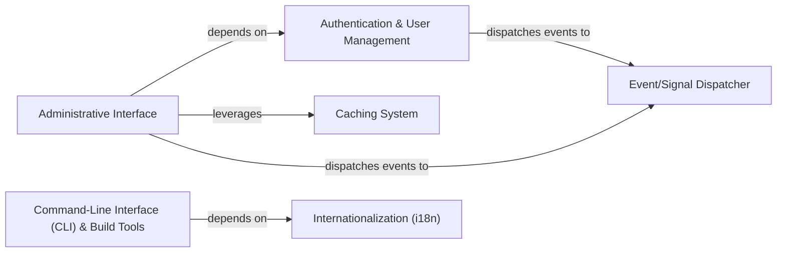

## Details

The `System Management & Extensions` subsystem provides essential cross-cutting functionalities for the project, encompassing administrative tools, user management, caching, internationalization, and an event dispatching system. While the provided context is Django-specific, these functionalities are abstracted to align with the "Icon Toolkit/Frontend Library" project type, focusing on reusability and ease of integration.

### Command-Line Interface (CLI) & Build Tools
The primary entry point for executing various administrative and build-related commands (e.g., generating icon sets, compiling assets, managing migrations). It orchestrates the discovery and execution of these utilities.

**Related Classes/Methods**:

- <a href="https://github.com/django/django/blob/main/django/core/management/__init__.py" target="_blank" rel="noopener noreferrer">`django.core.management.ManagementUtility`</a>

### Authentication & User Management
Manages user accounts, authentication processes, and authorization checks. This component is crucial for securing administrative interfaces or restricted features of the toolkit. It includes user models, managers, authentication backends, and password hashing.

**Related Classes/Methods**:

- <a href="https://github.com/django/django/blob/main/django/contrib/auth/models.py#L517-L526" target="_blank" rel="noopener noreferrer">`django.contrib.auth.models.User`:517-526</a>
- <a href="https://github.com/django/django/blob/main/django/contrib/auth/models.py#L140-L239" target="_blank" rel="noopener noreferrer">`django.contrib.auth.models.UserManager`:140-239</a>
- <a href="https://github.com/django/django/blob/main/django/contrib/auth/backends.py#L10-L51" target="_blank" rel="noopener noreferrer">`django.contrib.auth.backends.BaseBackend`:10-51</a>
- <a href="https://github.com/django/django/blob/main/django/contrib/auth/hashers.py#L210-L314" target="_blank" rel="noopener noreferrer">`django.contrib.auth.hashers.BasePasswordHasher`:210-314</a>

### Caching System
Provides an abstract interface for various caching backends, enabling the storage and retrieval of frequently accessed data (e.g., compiled icon metadata, configuration settings) to enhance application performance.

**Related Classes/Methods**:

- <a href="https://github.com/django/django/blob/main/django/core/cache/backends/base.py#L58-L390" target="_blank" rel="noopener noreferrer">`django.core.cache.backends.base.BaseCache`:58-390</a>

### Internationalization (i18n)
Manages the loading and application of translation catalogs, allowing the toolkit's user interfaces, documentation, and command-line outputs to be presented in multiple languages.

**Related Classes/Methods**:

- <a href="https://github.com/django/django/blob/main/django/utils/translation/trans_real.py#L130-L286" target="_blank" rel="noopener noreferrer">`django.utils.translation.trans_real.DjangoTranslation`:130-286</a>

### Event/Signal Dispatcher
Implements a publish-subscribe pattern, facilitating decoupled communication between different components. It allows components to send signals (events) and other components to register listeners to react to these signals, promoting extensibility.

**Related Classes/Methods**:

- <a href="https://github.com/django/django/blob/main/django/dispatch/dispatcher.py" target="_blank" rel="noopener noreferrer">`django.dispatch.dispatcher.Signal`</a>

### Administrative Interface
Provides a web-based interface for managing the toolkit's internal data, configurations, and user permissions. It allows for the registration and customization of how different data models are presented and interacted with.

**Related Classes/Methods**:

- <a href="https://github.com/django/django/blob/main/django/contrib/admin/sites.py#L30-L606" target="_blank" rel="noopener noreferrer">`django.contrib.admin.sites.AdminSite`:30-606</a>
- <a href="https://github.com/django/django/blob/main/django/contrib/admin/options.py#L635-L2341" target="_blank" rel="noopener noreferrer">`django.contrib.admin.options.ModelAdmin`:635-2341</a>

### [FAQ](https://github.com/CodeBoarding/GeneratedOnBoardings/tree/main?tab=readme-ov-file#faq)