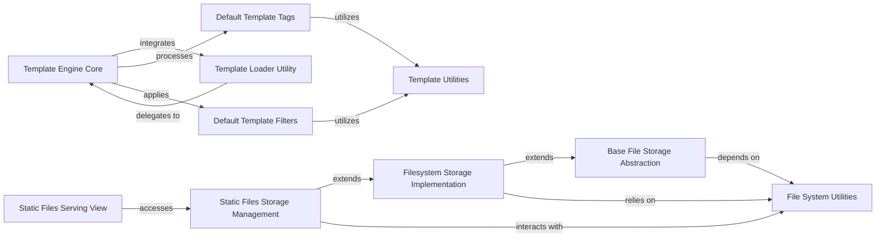

## Component Details

Django's built-in templating system for generating dynamic HTML, XML, or other text-based content. It provides a syntax for embedding Python-like logic within templates, including variables, tags, and filters, and supports various template loaders and context processors. This component also manages the storage, retrieval, and serving of user-uploaded files (media files) and static assets (CSS, JavaScript, images).

### Template Engine Core
Manages the fundamental aspects of template processing, including loading, compiling, and rendering templates. It acts as the central orchestrator for template-related operations.

**Related Classes/Methods**:

- <a href="https://github.com/django/django/blob/master/django/template/engine.py#L19-L62" target="_blank" rel="noopener noreferrer">`django.template.engine.Engine.__init__` (19:62)</a>
- <a href="https://github.com/django/django/blob/master/django/template/engine.py#L88-L111" target="_blank" rel="noopener noreferrer">`django.template.engine.Engine.get_default` (88:111)</a>
- <a href="https://github.com/django/django/blob/master/django/template/engine.py#L114-L117" target="_blank" rel="noopener noreferrer">`django.template.engine.Engine.template_context_processors` (114:117)</a>
- <a href="https://github.com/django/django/blob/master/django/template/engine.py#L119-L120" target="_blank" rel="noopener noreferrer">`django.template.engine.Engine.get_template_builtins` (119:120)</a>
- <a href="https://github.com/django/django/blob/master/django/template/engine.py#L122-L126" target="_blank" rel="noopener noreferrer">`django.template.engine.Engine.get_template_libraries` (122:126)</a>
- <a href="https://github.com/django/django/blob/master/django/template/engine.py#L129-L130" target="_blank" rel="noopener noreferrer">`django.template.engine.Engine.template_loaders` (129:130)</a>
- <a href="https://github.com/django/django/blob/master/django/template/engine.py#L132-L138" target="_blank" rel="noopener noreferrer">`django.template.engine.Engine.get_template_loaders` (132:138)</a>
- <a href="https://github.com/django/django/blob/master/django/template/engine.py#L140-L152" target="_blank" rel="noopener noreferrer">`django.template.engine.Engine.find_template_loader` (140:152)</a>
- <a href="https://github.com/django/django/blob/master/django/template/engine.py#L154-L162" target="_blank" rel="noopener noreferrer">`django.template.engine.Engine.find_template` (154:162)</a>
- <a href="https://github.com/django/django/blob/master/django/template/engine.py#L164-L169" target="_blank" rel="noopener noreferrer">`django.template.engine.Engine.from_string` (164:169)</a>
- <a href="https://github.com/django/django/blob/master/django/template/engine.py#L171-L180" target="_blank" rel="noopener noreferrer">`django.template.engine.Engine.get_template` (171:180)</a>
- <a href="https://github.com/django/django/blob/master/django/template/engine.py#L182-L196" target="_blank" rel="noopener noreferrer">`django.template.engine.Engine.render_to_string` (182:196)</a>
- <a href="https://github.com/django/django/blob/master/django/template/engine.py#L198-L213" target="_blank" rel="noopener noreferrer">`django.template.engine.Engine.select_template` (198:213)</a>

### Template Loader Utility
Provides convenience functions for loading and rendering templates, abstracting away the direct interaction with the template engine for common use cases.

**Related Classes/Methods**:

- <a href="https://github.com/django/django/blob/master/django/template/loader.py#L4-L18" target="_blank" rel="noopener noreferrer">`django.template.loader.get_template` (4:18)</a>
- <a href="https://github.com/django/django/blob/master/django/template/loader.py#L21-L48" target="_blank" rel="noopener noreferrer">`django.template.loader.select_template` (21:48)</a>
- <a href="https://github.com/django/django/blob/master/django/template/loader.py#L51-L61" target="_blank" rel="noopener noreferrer">`django.template.loader.render_to_string` (51:61)</a>
- <a href="https://github.com/django/django/blob/master/django/template/loader.py#L64-L65" target="_blank" rel="noopener noreferrer">`django.template.loader._engine_list` (64:65)</a>

### Default Template Tags
Implements the logic for various built-in template tags, enabling conditional rendering, loops, URL generation, and other dynamic content manipulation within templates.

**Related Classes/Methods**:

- <a href="https://github.com/django/django/blob/master/django/template/defaulttags.py#L52-L60" target="_blank" rel="noopener noreferrer">`django.template.defaulttags.AutoEscapeControlNode.render` (52:60)</a>
- <a href="https://github.com/django/django/blob/master/django/template/defaulttags.py#L73-L92" target="_blank" rel="noopener noreferrer">`django.template.defaulttags.CsrfTokenNode.render` (73:92)</a>
- <a href="https://github.com/django/django/blob/master/django/template/defaulttags.py#L101-L111" target="_blank" rel="noopener noreferrer">`django.template.defaulttags.CycleNode.render` (101:111)</a>
- <a href="https://github.com/django/django/blob/master/django/template/defaulttags.py#L121-L130" target="_blank" rel="noopener noreferrer">`django.template.defaulttags.DebugNode.render` (121:130)</a>
- <a href="https://github.com/django/django/blob/master/django/template/defaulttags.py#L150-L160" target="_blank" rel="noopener noreferrer">`django.template.defaulttags.FirstOfNode.render` (150:160)</a>
- <a href="https://github.com/django/django/blob/master/django/template/defaulttags.py#L166-L176" target="_blank" rel="noopener noreferrer">`django.template.defaulttags.ForNode.__init__` (166:176)</a>
- <a href="https://github.com/django/django/blob/master/django/template/defaulttags.py#L188-L253" target="_blank" rel="noopener noreferrer">`django.template.defaulttags.ForNode.render` (188:253)</a>
- <a href="https://github.com/django/django/blob/master/django/template/defaulttags.py#L264-L287" target="_blank" rel="noopener noreferrer">`django.template.defaulttags.IfChangedNode.render` (264:287)</a>
- <a href="https://github.com/django/django/blob/master/django/template/defaulttags.py#L316-L317" target="_blank" rel="noopener noreferrer">`django.template.defaulttags.IfNode.nodelist` (316:317)</a>
- <a href="https://github.com/django/django/blob/master/django/template/defaulttags.py#L341-L352" target="_blank" rel="noopener noreferrer">`django.template.defaulttags.LoremNode.render` (341:352)</a>
- <a href="https://github.com/django/django/blob/master/django/template/defaulttags.py#L370-L384" target="_blank" rel="noopener noreferrer">`django.template.defaulttags.RegroupNode.render` (370:384)</a>
- <a href="https://github.com/django/django/blob/master/django/template/defaulttags.py#L399-L407" target="_blank" rel="noopener noreferrer">`django.template.defaulttags.NowNode.render` (399:407)</a>
- <a href="https://github.com/django/django/blob/master/django/template/defaulttags.py#L423-L426" target="_blank" rel="noopener noreferrer">`django.template.defaulttags.SpacelessNode.render` (423:426)</a>
- <a href="https://github.com/django/django/blob/master/django/template/defaulttags.py#L466-L494" target="_blank" rel="noopener noreferrer">`django.template.defaulttags.URLNode.render` (466:494)</a>
- <a href="https://github.com/django/django/blob/master/django/template/defaulttags.py#L512-L535" target="_blank" rel="noopener noreferrer">`django.template.defaulttags.WidthRatioNode.render` (512:535)</a>
- <a href="https://github.com/django/django/blob/master/django/template/defaulttags.py#L557-L571" target="_blank" rel="noopener noreferrer">`django.template.defaulttags.autoescape` (557:571)</a>
- <a href="https://github.com/django/django/blob/master/django/template/defaulttags.py#L575-L580" target="_blank" rel="noopener noreferrer">`django.template.defaulttags.comment` (575:580)</a>
- <a href="https://github.com/django/django/blob/master/django/template/defaulttags.py#L584-L673" target="_blank" rel="noopener noreferrer">`django.template.defaulttags.cycle` (584:673)</a>
- <a href="https://github.com/django/django/blob/master/django/template/defaulttags.py#L677-L678" target="_blank" rel="noopener noreferrer">`django.template.defaulttags.csrf_token` (677:678)</a>
- <a href="https://github.com/django/django/blob/master/django/template/defaulttags.py#L682-L693" target="_blank" rel="noopener noreferrer">`django.template.defaulttags.debug` (682:693)</a>
- <a href="https://github.com/django/django/blob/master/django/template/defaulttags.py#L697-L727" target="_blank" rel="noopener noreferrer">`django.template.defaulttags.do_filter` (697:727)</a>
- <a href="https://github.com/django/django/blob/master/django/template/defaulttags.py#L731-L776" target="_blank" rel="noopener noreferrer">`django.template.defaulttags.firstof` (731:776)</a>
- <a href="https://github.com/django/django/blob/master/django/template/defaulttags.py#L780-L877" target="_blank" rel="noopener noreferrer">`django.template.defaulttags.do_for` (780:877)</a>
- <a href="https://github.com/django/django/blob/master/django/template/defaulttags.py#L895-L897" target="_blank" rel="noopener noreferrer">`django.template.defaulttags.TemplateIfParser.__init__` (895:897)</a>
- <a href="https://github.com/django/django/blob/master/django/template/defaulttags.py#L899-L900" target="_blank" rel="noopener noreferrer">`django.template.defaulttags.TemplateIfParser.create_var` (899:900)</a>
- <a href="https://github.com/django/django/blob/master/django/template/defaulttags.py#L904-L991" target="_blank" rel="noopener noreferrer">`django.template.defaulttags.do_if` (904:991)</a>
- <a href="https://github.com/django/django/blob/master/django/template/defaulttags.py#L995-L1033" target="_blank" rel="noopener noreferrer">`django.template.defaulttags.ifchanged` (995:1033)</a>
- <a href="https://github.com/django/django/blob/master/django/template/defaulttags.py#L1036-L1046" target="_blank" rel="noopener noreferrer">`django.template.defaulttags.find_library` (1036:1046)</a>
- <a href="https://github.com/django/django/blob/master/django/template/defaulttags.py#L1049-L1070" target="_blank" rel="noopener noreferrer">`django.template.defaulttags.load_from_library` (1049:1070)</a>
- <a href="https://github.com/django/django/blob/master/django/template/defaulttags.py#L1074-L1102" target="_blank" rel="noopener noreferrer">`django.template.defaulttags.load` (1074:1102)</a>
- <a href="https://github.com/django/django/blob/master/django/template/defaulttags.py#L1106-L1149" target="_blank" rel="noopener noreferrer">`django.template.defaulttags.lorem` (1106:1149)</a>
- <a href="https://github.com/django/django/blob/master/django/template/defaulttags.py#L1153-L1172" target="_blank" rel="noopener noreferrer">`django.template.defaulttags.now` (1153:1172)</a>
- <a href="https://github.com/django/django/blob/master/django/template/defaulttags.py#L1176-L1232" target="_blank" rel="noopener noreferrer">`django.template.defaulttags.querystring` (1176:1232)</a>
- <a href="https://github.com/django/django/blob/master/django/template/defaulttags.py#L1236-L1300" target="_blank" rel="noopener noreferrer">`django.template.defaulttags.regroup` (1236:1300)</a>
- <a href="https://github.com/django/django/blob/master/django/template/defaulttags.py#L1304-L1326" target="_blank" rel="noopener noreferrer">`django.template.defaulttags.resetcycle` (1304:1326)</a>
- <a href="https://github.com/django/django/blob/master/django/template/defaulttags.py#L1330-L1357" target="_blank" rel="noopener noreferrer">`django.template.defaulttags.spaceless` (1330:1357)</a>
- <a href="https://github.com/django/django/blob/master/django/template/defaulttags.py#L1361-L1394" target="_blank" rel="noopener noreferrer">`django.template.defaulttags.templatetag` (1361:1394)</a>
- <a href="https://github.com/django/django/blob/master/django/template/defaulttags.py#L1398-L1463" target="_blank" rel="noopener noreferrer">`django.template.defaulttags.url` (1398:1463)</a>
- <a href="https://github.com/django/django/blob/master/django/template/defaulttags.py#L1467-L1486" target="_blank" rel="noopener noreferrer">`django.template.defaulttags.verbatim` (1467:1486)</a>
- <a href="https://github.com/django/django/blob/master/django/template/defaulttags.py#L1490-L1528" target="_blank" rel="noopener noreferrer">`django.template.defaulttags.widthratio` (1490:1528)</a>
- <a href="https://github.com/django/django/blob/master/django/template/defaulttags.py#L1532-L1565" target="_blank" rel="noopener noreferrer">`django.template.defaulttags.do_with` (1532:1565)</a>

### Default Template Filters
Provides a set of built-in functions for transforming and formatting data within templates, such as date formatting, string manipulation, and number formatting.

**Related Classes/Methods**:

- <a href="https://github.com/django/django/blob/master/django/template/defaultfilters.py#L37-L51" target="_blank" rel="noopener noreferrer">`django.template.defaultfilters.stringfilter` (37:51)</a>
- <a href="https://github.com/django/django/blob/master/django/template/defaultfilters.py#L61-L67" target="_blank" rel="noopener noreferrer">`django.template.defaultfilters.addslashes` (61:67)</a>
- <a href="https://github.com/django/django/blob/master/django/template/defaultfilters.py#L72-L74" target="_blank" rel="noopener noreferrer">`django.template.defaultfilters.capfirst` (72:74)</a>
- <a href="https://github.com/django/django/blob/master/django/template/defaultfilters.py#L79-L81" target="_blank" rel="noopener noreferrer">`django.template.defaultfilters.escapejs_filter` (79:81)</a>
- <a href="https://github.com/django/django/blob/master/django/template/defaultfilters.py#L85-L90" target="_blank" rel="noopener noreferrer">`django.template.defaultfilters.json_script` (85:90)</a>
- <a href="https://github.com/django/django/blob/master/django/template/defaultfilters.py#L94-L218" target="_blank" rel="noopener noreferrer">`django.template.defaultfilters.floatformat` (94:218)</a>
- <a href="https://github.com/django/django/blob/master/django/template/defaultfilters.py#L223-L225" target="_blank" rel="noopener noreferrer">`django.template.defaultfilters.iriencode` (223:225)</a>
- <a href="https://github.com/django/django/blob/master/django/template/defaultfilters.py#L230-L242" target="_blank" rel="noopener noreferrer">`django.template.defaultfilters.linenumbers` (230:242)</a>
- <a href="https://github.com/django/django/blob/master/django/template/defaultfilters.py#L247-L249" target="_blank" rel="noopener noreferrer">`django.template.defaultfilters.lower` (247:249)</a>
- <a href="https://github.com/django/django/blob/master/django/template/defaultfilters.py#L254-L261" target="_blank" rel="noopener noreferrer">`django.template.defaultfilters.make_list` (254:261)</a>
- <a href="https://github.com/django/django/blob/master/django/template/defaultfilters.py#L266-L272" target="_blank" rel="noopener noreferrer">`django.template.defaultfilters.slugify` (266:272)</a>
- <a href="https://github.com/django/django/blob/master/django/template/defaultfilters.py#L276-L291" target="_blank" rel="noopener noreferrer">`django.template.defaultfilters.stringformat` (276:291)</a>
- <a href="https://github.com/django/django/blob/master/django/template/defaultfilters.py#L296-L299" target="_blank" rel="noopener noreferrer">`django.template.defaultfilters.title` (296:299)</a>
- <a href="https://github.com/django/django/blob/master/django/template/defaultfilters.py#L304-L310" target="_blank" rel="noopener noreferrer">`django.template.defaultfilters.truncatechars` (304:310)</a>
- <a href="https://github.com/django/django/blob/master/django/template/defaultfilters.py#L315-L324" target="_blank" rel="noopener noreferrer">`django.template.defaultfilters.truncatechars_html` (315:324)</a>
- <a href="https://github.com/django/django/blob/master/django/template/defaultfilters.py#L329-L338" target="_blank" rel="noopener noreferrer">`django.template.defaultfilters.truncatewords` (329:338)</a>
- <a href="https://github.com/django/django/blob/master/django/template/defaultfilters.py#L343-L352" target="_blank" rel="noopener noreferrer">`django.template.defaultfilters.truncatewords_html` (343:352)</a>
- <a href="https://github.com/django/django/blob/master/django/template/defaultfilters.py#L357-L359" target="_blank" rel="noopener noreferrer">`django.template.defaultfilters.upper` (357:359)</a>
- <a href="https://github.com/django/django/blob/master/django/template/defaultfilters.py#L364-L376" target="_blank" rel="noopener noreferrer">`django.template.defaultfilters.urlencode` (364:376)</a>
- <a href="https://github.com/django/django/blob/master/django/template/defaultfilters.py#L381-L383" target="_blank" rel="noopener noreferrer">`django.template.defaultfilters.urlize` (381:383)</a>
- <a href="https://github.com/django/django/blob/master/django/template/defaultfilters.py#L388-L397" target="_blank" rel="noopener noreferrer">`django.template.defaultfilters.urlizetrunc` (388:397)</a>
- <a href="https://github.com/django/django/blob/master/django/template/defaultfilters.py#L402-L404" target="_blank" rel="noopener noreferrer">`django.template.defaultfilters.wordcount` (402:404)</a>
- <a href="https://github.com/django/django/blob/master/django/template/defaultfilters.py#L409-L411" target="_blank" rel="noopener noreferrer">`django.template.defaultfilters.wordwrap` (409:411)</a>
- <a href="https://github.com/django/django/blob/master/django/template/defaultfilters.py#L416-L418" target="_blank" rel="noopener noreferrer">`django.template.defaultfilters.ljust` (416:418)</a>
- <a href="https://github.com/django/django/blob/master/django/template/defaultfilters.py#L423-L425" target="_blank" rel="noopener noreferrer">`django.template.defaultfilters.rjust` (423:425)</a>
- <a href="https://github.com/django/django/blob/master/django/template/defaultfilters.py#L430-L432" target="_blank" rel="noopener noreferrer">`django.template.defaultfilters.center` (430:432)</a>
- <a href="https://github.com/django/django/blob/master/django/template/defaultfilters.py#L437-L443" target="_blank" rel="noopener noreferrer">`django.template.defaultfilters.cut` (437:443)</a>
- <a href="https://github.com/django/django/blob/master/django/template/defaultfilters.py#L453-L455" target="_blank" rel="noopener noreferrer">`django.template.defaultfilters.escape_filter` (453:455)</a>
- <a href="https://github.com/django/django/blob/master/django/template/defaultfilters.py#L459-L465" target="_blank" rel="noopener noreferrer">`django.template.defaultfilters.escapeseq` (459:465)</a>
- <a href="https://github.com/django/django/blob/master/django/template/defaultfilters.py#L470-L476" target="_blank" rel="noopener noreferrer">`django.template.defaultfilters.force_escape` (470:476)</a>
- <a href="https://github.com/django/django/blob/master/django/template/defaultfilters.py#L481-L488" target="_blank" rel="noopener noreferrer">`django.template.defaultfilters.linebreaks_filter` (481:488)</a>
- <a href="https://github.com/django/django/blob/master/django/template/defaultfilters.py#L493-L502" target="_blank" rel="noopener noreferrer">`django.template.defaultfilters.linebreaksbr` (493:502)</a>
- <a href="https://github.com/django/django/blob/master/django/template/defaultfilters.py#L507-L509" target="_blank" rel="noopener noreferrer">`django.template.defaultfilters.safe` (507:509)</a>
- <a href="https://github.com/django/django/blob/master/django/template/defaultfilters.py#L513-L519" target="_blank" rel="noopener noreferrer">`django.template.defaultfilters.safeseq` (513:519)</a>
- <a href="https://github.com/django/django/blob/master/django/template/defaultfilters.py#L524-L526" target="_blank" rel="noopener noreferrer">`django.template.defaultfilters.striptags` (524:526)</a>
- <a href="https://github.com/django/django/blob/master/django/template/defaultfilters.py#L573-L581" target="_blank" rel="noopener noreferrer">`django.template.defaultfilters.dictsort` (573:581)</a>
- <a href="https://github.com/django/django/blob/master/django/template/defaultfilters.py#L585-L593" target="_blank" rel="noopener noreferrer">`django.template.defaultfilters.dictsortreversed` (585:593)</a>
- <a href="https://github.com/django/django/blob/master/django/template/defaultfilters.py#L597-L602" target="_blank" rel="noopener noreferrer">`django.template.defaultfilters.first` (597:602)</a>
- <a href="https://github.com/django/django/blob/master/django/template/defaultfilters.py#L606-L615" target="_blank" rel="noopener noreferrer">`django.template.defaultfilters.join` (606:615)</a>
- <a href="https://github.com/django/django/blob/master/django/template/defaultfilters.py#L619-L624" target="_blank" rel="noopener noreferrer">`django.template.defaultfilters.last` (619:624)</a>
- <a href="https://github.com/django/django/blob/master/django/template/defaultfilters.py#L628-L633" target="_blank" rel="noopener noreferrer">`django.template.defaultfilters.length` (628:633)</a>
- <a href="https://github.com/django/django/blob/master/django/template/defaultfilters.py#L637-L642" target="_blank" rel="noopener noreferrer">`django.template.defaultfilters.random` (637:642)</a>
- <a href="https://github.com/django/django/blob/master/django/template/defaultfilters.py#L646-L660" target="_blank" rel="noopener noreferrer">`django.template.defaultfilters.slice_filter` (646:660)</a>
- <a href="https://github.com/django/django/blob/master/django/template/defaultfilters.py#L664-L731" target="_blank" rel="noopener noreferrer">`django.template.defaultfilters.unordered_list` (664:731)</a>
- <a href="https://github.com/django/django/blob/master/django/template/defaultfilters.py#L740-L748" target="_blank" rel="noopener noreferrer">`django.template.defaultfilters.add` (740:748)</a>
- <a href="https://github.com/django/django/blob/master/django/template/defaultfilters.py#L752-L769" target="_blank" rel="noopener noreferrer">`django.template.defaultfilters.get_digit` (752:769)</a>
- <a href="https://github.com/django/django/blob/master/django/template/defaultfilters.py#L778-L788" target="_blank" rel="noopener noreferrer">`django.template.defaultfilters.date` (778:788)</a>
- <a href="https://github.com/django/django/blob/master/django/template/defaultfilters.py#L792-L802" target="_blank" rel="noopener noreferrer">`django.template.defaultfilters.time` (792:802)</a>
- <a href="https://github.com/django/django/blob/master/django/template/defaultfilters.py#L806-L815" target="_blank" rel="noopener noreferrer">`django.template.defaultfilters.timesince_filter` (806:815)</a>
- <a href="https://github.com/django/django/blob/master/django/template/defaultfilters.py#L819-L826" target="_blank" rel="noopener noreferrer">`django.template.defaultfilters.timeuntil_filter` (819:826)</a>
- <a href="https://github.com/django/django/blob/master/django/template/defaultfilters.py#L835-L837" target="_blank" rel="noopener noreferrer">`django.template.defaultfilters.default` (835:837)</a>
- <a href="https://github.com/django/django/blob/master/django/template/defaultfilters.py#L841-L845" target="_blank" rel="noopener noreferrer">`django.template.defaultfilters.default_if_none` (841:845)</a>
- <a href="https://github.com/django/django/blob/master/django/template/defaultfilters.py#L849-L851" target="_blank" rel="noopener noreferrer">`django.template.defaultfilters.divisibleby` (849:851)</a>
- <a href="https://github.com/django/django/blob/master/django/template/defaultfilters.py#L855-L885" target="_blank" rel="noopener noreferrer">`django.template.defaultfilters.yesno` (855:885)</a>
- <a href="https://github.com/django/django/blob/master/django/template/defaultfilters.py#L894-L933" target="_blank" rel="noopener noreferrer">`django.template.defaultfilters.filesizeformat` (894:933)</a>
- <a href="https://github.com/django/django/blob/master/django/template/defaultfilters.py#L937-L975" target="_blank" rel="noopener noreferrer">`django.template.defaultfilters.pluralize` (937:975)</a>
- <a href="https://github.com/django/django/blob/master/django/template/defaultfilters.py#L979-L981" target="_blank" rel="noopener noreferrer">`django.template.defaultfilters.phone2numeric_filter` (979:981)</a>
- <a href="https://github.com/django/django/blob/master/django/template/defaultfilters.py#L985-L990" target="_blank" rel="noopener noreferrer">`django.template.defaultfilters.pprint` (985:990)</a>

### Base File Storage Abstraction
Defines the abstract interface for all file storage systems, providing a consistent API for file operations like saving, deleting, and checking existence, regardless of the underlying storage mechanism.

**Related Classes/Methods**:

- <a href="https://github.com/django/django/blob/master/django/core/files/storage/base.py#L23-L51" target="_blank" rel="noopener noreferrer">`django.core.files.storage.base.Storage.save` (23:51)</a>
- <a href="https://github.com/django/django/blob/master/django/core/files/storage/base.py#L53-L55" target="_blank" rel="noopener noreferrer">`django.core.files.storage.base.Storage.is_name_available` (53:55)</a>
- <a href="https://github.com/django/django/blob/master/django/core/files/storage/base.py#L59-L64" target="_blank" rel="noopener noreferrer">`django.core.files.storage.base.Storage.get_valid_name` (59:64)</a>
- <a href="https://github.com/django/django/blob/master/django/core/files/storage/base.py#L66-L72" target="_blank" rel="noopener noreferrer">`django.core.files.storage.base.Storage.get_alternative_name` (66:72)</a>
- <a href="https://github.com/django/django/blob/master/django/core/files/storage/base.py#L74-L114" target="_blank" rel="noopener noreferrer">`django.core.files.storage.base.Storage.get_available_name` (74:114)</a>
- <a href="https://github.com/django/django/blob/master/django/core/files/storage/base.py#L116-L128" target="_blank" rel="noopener noreferrer">`django.core.files.storage.base.Storage.generate_filename` (116:128)</a>

### Filesystem Storage Implementation
Provides a concrete implementation of the file storage abstraction, enabling Django to store and retrieve files directly from the local filesystem.

**Related Classes/Methods**:

- <a href="https://github.com/django/django/blob/master/django/core/files/storage/filesystem.py#L23-L36" target="_blank" rel="noopener noreferrer">`django.core.files.storage.filesystem.FileSystemStorage.__init__` (23:36)</a>
- <a href="https://github.com/django/django/blob/master/django/core/files/storage/filesystem.py#L39-L40" target="_blank" rel="noopener noreferrer">`django.core.files.storage.filesystem.FileSystemStorage.base_location` (39:40)</a>
- <a href="https://github.com/django/django/blob/master/django/core/files/storage/filesystem.py#L47-L50" target="_blank" rel="noopener noreferrer">`django.core.files.storage.filesystem.FileSystemStorage.base_url` (47:50)</a>
- <a href="https://github.com/django/django/blob/master/django/core/files/storage/filesystem.py#L53-L56" target="_blank" rel="noopener noreferrer">`django.core.files.storage.filesystem.FileSystemStorage.file_permissions_mode` (53:56)</a>
- <a href="https://github.com/django/django/blob/master/django/core/files/storage/filesystem.py#L59-L62" target="_blank" rel="noopener noreferrer">`django.core.files.storage.filesystem.FileSystemStorage.directory_permissions_mode` (59:62)</a>
- <a href="https://github.com/django/django/blob/master/django/core/files/storage/filesystem.py#L64-L65" target="_blank" rel="noopener noreferrer">`django.core.files.storage.filesystem.FileSystemStorage._open` (64:65)</a>
- <a href="https://github.com/django/django/blob/master/django/core/files/storage/filesystem.py#L67-L147" target="_blank" rel="noopener noreferrer">`django.core.files.storage.filesystem.FileSystemStorage._save` (67:147)</a>
- <a href="https://github.com/django/django/blob/master/django/core/files/storage/filesystem.py#L159-L172" target="_blank" rel="noopener noreferrer">`django.core.files.storage.filesystem.FileSystemStorage.delete` (159:172)</a>
- <a href="https://github.com/django/django/blob/master/django/core/files/storage/filesystem.py#L174-L177" target="_blank" rel="noopener noreferrer">`django.core.files.storage.filesystem.FileSystemStorage.is_name_available` (174:177)</a>
- <a href="https://github.com/django/django/blob/master/django/core/files/storage/filesystem.py#L179-L182" target="_blank" rel="noopener noreferrer">`django.core.files.storage.filesystem.FileSystemStorage.get_alternative_name` (179:182)</a>
- <a href="https://github.com/django/django/blob/master/django/core/files/storage/filesystem.py#L184-L185" target="_blank" rel="noopener noreferrer">`django.core.files.storage.filesystem.FileSystemStorage.exists` (184:185)</a>
- <a href="https://github.com/django/django/blob/master/django/core/files/storage/filesystem.py#L187-L196" target="_blank" rel="noopener noreferrer">`django.core.files.storage.filesystem.FileSystemStorage.listdir` (187:196)</a>
- <a href="https://github.com/django/django/blob/master/django/core/files/storage/filesystem.py#L198-L199" target="_blank" rel="noopener noreferrer">`django.core.files.storage.filesystem.FileSystemStorage.path` (198:199)</a>
- <a href="https://github.com/django/django/blob/master/django/core/files/storage/filesystem.py#L201-L202" target="_blank" rel="noopener noreferrer">`django.core.files.storage.filesystem.FileSystemStorage.size` (201:202)</a>
- <a href="https://github.com/django/django/blob/master/django/core/files/storage/filesystem.py#L204-L210" target="_blank" rel="noopener noreferrer">`django.core.files.storage.filesystem.FileSystemStorage.url` (204:210)</a>
- <a href="https://github.com/django/django/blob/master/django/core/files/storage/filesystem.py#L220-L221" target="_blank" rel="noopener noreferrer">`django.core.files.storage.filesystem.FileSystemStorage.get_accessed_time` (220:221)</a>
- <a href="https://github.com/django/django/blob/master/django/core/files/storage/filesystem.py#L223-L224" target="_blank" rel="noopener noreferrer">`django.core.files.storage.filesystem.FileSystemStorage.get_created_time` (223:224)</a>
- <a href="https://github.com/django/django/blob/master/django/core/files/storage/filesystem.py#L226-L227" target="_blank" rel="noopener noreferrer">`django.core.files.storage.filesystem.FileSystemStorage.get_modified_time` (226:227)</a>

### Static Files Storage Management
Extends the basic file storage capabilities to specifically handle static assets, incorporating features like file hashing for cache invalidation and manifest file generation.

**Related Classes/Methods**:

- <a href="https://github.com/django/django/blob/master/django/contrib/staticfiles/storage.py#L23-L34" target="_blank" rel="noopener noreferrer">`django.contrib.staticfiles.storage.StaticFilesStorage.__init__` (23:34)</a>
- <a href="https://github.com/django/django/blob/master/django/contrib/staticfiles/storage.py#L36-L43" target="_blank" rel="noopener noreferrer">`django.contrib.staticfiles.storage.StaticFilesStorage.path` (36:43)</a>
- <a href="https://github.com/django/django/blob/master/django/contrib/staticfiles/storage.py#L135-L167" target="_blank" rel="noopener noreferrer">`django.contrib.staticfiles.storage.HashedFilesMixin.hashed_name` (135:167)</a>
- <a href="https://github.com/django/django/blob/master/django/contrib/staticfiles/storage.py#L200-L204" target="_blank" rel="noopener noreferrer">`django.contrib.staticfiles.storage.HashedFilesMixin.url` (200:204)</a>
- <a href="https://github.com/django/django/blob/master/django/contrib/staticfiles/storage.py#L206-L269" target="_blank" rel="noopener noreferrer">`django.contrib.staticfiles.storage.HashedFilesMixin.url_converter` (206:269)</a>
- <a href="https://github.com/django/django/blob/master/django/contrib/staticfiles/storage.py#L271-L333" target="_blank" rel="noopener noreferrer">`django.contrib.staticfiles.storage.HashedFilesMixin.post_process` (271:333)</a>
- <a href="https://github.com/django/django/blob/master/django/contrib/staticfiles/storage.py#L335-L410" target="_blank" rel="noopener noreferrer">`django.contrib.staticfiles.storage.HashedFilesMixin._post_process` (335:410)</a>
- <a href="https://github.com/django/django/blob/master/django/contrib/staticfiles/storage.py#L418-L428" target="_blank" rel="noopener noreferrer">`django.contrib.staticfiles.storage.HashedFilesMixin._stored_name` (418:428)</a>
- <a href="https://github.com/django/django/blob/master/django/contrib/staticfiles/storage.py#L430-L451" target="_blank" rel="noopener noreferrer">`django.contrib.staticfiles.storage.HashedFilesMixin.stored_name` (430:451)</a>
- <a href="https://github.com/django/django/blob/master/django/contrib/staticfiles/storage.py#L460-L465" target="_blank" rel="noopener noreferrer">`django.contrib.staticfiles.storage.ManifestFilesMixin.__init__` (460:465)</a>
- <a href="https://github.com/django/django/blob/master/django/contrib/staticfiles/storage.py#L474-L489" target="_blank" rel="noopener noreferrer">`django.contrib.staticfiles.storage.ManifestFilesMixin.load_manifest` (474:489)</a>
- <a href="https://github.com/django/django/blob/master/django/contrib/staticfiles/storage.py#L491-L495" target="_blank" rel="noopener noreferrer">`django.contrib.staticfiles.storage.ManifestFilesMixin.post_process` (491:495)</a>
- <a href="https://github.com/django/django/blob/master/django/contrib/staticfiles/storage.py#L497-L509" target="_blank" rel="noopener noreferrer">`django.contrib.staticfiles.storage.ManifestFilesMixin.save_manifest` (497:509)</a>
- <a href="https://github.com/django/django/blob/master/django/contrib/staticfiles/storage.py#L511-L528" target="_blank" rel="noopener noreferrer">`django.contrib.staticfiles.storage.ManifestFilesMixin.stored_name` (511:528)</a>

### Static Files Serving View
Provides a dedicated view function for serving static files during development, ensuring that static assets are accessible through the web server.

**Related Classes/Methods**:

- <a href="https://github.com/django/django/blob/master/django/contrib/staticfiles/views.py#L16-L40" target="_blank" rel="noopener noreferrer">`django.contrib.staticfiles.views.serve` (16:40)</a>

### Template Utilities
A collection of helper functions and classes used across the template system for various tasks like module loading, string manipulation, and exception handling.

**Related Classes/Methods**:

- <a href="https://github.com/django/django/blob/master/django/template/utils.py#L92-L93" target="_blank" rel="noopener noreferrer">`django.template.utils.EngineHandler.all` (92:93)</a>
- <a href="https://github.com/django/django/blob/master/django/utils/module_loading.py#L18-L34" target="_blank" rel="noopener noreferrer">`django.utils.module_loading.import_string` (18:34)</a>
- <a href="https://github.com/django/django/blob/master/django/template/library.py#L471-L487" target="_blank" rel="noopener noreferrer">`django.template.library.import_library` (471:487)</a>
- <a href="https://github.com/django/django/blob/master/django/template/exceptions.py#L9-L36" target="_blank" rel="noopener noreferrer">`django.template.exceptions.TemplateDoesNotExist` (9:36)</a>
- <a href="https://github.com/django/django/blob/master/django/template/base.py#L138-L288" target="_blank" rel="noopener noreferrer">`django.template.base.Template` (138:288)</a>
- <a href="https://github.com/django/django/blob/master/django/template/context.py#L137-L172" target="_blank" rel="noopener noreferrer">`django.template.context.Context` (137:172)</a>
- <a href="https://github.com/django/django/blob/master/django/core/exceptions.py#L123-L126" target="_blank" rel="noopener noreferrer">`django.core.exceptions.ImproperlyConfigured` (123:126)</a>
- <a href="https://github.com/django/django/blob/master/django/template/base.py#L1017-L1030" target="_blank" rel="noopener noreferrer">`django.template.base.NodeList` (1017:1030)</a>
- <a href="https://github.com/django/django/blob/master/django/template/smartif.py#L155-L214" target="_blank" rel="noopener noreferrer">`django.template.smartif.IfParser` (155:214)</a>
- <a href="https://github.com/django/django/blob/master/django/template/library.py#L15-L287" target="_blank" rel="noopener noreferrer">`django.template.library.Library` (15:287)</a>
- <a href="https://github.com/django/django/blob/master/django/template/base.py#L1055-L1068" target="_blank" rel="noopener noreferrer">`django.template.base.render_value_in_context` (1055:1068)</a>
- <a href="https://github.com/django/django/blob/master/django/template/base.py#L1095-L1139" target="_blank" rel="noopener noreferrer">`django.template.base.token_kwargs` (1095:1139)</a>
- <a href="https://github.com/django/django/blob/master/django/template/defaulttags.py#L63-L67" target="_blank" rel="noopener noreferrer">`django.template.defaulttags.CommentNode` (63:67)</a>
- <a href="https://github.com/django/django/blob/master/django/template/defaulttags.py#L133-L142" target="_blank" rel="noopener noreferrer">`django.template.defaulttags.FilterNode` (133:142)</a>
- <a href="https://github.com/django/django/blob/master/django/template/defaulttags.py#L387-L391" target="_blank" rel="noopener noreferrer">`django.template.defaulttags.LoadNode` (387:391)</a>
- <a href="https://github.com/django/django/blob/master/django/template/defaulttags.py#L410-L416" target="_blank" rel="noopener noreferrer">`django.template.defaulttags.ResetCycleNode` (410:416)</a>
- <a href="https://github.com/django/django/blob/master/django/template/defaulttags.py#L880-L889" target="_blank" rel="noopener noreferrer">`django.template.defaulttags.TemplateLiteral` (880:889)</a>
- <a href="https://github.com/django/django/blob/master/django/template/defaulttags.py#L429-L445" target="_blank" rel="noopener noreferrer">`django.template.defaulttags.TemplateTagNode` (429:445)</a>
- <a href="https://github.com/django/django/blob/master/django/template/defaulttags.py#L538-L553" target="_blank" rel="noopener noreferrer">`django.template.defaulttags.WithNode` (538:553)</a>

### File System Utilities
A collection of helper functions and classes used by the file storage and static/media handling systems for tasks like file name validation, path manipulation, file locking, and other low-level file operations.

**Related Classes/Methods**:

- <a href="https://github.com/django/django/blob/master/django/core/files/base.py#L7-L117" target="_blank" rel="noopener noreferrer">`django.core.files.base.File` (7:117)</a>
- <a href="https://github.com/django/django/blob/master/django/core/files/utils.py#L6-L22" target="_blank" rel="noopener noreferrer">`django.core.files.utils.validate_file_name` (6:22)</a>
- <a href="https://github.com/django/django/blob/master/django/core/files/move.py#L16-L91" target="_blank" rel="noopener noreferrer">`django.core.files.move.file_move_safe` (16:91)</a>
- <a href="https://github.com/django/django/blob/master/django/utils/_os.py#L8-L34" target="_blank" rel="noopener noreferrer">`django.utils._os.safe_join` (8:34)</a>
- <a href="https://github.com/django/django/blob/master/django/utils/crypto.py#L51-L62" target="_blank" rel="noopener noreferrer">`django.utils.crypto.get_random_string` (51:62)</a>
- <a href="https://github.com/django/django/blob/master/django/core/exceptions.py#L48-L51" target="_blank" rel="noopener noreferrer">`django.core.exceptions.SuspiciousFileOperation` (48:51)</a>
- <a href="https://github.com/django/django/blob/master/django/core/files/storage/mixins.py#L14-L15" target="_blank" rel="noopener noreferrer">`django.core.files.storage.mixins.StorageSettingsMixin._value_or_setting` (14:15)</a>
- <a href="https://github.com/django/django/blob/master/django/contrib/staticfiles/utils.py#L41-L70" target="_blank" rel="noopener noreferrer">`django.contrib.staticfiles.utils.check_settings` (41:70)</a>
- <a href="https://github.com/django/django/blob/master/django/contrib/staticfiles/utils.py#L7-L12" target="_blank" rel="noopener noreferrer">`django.contrib.staticfiles.utils.matches_patterns` (7:12)</a>

### [FAQ](https://github.com/CodeBoarding/GeneratedOnBoardings/tree/main?tab=readme-ov-file#faq)