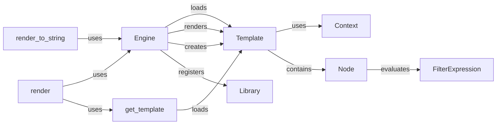

## Component Details

The Django template engine is responsible for transforming data into presentable HTML or other text-based formats. It involves loading templates, compiling them into a renderable format, providing a context (data) for rendering, and then producing the final output. The core components work together to provide a flexible and extensible system for generating dynamic content.

### Engine
The Engine class is the central component for managing and rendering templates. It handles template loading from various sources, template compilation, and rendering with a given context. It also manages the template cache, improving performance by storing compiled templates for reuse.
- **Related Classes/Methods**: `django.template.engine.Engine`, `django.template.engine.Engine:get_template`, `django.template.engine.Engine:render_to_string`

### Template
Represents a compiled template. It holds the parsed template structure (nodes) and provides a `render` method to generate the final output by combining the template with a context. The template is compiled once and can be rendered multiple times with different contexts.
- **Related Classes/Methods**: `django.template.base.Template`, `django.template.base.Template:render`

### Context
The `Context` class holds the variables available within a template. It's a dictionary-like object that provides a way to pass data to the template during rendering. It also handles context processors, which add additional variables to the context.
- **Related Classes/Methods**: `django.template.context.Context`

### get_template
Responsible for loading a template from the available template loaders based on its name. It abstracts the process of finding and reading template files from different locations (e.g., file system, database).
- **Related Classes/Methods**: `django.template.loader:get_template`

### render_to_string
A utility function that combines template loading and rendering into a single step. It loads a template, renders it with a given context, and returns the rendered content as a string. This is useful for generating HTML fragments or emails.
- **Related Classes/Methods**: `django.template.loader:render_to_string`

### Node
Base class for all template nodes. Template parsing creates a tree of Node objects. The render method of each node is called during template rendering. Nodes represent elements within the template structure, such as variables, tags, and filters.
- **Related Classes/Methods**: `django.template.base.Node`

### FilterExpression
Represents a filter expression in a template. It parses the filter expression and applies the filters to the variable during rendering. Filter expressions allow for modifying variable values within the template.
- **Related Classes/Methods**: `django.template.base.FilterExpression`

### Library
A class that stores template tags and filters. Template libraries are used to register custom tags and filters for use in templates, extending the template language with custom functionality.
- **Related Classes/Methods**: `django.template.library.Library`

### render
A high-level function that simplifies the process of rendering a template with a context and returning an HTTP response. It encapsulates the calls to template loading, context processing, and response creation.
- **Related Classes/Methods**: `django.shortcuts.render`
