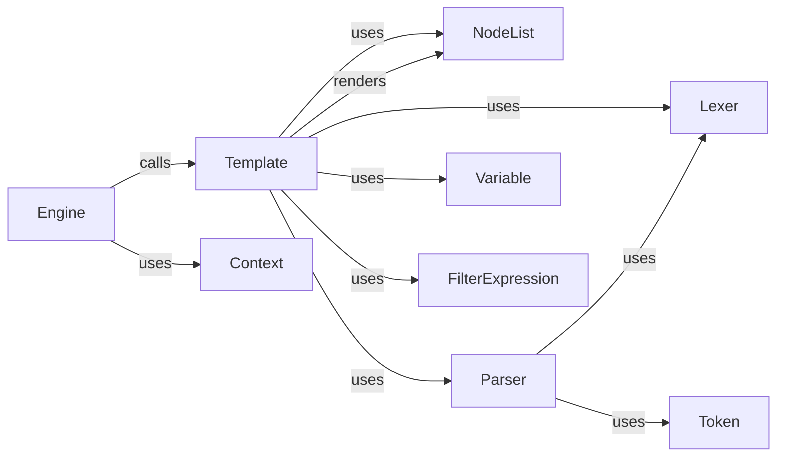

## Component Details

### Engine
The Engine is the central component responsible for managing the template loading, compilation, and rendering processes. It interacts with the template backends to load templates from various sources, compiles them into a usable format, and renders them with a given context. The Engine orchestrates the entire template rendering workflow.
- **Related Classes/Methods**: `django.template.engine:Engine`

### Template
The Template component represents a compiled template, ready for rendering. It encapsulates the parsed template content and provides methods for rendering it with a specific context. The Template uses NodeList, Lexer, and Parser internally to process the template source and generate the final output.
- **Related Classes/Methods**: `django.template.base:Template`

### Context
The Context component provides the data and environment for rendering templates. It holds variables, settings, and other information that are accessible within the template during rendering. The Engine uses the Context to pass data to the Template for rendering.
- **Related Classes/Methods**: `django.template.context:Context`, `django.template.context:BaseContext`, `django.template.context:RenderContext`

### NodeList
The NodeList component represents a sequence of template nodes. It is the compiled representation of the template content, consisting of various nodes such as text nodes, variable nodes, and tag nodes. The Template renders the NodeList to generate the final output.
- **Related Classes/Methods**: `django.template.base:NodeList`

### Lexer
The Lexer component is responsible for tokenizing the template source code. It breaks down the template source into a stream of tokens, which are then used by the Parser to build the template's node list. The Lexer identifies different types of tokens, such as variables, tags, and literals.
- **Related Classes/Methods**: `django.template.base:Lexer`, `django.template.base:DebugLexer`

### Parser
The Parser component takes the tokens generated by the Lexer and builds the template's node list. It interprets the tokens and creates a hierarchical representation of the template content, consisting of various nodes. The Parser uses the Lexer to generate tokens and constructs the NodeList.
- **Related Classes/Methods**: `django.template.base:Parser`

### Variable
The Variable component represents a template variable. It is used to resolve variables within the template context during rendering. The Variable retrieves the value of a variable from the Context and inserts it into the rendered output.
- **Related Classes/Methods**: `django.template.base:Variable`

### Token
The Token component represents a single token in the template language. It is generated by the Lexer and used by the Parser to build the template's node list. Tokens can represent various elements of the template language, such as variables, tags, and literals.
- **Related Classes/Methods**: `django.template.base:Token`

### FilterExpression
The FilterExpression component represents a filter expression in the template language. It is used to apply filters to variables during rendering. The FilterExpression takes a variable and a filter function and applies the filter to the variable's value.
- **Related Classes/Methods**: `django.template.base:FilterExpression`
