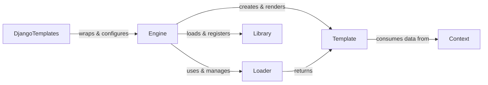

## Component Details

Overview of abstract components in a template system, detailing their roles and interrelationships.

### Engine
The `Engine` class is the central orchestrator of the template system. It manages the configuration, including template loaders, built-in tags and filters, and custom template libraries. It provides the primary API for loading, compiling, and rendering templates. It's the entry point for interacting with the template system.

**Related Classes/Methods**:

- <a href="https://github.com/django/django/blob/master/django/template/engine.py#L12-L213" target="_blank" rel="noopener noreferrer">`django.template.engine.Engine` (12:213)</a>

### Template
A `Template` object represents a compiled template. Once the raw template content is parsed, it's transformed into a `Template` object, which can then be efficiently rendered multiple times with different context data. It handles the actual rendering process by traversing its internal node list.

**Related Classes/Methods**:

- <a href="https://github.com/django/django/blob/master/django/utils/translation/template.py#L1-L1" target="_blank" rel="noopener noreferrer">`Template` (1:1)</a>

### Context
The `Context` is a dictionary-like object that holds the data (variables) passed to a template during the rendering process. It manages variable scope and provides mechanisms for pushing and popping data layers, allowing for hierarchical data access. `RequestContext` (a subclass) adds request-specific variables.

**Related Classes/Methods**:

- <a href="https://github.com/django/django/blob/master/django/template/context.py#L137-L172" target="_blank" rel="noopener noreferrer">`Context` (137:172)</a>

### Loader
`Loader` is an abstract base class defining the interface for template loaders. Concrete subclasses (e.g., `AppDirectoriesLoader`, `FilesystemLoader`, `CachedLoader`) implement specific strategies for locating and loading raw template content from various sources (e.g., file system, installed applications).

**Related Classes/Methods**:

- <a href="https://github.com/django/django/blob/master/django/db/migrations/loader.py#L1-L1" target="_blank" rel="noopener noreferrer">`Loader` (1:1)</a>

### Library
The `Library` class acts as a registry for template tags and filters. Both Django's built-in tags/filters and custom ones (defined by developers) are registered with a `Library` instance, making them available for use within templates. It provides methods for registering different types of tags and filters.

**Related Classes/Methods**:

- <a href="https://github.com/django/django/blob/master/django/template/library.py#L15-L287" target="_blank" rel="noopener noreferrer">`Library` (15:287)</a>

### DjangoTemplates
This class acts as a standardized wrapper around the `Engine` for Django's multi-backend template system. It integrates the `Engine` with Django's `TEMPLATES` settings, allowing different template engines (like Jinja2) to be used interchangeably. It's the primary interface for Django applications to interact with the Django template engine.

**Related Classes/Methods**:

- `DjangoTemplates` (1:1)

### [FAQ](https://github.com/CodeBoarding/GeneratedOnBoardings/tree/main?tab=readme-ov-file#faq)