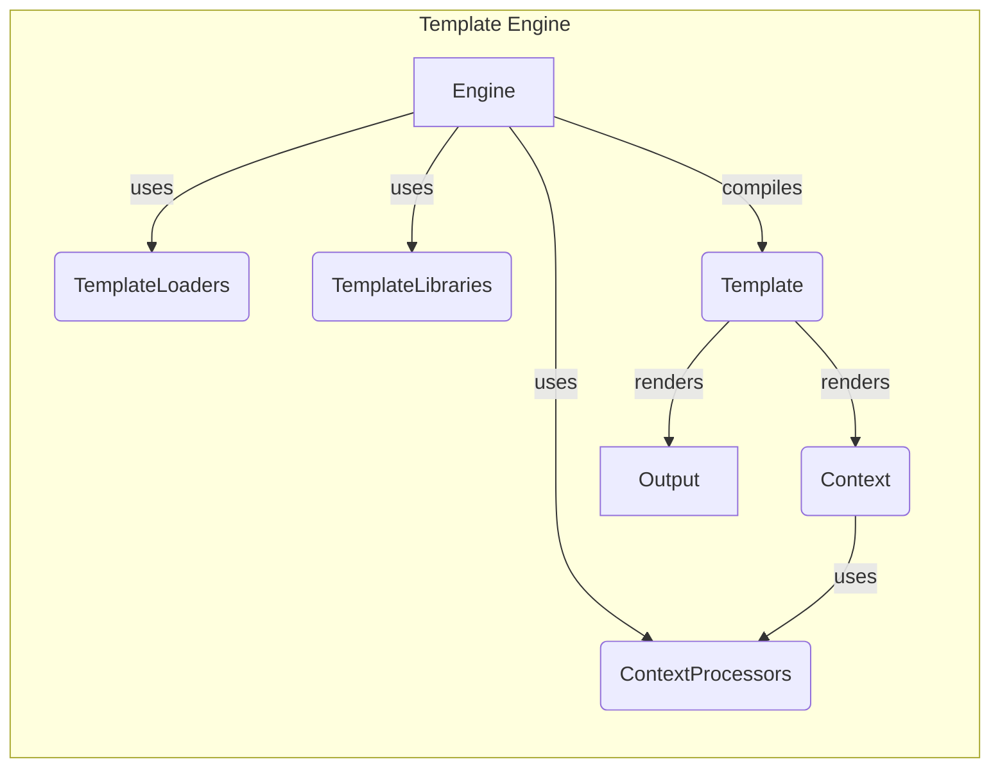

## Template Engine Overview

This diagram illustrates the flow of template rendering in Django's template engine.

### Component Descriptions:

*   **Engine:** The central component that manages template loading, compilation, and rendering. It orchestrates the interaction between template loaders, context processors, and compiled templates. It uses `TemplateLoaders` to find templates, `ContextProcessors` to prepare the context, and compiles the template source into a `Template` object. The `Engine` class is responsible for configuring the template environment.
    *   Relevant source files: `django.template.engine.Engine`

*   **TemplateLoaders:** Responsible for locating and retrieving template files from various sources, such as the filesystem or installed applications. It provides an abstraction layer for accessing templates, allowing the engine to load templates from different locations without being concerned about the underlying storage mechanism. The `get_template` method uses these loaders to find the appropriate template.
    *   Relevant source files: `django.template.loaders`, `django.template.loaders.filesystem.Loader`, `django.template.loaders.app_directories.Loader`, `django.template.loaders.cached.Loader`

*   **ContextProcessors:** Prepare the context data that is passed to the template during rendering. They define a set of functions that add variables to the context, making them available within the template. The `Context` object uses these processors to enrich the context with request-specific or application-specific data.
    *   Relevant source files: `django.template.context_processors`, `django.template.context.Context`

*   **TemplateLibraries:** Provide a collection of template tags and filters that can be used within templates. They allow developers to extend the template language with custom functionality. The `Engine` uses these libraries during template compilation to register the available tags and filters.
    *   Relevant source files: `django.template.library`, `django.template.defaulttags`, `django.template.defaultfilters`

*   **Template:** Represents a compiled template that is ready for rendering. It takes template code and an engine, compiles the code, and provides a render method to generate the final output with a given context. The `Template` object uses the `Context` to resolve variables and render the template.
    *   Relevant source files: `django.template.base.Template`

*   **Context:** A dictionary-like object that holds the variables and data available to the template during rendering. It provides a way to pass data from the application logic to the template. The `Template` object renders itself using the `Context`.
    *   Relevant source files: `django.template.context.Context`

*   **Output:** The final rendered string that is sent to the client. It is the result of the template engine processing the template with the given context.
