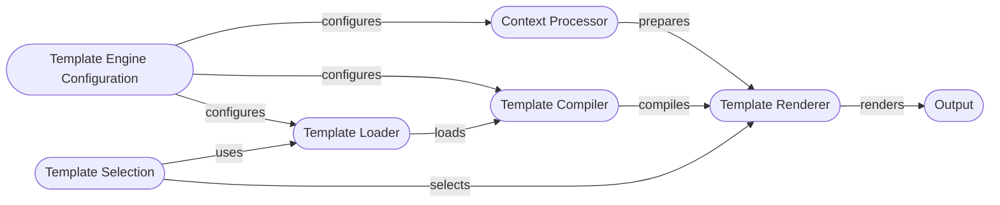

## Template Engine Overview

This diagram illustrates the flow of the Django Template Engine, highlighting the key components and their interactions.

### Component Descriptions:

*   **Template Engine Configuration**:
    *Description*: Configures the template engine with settings like template directories, context processors, loaders, and built-in template tags and filters. It initializes the engine with the specified settings.
    *Interaction*: Configures the `Template Loader`, `Context Processor`, and `Template Compiler` with the necessary settings.
    *Relevant source files*: `django.template.engine.Engine.__init__`, `django.template.engine.Engine.get_template_builtins`, `django.template.engine.Engine.get_template_libraries`

*   **Template Loader**:
    *Description*: Responsible for locating and loading template files from various sources (filesystem, apps, etc.).
    *Interaction*: Receives configuration from `Template Engine Configuration` and provides template code to the `Template Compiler`.
    *Relevant source files*: `django.template.loaders.base.Loader`, `django.template.loaders.cached.Loader`, `django.template.engine.Engine.get_template_loaders`, `django.template.engine.Engine.find_template_loader`, `django.template.engine.Engine.find_template`

*   **Template Compiler**:
    *Description*: Compiles template code into a renderable Template object.
    *Interaction*: Receives template code from the `Template Loader` and creates a `Template` object that is used by the `Template Renderer`.
    *Relevant source files*: `django.template.base.Template`, `django.template.engine.Engine.from_string`, `django.template.engine.Engine.get_template`

*   **Context Processor**:
    *Description*: Prepares the context data that will be available to the template during rendering. Adds variables to the context.
    *Interaction*: Receives configuration from `Template Engine Configuration` and provides context data to the `Template Renderer`.
    *Relevant source files*: `django.template.context.Context`, `django.template.engine.Engine.template_context_processors`

*   **Template Renderer**:
    *Description*: Renders the template with the provided context and returns the final output.
    *Interaction*: Receives the compiled template from `Template Compiler`, context data from `Context Processor`, and renders the final output.
    *Relevant source files*: `django.template.base.Template.render`, `django.template.engine.Engine.render_to_string`

*   **Template Selection**:
    *Description*: Selects the appropriate template from a list of template names.
    *Interaction*: Uses the `Template Loader` to find the template. Passes the selected template to the `Template Renderer`.
    *Relevant source files*: `django.template.engine.Engine.select_template`
