## Template Engine Component Overview

This document provides a high-level overview of the Django Template Engine component, its structure, and its functionality. The template engine is responsible for processing templates and rendering dynamic content.

### Data Flow Diagram

```mermaid
graph LR
    Source[Source Template] --> Lexer[Lexer: django.template.base.Lexer] 
    Lexer -- Tokenizes --> Parser[Parser: django.template.base.Parser]
    Parser -- Parses --> NodeList[NodeList: django.template.base.NodeList]
    NodeList -- Contains --> TextNode[TextNode: django.template.base.TextNode]
    NodeList -- Contains --> VariableNode[VariableNode: django.template.base.VariableNode]
    VariableNode -- Resolves --> FilterExpression[FilterExpression: django.template.base.FilterExpression]
    FilterExpression -- Resolves --> Variable[Variable: django.template.base.Variable]
    Variable -- Resolves --> Context[Context: django.template.context.Context]
    Context -- Provides --> Template[Template: django.template.base.Template]
    Template -- Uses --> Engine[Engine: django.template.engine.Engine]
    Engine -- Configures --> Lexer
    Engine -- Configures --> Parser
    Template -- Renders --> Output[Rendered Output]




```

### Component Descriptions

**1. Source Template**
   - *Description*: The initial template string containing markup, variables, and template tags.
   - *Interaction*: Provides the raw template content to the Lexer.
   - *Source File*: N/A (Input)

**2. Lexer: `django.template.base.Lexer`**
   - *Description*: Tokenizes the template string into a stream of tokens, distinguishing between text, variables, and block tags.
   - *Interaction*: Receives the template string from the Source Template and sends tokens to the Parser.
   - *Source File*: `django/template/base.py`

**3. Parser: `django.template.base.Parser`**
   - *Description*: Parses the tokens and compiles them into a nodelist, managing template tags, filters, and custom libraries.
   - *Interaction*: Receives tokens from the Lexer and creates a NodeList.
   - *Source File*: `django/template/base.py`

**4. NodeList: `django.template.base.NodeList`**
   - *Description*: A list of template nodes representing the parsed structure of the template.
   - *Interaction*: Contains various nodes (TextNode, VariableNode) and is rendered by the Template.
   - *Source File*: `django/template/base.py`

**5. TextNode: `django.template.base.TextNode`**
   - *Description*: Represents a plain text node in the template.
   - *Interaction*: Returns the text when rendered.
   - *Source File*: `django/template/base.py`

**6. VariableNode: `django.template.base.VariableNode`**
   - *Description*: Represents a variable node in the template, resolving the variable against the context and rendering the result.
   - *Interaction*: Resolves variables using FilterExpression and renders the output.
   - *Source File*: `django/template/base.py`

**7. FilterExpression: `django.template.base.FilterExpression`**
   - *Description*: Parses a variable token and its optional filters, resolving the variable and applying the filters to the resolved value.
   - *Interaction*: Resolves variables and applies filters using Variable and registered filters.
   - *Source File*: `django/template/base.py`

**8. Variable: `django.template.base.Variable`**
   - *Description*: Represents a template variable to be resolved against a given context, handling variable lookups and translation.
   - *Interaction*: Resolves variable values from the Context.
   - *Source File*: `django/template/base.py`

**9. Context: `django.template.context.Context`**
   - *Description*: A dictionary-like object holding variables to be passed to the template during rendering, managing auto-escaping, localization, and time zone settings.
   - *Interaction*: Provides variable values to the Variable and is used during rendering.
   - *Source File*: `django/template/context.py`

**10. Template: `django.template.base.Template`**
    - *Description*: Represents a compiled template, holding the template string, origin, and compiled nodelist. It provides the render method to generate output based on a given context.
    - *Interaction*: Uses the Engine to compile the template and renders the NodeList with a given Context.
    - *Source File*: `django/template/base.py`

**11. Engine: `django.template.engine.Engine`**
    - *Description*: The core component responsible for managing the template compilation and rendering process. It configures template loaders, context processors, and built-in template libraries.
    - *Interaction*: Configures the Lexer and Parser, loads templates, and renders them.
    - *Source File*: `django/template/engine.py`

**12. Rendered Output**
    - *Description*: The final output string generated by rendering the template with the context.
    - *Interaction*: The end result of the template rendering process.
    - *Source File*: N/A (Output)
