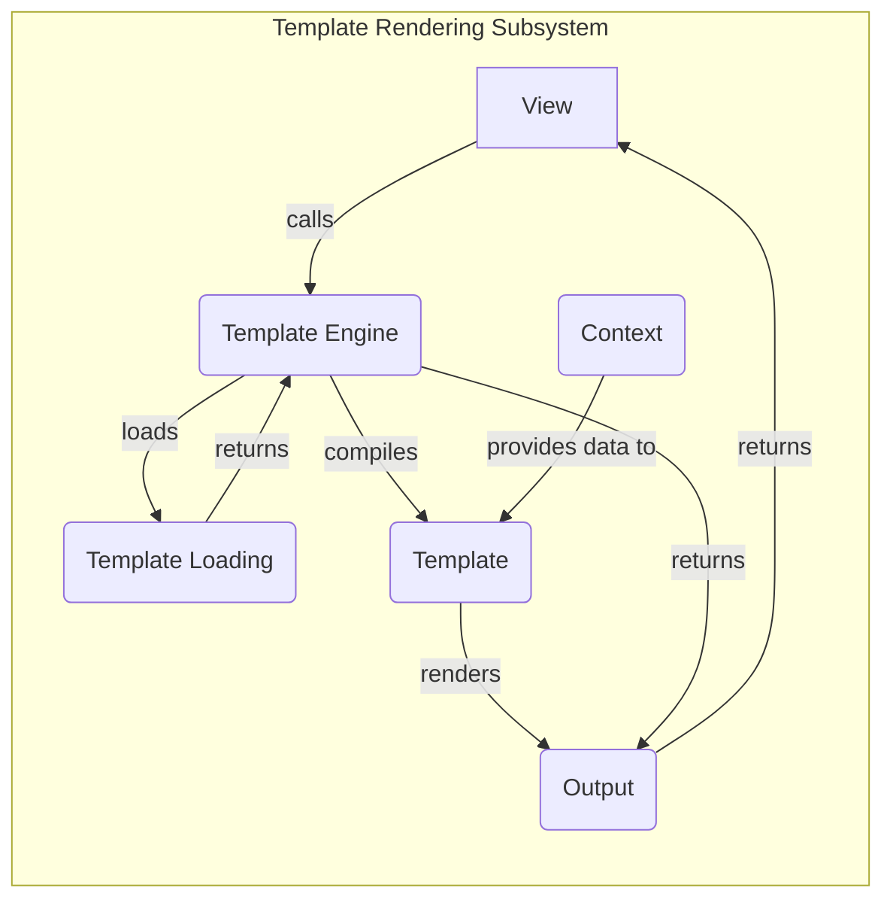

**Component Descriptions:**

*   **View:**
    *   Description: The view receives the request and prepares the data to be displayed. It then calls the Template Engine to render the template with the provided data.
    *   Interaction: Calls the Template Engine to render a template.
    *   Relevant source files: `django.shortcuts:render`

*   **Template Engine:**
    *   Description: Manages template loading, compilation, and rendering. It selects the appropriate template backend and uses it to load and compile the template. It then combines the compiled template with the context to produce the final output.
    *   Interaction: Loads templates from Template Loading, compiles them into Template objects, and renders them using a Context.
    *   Relevant source files: `django.template.engine.Engine`, `django.template.engine.Engine:get_template`, `django.template.engine.Engine:select_template`, `django.template.engine.Engine:from_string`

*   **Template Loading:**
    *   Description: Locates and retrieves templates from various sources, such as the filesystem or a database. It uses template loaders to find the template based on its name.
    *   Interaction: Receives template names from the Template Engine and returns Template objects.
    *   Relevant source files: `django.template.loader:get_template`, `django.template.loader:select_template`

*   **Template:**
    *   Description: Represents a compiled template. It holds the parsed template structure and provides a render method to generate the output by combining the template with a context.
    *   Interaction: Receives a Context and renders the template to produce output.
    *   Relevant source files: `django.template.base.Template`, `django.template.base.Template:_render`

*   **Context:**
    *   Description: Provides the data (variables) that are used to render a template. It acts as a dictionary-like object that maps variable names to their values, making them accessible within the template.
    *   Interaction: Provides data to the Template for rendering.
    *   Relevant source files: `django.template.context.Context`, `django.template.context.Context:__init__`, `django.template.context.Context:update`

*   **Output:**
    *   Description: The final rendered output, which is then returned to the view to be sent as a response.
    *   Interaction: Returned to the View.
    *   Relevant source files: N/A
