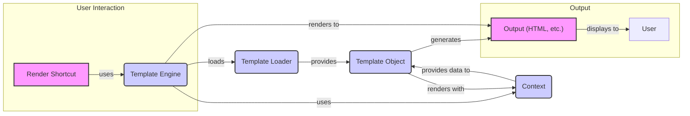

### Component Descriptions:

*   **Render Shortcut:** Combines template loading, context processing, and rendering into a single function for ease of use. It simplifies the process of rendering templates for common use cases.
    *   Relevant source file: `django.shortcuts.render`

*   **Template Engine:** The central component that manages template loading, compilation, and rendering. It orchestrates the interaction between the loader, compiler, and context to produce the final output.
    *   Relevant source file: `django.template.engine.Engine`

*   **Template Loader:** Responsible for finding and loading templates from various sources (e.g., file system, database). It provides the Template Engine with the compiled Template Object.
    *   Relevant source file: `django.template.loader.get_template`

*   **Template Object:** Represents a compiled template. It holds the parsed template structure and provides the render method to generate output, using data from the Context.
    *   Relevant source file: `django.template.base.Template`

*   **Context:** A dictionary-like object that provides the data to the template during rendering. It can contain variables, objects, and functions, making data accessible within the template.
    *   Relevant source file: `django.template.context.Context`

*   **Output (HTML, etc.):** The final rendered output, typically HTML, which is then displayed to the user.
