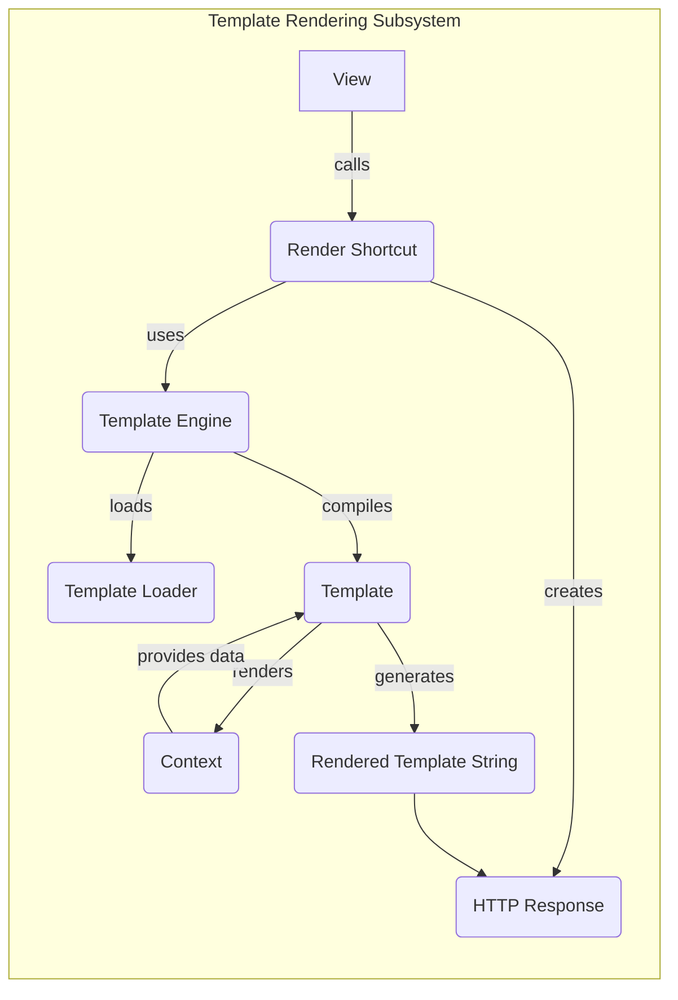

## Component Descriptions:

**View:**
*   Purpose: Receives HTTP requests and orchestrates the rendering of templates to generate responses.
*   Functionality: Processes user requests, retrieves data, and calls the `Render Shortcut` to render the appropriate template.
*   Interaction: Initiates the template rendering process by calling the `Render Shortcut`.
*   Relevant source files: `django.views`

**Render Shortcut:**
*   Purpose: Simplifies the process of rendering templates within views.
*   Functionality: Takes a template name and context data, uses the `Template Engine` to render the template, and returns an `HTTP Response`.
*   Interaction: Receives calls from views, uses the `Template Engine`, and creates an `HTTP Response`.
*   Relevant source files: `django.shortcuts.render`

**Template Engine:**
*   Purpose: Loads, compiles, and renders templates.
*   Functionality: Manages template caching, provides access to template sources via `Template Loader`, compiles templates into `Template` objects, and renders templates with a given `Context`.
*   Interaction: Receives requests from `Render Shortcut`, uses `Template Loader` to load templates, creates `Template` objects, and interacts with `Context` during rendering.
*   Relevant source files: `django.template.engine.Engine`

**Template Loader:**
*   Purpose: Locates and loads template files from various sources.
*   Functionality: Provides a consistent interface for accessing templates from different locations (e.g., file system, database).
*   Interaction: Used by the `Template Engine` to load template files.
*   Relevant source files: `django.template.loader`

**Template:**
*   Purpose: Represents a compiled template ready for rendering.
*   Functionality: Provides the `render` method to generate output based on a given `Context`.
*   Interaction: Created by the `Template Engine` and used to render templates with a given `Context`.
*   Relevant source files: `django.template.base.Template`

**Context:**
*   Purpose: Provides the context in which a template is rendered.
*   Functionality: Holds variables and data that are accessible within the template.
*   Interaction: Used by the `Template` during rendering to access data.
*   Relevant source files: `django.template.context.Context`

**Rendered Template String:**
*   Purpose: The final string output after the template has been rendered with the context.
*   Functionality: Contains the combined template and data, ready to be sent as part of an HTTP response.
*   Interaction: Output of the `Template` rendering process, input for the `HTTP Response`.
*   Relevant source files: N/A (string object)

**HTTP Response:**
*   Purpose: Encapsulates an HTTP response, which is returned to the client.
*   Functionality: Contains the rendered template output as content.
*   Interaction: Created by the `Render Shortcut` and contains the rendered template string.
*   Relevant source files: `django.http.response.HttpResponse`