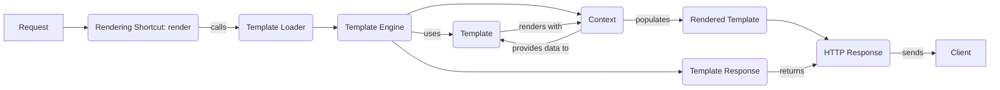

## Template Rendering Overview

This diagram illustrates the flow of template rendering in Django, starting from a request and ending with an HTTP response containing the rendered content.

## Components

Here's a breakdown of each component in the diagram:
