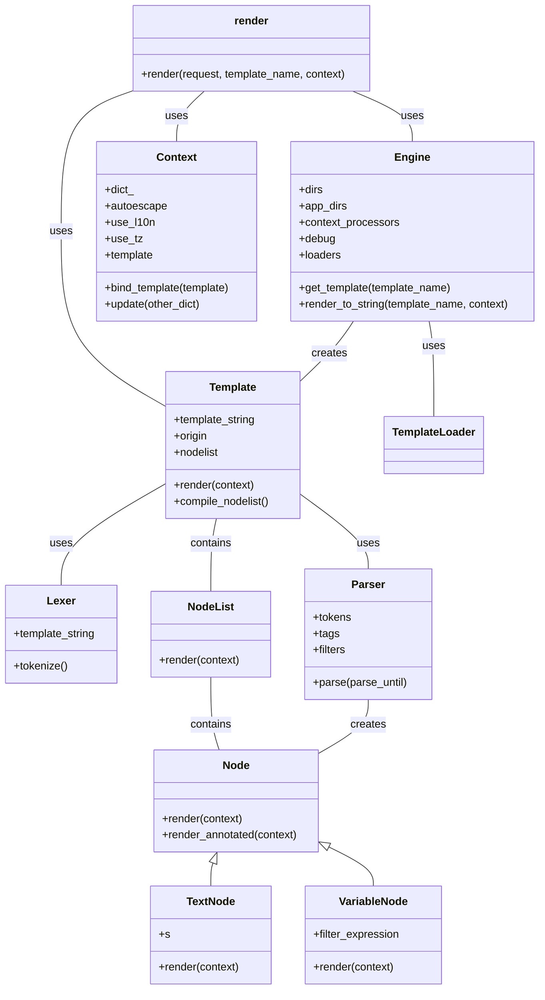

Okay, I have examined the source code of the core template rendering components in Django. Here's a breakdown of the component, its structure, and a visualization using Mermaid.

**Component Description: Django Template Rendering**

The Django template rendering component is responsible for transforming templates (usually HTML with embedded logic) into dynamic HTML output. It involves loading templates, providing a context (data) for the template, and then processing the template to generate the final output.

**Key Classes and Their Purposes:**

*   **`django.shortcuts.render`**: A convenience function that combines template loading, context creation, and response generation into a single step. It takes a request, template name, and context as input and returns an `HttpResponse` object.
*   **`django.template.engine.Engine`**: The central class responsible for managing templates. It configures template loaders, context processors, and settings like debug mode and auto-escaping. It provides methods for finding, compiling, and rendering templates.
*   **`django.template.base.Template`**: Represents a compiled template. It takes the template source (string) and compiles it into a node list. The `render()` method then uses a context to produce the final output.
*   **`django.template.context.Context`**: Holds the data that is available to the template during rendering. It's a dictionary-like object that provides variable values to the template. It also manages settings like auto-escaping and localization.
*   **`django.template.Lexer`**: Tokenizes the template source code.
*   **`django.template.Parser`**: Parses the tokens and builds a nodelist.
*   **`django.template.Node`**: Base class for nodes in the template's abstract syntax tree. Subclasses handle different types of content (text, variables, logic).
*   **`django.template.NodeList`**: A list of `Node` objects.

**Main Flow (Sequence Diagram):**

```mermaid
sequenceDiagram
    participant View
    participant render()
    participant Engine
    participant TemplateLoader
    participant Template
    participant Context
    participant NodeList
    View->>render() : request, template_name, context
    render() ->> Engine : engine = Engine.get_default()
    render() ->> Engine : template = engine.get_template(template_name)
    Engine->>TemplateLoader : template, origin = find_template(template_name)
    TemplateLoader-->>Engine : template, origin
    Engine->>Template : template = Template(template, origin, template_name, engine)
    render() ->> Context : context = Context(context, autoescape=engine.autoescape)
    render() ->> Template : content = template.render(context)
    Template->>NodeList : nodelist.render(context)
    NodeList->>Node : node.render_annotated(context)
    Node-->>NodeList : rendered_node
    NodeList-->>Template : content
    Template-->>render() : content
    render() ->> View : HttpResponse(content)
```

**Component Structure (Class Diagram):**

