```mermaid
graph LR
    django_template_engine_Engine["django.template.engine.Engine"]
    django_template_base_Template["django.template.base.Template"]
    django_template_context_Context["django.template.context.Context"]
    django_template_loader["django.template.loader"]
    django_template_loaders_filesystem_Loader["django.template.loaders.filesystem.Loader"]
    django_template_loaders_app_directories_Loader["django.template.loaders.app_directories.Loader"]
    django_template_backends_django_DjangoTemplates["django.template.backends.django.DjangoTemplates"]
    django_template_defaulttags["django.template.defaulttags"]
    django_template_defaultfilters["django.template.defaultfilters"]
    django_template_base_Node["django.template.base.Node"]
    django_template_engine_Engine -- "configures" --> django_template_loaders_filesystem_Loader
    django_template_engine_Engine -- "configures" --> django_template_loaders_app_directories_Loader
    django_template_engine_Engine -- "loads" --> django_template_defaulttags
    django_template_engine_Engine -- "loads" --> django_template_defaultfilters
    django_template_engine_Engine -- "compiles to" --> django_template_base_Template
    django_template_engine_Engine -- "uses" --> django_template_context_Context
    django_template_base_Template -- "is compiled by" --> django_template_engine_Engine
    django_template_base_Template -- "renders with" --> django_template_context_Context
    django_template_base_Template -- "composed of" --> django_template_base_Node
    django_template_context_Context -- "provides data to" --> django_template_base_Template
    django_template_context_Context -- "is used by" --> django_template_engine_Engine
    django_template_loader -- "uses" --> django_template_engine_Engine
    django_template_loader -- "returns" --> django_template_base_Template
    django_template_loaders_filesystem_Loader -- "is configured by" --> django_template_engine_Engine
    django_template_loaders_filesystem_Loader -- "finds templates for" --> django_template_engine_Engine
    django_template_loaders_app_directories_Loader -- "is configured by" --> django_template_engine_Engine
    django_template_loaders_app_directories_Loader -- "finds templates for" --> django_template_engine_Engine
    django_template_backends_django_DjangoTemplates -- "wraps" --> django_template_engine_Engine
    django_template_backends_django_DjangoTemplates -- "provides interface for" --> django_template_loader
    django_template_defaulttags -- "are loaded by" --> django_template_engine_Engine
    django_template_defaulttags -- "define behavior of" --> django_template_base_Node
    django_template_defaultfilters -- "are loaded by" --> django_template_engine_Engine
    django_template_defaultfilters -- "are applied to data in" --> django_template_context_Context
    django_template_base_Node -- "composes" --> django_template_base_Template
    django_template_base_Node -- "renders using" --> django_template_context_Context
```

## Component Details

The Django Template System is a robust and extensible component responsible for rendering dynamic content by combining template files with data. It enforces a clear separation between presentation and business logic, facilitating maintainable and scalable user interfaces.

### django.template.engine.Engine
The core of the templating system. It is responsible for loading, compiling, and rendering templates. It orchestrates the entire template processing by managing loaders, built-in tags, and filters. It's fundamental because all template operations ultimately flow through an `Engine` instance.

**Related Classes/Methods**:

- <a href="https://github.com/django/django/blob/master/django/template/engine.py#L12-L213" target="_blank" rel="noopener noreferrer">`django.template.engine.Engine` (12:213)</a>

### django.template.base.Template
Represents a compiled template. Once a template file or string is parsed, it becomes a `Template` object, which holds the internal structure (nodelist) and provides the `render` method to produce the final output. It's fundamental as it's the direct object that gets rendered.

**Related Classes/Methods**:

- <a href="https://github.com/django/django/blob/master/django/template/base.py#L1-L1" target="_blank" rel="noopener noreferrer">`django.template.base.Template` (1:1)</a>

### django.template.context.Context
Manages the data (variables) that are passed to the template during the rendering process. It acts as a stack-like container, allowing for variable scoping and resolution. It's fundamental because templates are useless without dynamic data to render.

**Related Classes/Methods**:

- <a href="https://github.com/django/django/blob/master/django/template/context.py#L137-L172" target="_blank" rel="noopener noreferrer">`django.template.context.Context` (137:172)</a>

### django.template.loader
Provides high-level functions like `render_to_string` and `get_template`, which serve as the primary interface for developers to load and render templates. It abstracts the underlying engine and loader mechanisms. It's fundamental as it's the common entry point for template operations.

**Related Classes/Methods**:

- <a href="https://github.com/django/django/blob/master/django/template/loader.py#L1-L1" target="_blank" rel="noopener noreferrer">`django.template.loader` (1:1)</a>

### django.template.loaders.filesystem.Loader
A concrete template loader that discovers and loads templates from specified directories on the file system. It's a crucial component for locating template files based on configured paths. It's fundamental because it's one of the most common ways templates are located.

**Related Classes/Methods**:

- <a href="https://github.com/django/django/blob/master/django/template/loaders/filesystem.py#L1-L1" target="_blank" rel="noopener noreferrer">`django.template.loaders.filesystem.Loader` (1:1)</a>

### django.template.loaders.app_directories.Loader
Another concrete template loader that finds templates within the `templates` subdirectory of installed Django applications. This promotes modularity by allowing applications to ship with their own templates. It's fundamental for modular template organization within Django apps.

**Related Classes/Methods**:

- <a href="https://github.com/django/django/blob/master/django/template/loaders/app_directories.py#L1-L1" target="_blank" rel="noopener noreferrer">`django.template.loaders.app_directories.Loader` (1:1)</a>

### django.template.backends.django.DjangoTemplates
An adapter that integrates the `django.template.engine.Engine` with Django's `TEMPLATES` setting. It allows Django to manage multiple template engines (e.g., Django's default, Jinja2) and provides a consistent configuration interface. It's fundamental for configuring and using the Django template engine within a Django project.

**Related Classes/Methods**:

- <a href="https://github.com/django/django/blob/master/django/template/backends/django.py#L15-L89" target="_blank" rel="noopener noreferrer">`django.template.backends.django.DjangoTemplates` (15:89)</a>

### django.template.defaulttags
Contains Django's built-in template tags (e.g., `if`, `for`, `url`). These tags provide control flow, iteration, and other logic directly within the template language. It's fundamental because these tags are essential for creating dynamic and interactive templates.

**Related Classes/Methods**:

- <a href="https://github.com/django/django/blob/master/django/template/defaulttags.py#L1-L1" target="_blank" rel="noopener noreferrer">`django.template.defaulttags` (1:1)</a>

### django.template.defaultfilters
Contains Django's built-in template filters (e.g., `date`, `length`, `lower`). Filters are used to transform and format data within templates before it is displayed. It's fundamental for presenting data in a user-friendly way.

**Related Classes/Methods**:

- <a href="https://github.com/django/django/blob/master/django/template/defaultfilters.py#L1-L1" target="_blank" rel="noopener noreferrer">`django.template.defaultfilters` (1:1)</a>

### django.template.base.Node
The base class for all elements (tags, text, variables) in a template's parsed structure. A compiled template is essentially a tree of `Node` objects, each responsible for rendering its specific part. It's fundamental as it's the building block of the compiled template.

**Related Classes/Methods**:

- <a href="https://github.com/django/django/blob/master/django/template/base.py#L1-L1" target="_blank" rel="noopener noreferrer">`django.template.base.Node` (1:1)</a>

### [FAQ](https://github.com/CodeBoarding/GeneratedOnBoardings/tree/main?tab=readme-ov-file#faq)