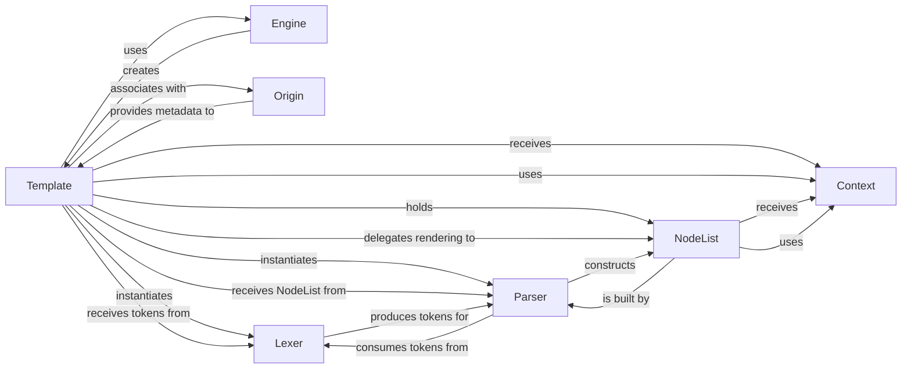

## Component Details

The `Template` component is the central orchestrator within the Django template system, responsible for the entire lifecycle of a template from its raw string form to its final rendered output. It is fundamental because it ties together the parsing, compilation, and rendering phases, acting as the primary interface for developers to interact with templates.

### Template
The core class that encapsulates a Django template. It manages the entire lifecycle from initialization and compilation to rendering. It orchestrates the parsing process by delegating to the `Lexer` and `Parser`, holds the compiled `NodeList`, and handles the final rendering by interacting with a `Context` object. It also integrates debugging capabilities.

**Related Classes/Methods**:

- <a href="https://github.com/django/django/blob/master/django/utils/translation/template.py#L1-L1" target="_blank" rel="noopener noreferrer">`Template` (1:1)</a>

### Engine
Manages the overall configuration and settings for the template system. This includes defining template directories, context processors, debug mode, and registering template libraries and built-ins. It acts as a factory for `Template` objects, providing the necessary context for their creation and behavior.

**Related Classes/Methods**:

- <a href="https://github.com/django/django/blob/master/django/template/engine.py#L12-L213" target="_blank" rel="noopener noreferrer">`Engine` (12:213)</a>

### Origin
Represents the source location of a template, such as a file path or a string. It's crucial for providing meaningful debugging information and error messages, indicating precisely where a template originated, which is invaluable during development.

**Related Classes/Methods**:

- `Origin` (1:1)

### Lexer
The tokenizer responsible for breaking down the raw template string into a stream of `Token` objects. It identifies different parts of the template, such as plain text, variable tags (`{{...}}`), and block tags (``). `DebugLexer` is a specialized subclass that also captures precise position information for enhanced debugging.

**Related Classes/Methods**:

- `Lexer` (1:1)

### Parser
Takes the stream of `Token` objects generated by the `Lexer` and constructs the `NodeList`, which serves as the Abstract Syntax Tree (AST) of the template. It interprets tokens, resolves template tags and variables, and builds the hierarchical structure of the template, handling control flow and variable evaluation logic.

**Related Classes/Methods**:

- `Parser` (1:1)

### NodeList
Represents the compiled structure of a template, essentially a list of `Node` objects. Each `Node` within the list represents a specific element of the template (e.g., plain text, a variable, a control flow tag like `if` or `for`). The `NodeList`'s `render` method is responsible for traversing these nodes and producing the final output by calling each node's `render` method sequentially.

**Related Classes/Methods**:

- `NodeList` (1:1)

### Context
A dictionary-like object that holds all the variables and data available to the template during rendering. It manages variable lookup, context processors, and the rendering state, allowing dynamic data to be injected into the template.

**Related Classes/Methods**:

- <a href="https://github.com/django/django/blob/master/django/template/context.py#L137-L172" target="_blank" rel="noopener noreferrer">`Context` (137:172)</a>

### [FAQ](https://github.com/CodeBoarding/GeneratedOnBoardings/tree/main?tab=readme-ov-file#faq)