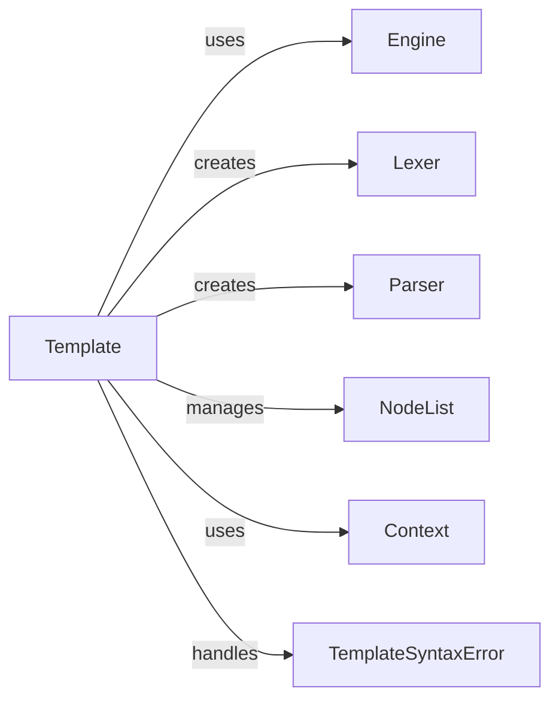

## Component Details

The `Template` component is fundamental because it serves as the central, executable unit of the Django template system. It bridges the gap between the raw template string and the rendered output. Without it, the parsed structure would not have a cohesive object to manage its rendering logic, nor would there be a direct interface for users to trigger the rendering process. It's the compiled artifact that can be reused efficiently.

### Template
The `Template` object is the core compiled representation of a Django template. It encapsulates the parsed structure as a `NodeList` and provides the `render()` method, which processes the template with a given `Context` to produce the final output. It orchestrates the initial parsing process by utilizing `Lexer` for tokenization and `Parser` for constructing its internal `NodeList`.

**Related Classes/Methods**:

- <a href="https://github.com/django/django/blob/master/django/template/base.py#L0-L0" target="_blank" rel="noopener noreferrer">`django.template.base.Template` (0:0)</a>

### [FAQ](https://github.com/CodeBoarding/GeneratedOnBoardings/tree/main?tab=readme-ov-file#faq)