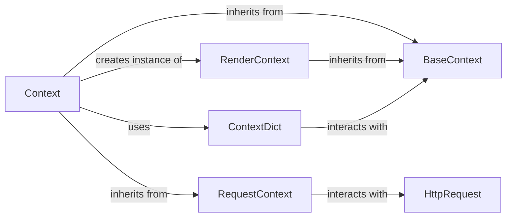

## Component Details

The Template Context subsystem in Django is responsible for managing the data available to templates during the rendering process. It employs a stack-based approach to handle variable scope, allowing for hierarchical data access and overriding.

### BaseContext
This is the foundational class (django/template/context.py, lines 28-135). It implements the core logic for managing a stack of dictionaries (self.dicts). Variables are looked up by searching this stack from the most recently added dictionary downwards. It provides methods for pushing new dictionaries onto the stack (push), popping them (pop), and accessing/modifying variables (__getitem__, __setitem__, get, set_upward). This class is fundamental as it establishes the hierarchical variable lookup mechanism, enabling variable shadowing and context isolation.

**Related Classes/Methods**:

- <a href="https://github.com/django/django/blob/master/django/template/context.py#L27-L134" target="_blank" rel="noopener noreferrer">`django.template.context.BaseContext` (27:134)</a>

### Context
Extending BaseContext (django/template/context.py, lines 138-173), Context is the standard context object used for rendering templates. It initializes with template-specific settings like autoescape, use_l10n, and use_tz. Crucially, it creates and manages an instance of RenderContext to handle rendering-specific state. It also provides a bind_template context manager to associate the context with a specific template during rendering. This class is fundamental as it's the primary interface for the template engine to access data and manage rendering state.

**Related Classes/Methods**:

- <a href="https://github.com/django/django/blob/master/django/template/context.py#L137-L172" target="_blank" rel="noopener noreferrer">`django.template.context.Context` (137:172)</a>

### RequestContext
A specialized subclass of Context (django/template/context.py, lines 220-283), RequestContext automatically populates itself with request-specific variables. It achieves this by executing context processors (functions that take an HttpRequest object and return a dictionary of variables) defined in the template engine's settings or provided explicitly. This ensures that common variables like request, user, and csrf_token are readily available in templates without explicit passing from every view. This class is fundamental for web applications, streamlining the integration of HTTP request data into templates.

**Related Classes/Methods**:

- <a href="https://github.com/django/django/blob/master/django/template/context.py#L219-L282" target="_blank" rel="noopener noreferrer">`django.template.context.RequestContext` (219:282)</a>

### RenderContext
Inheriting from BaseContext (django/template/context.py, lines 176-217), RenderContext is designed to manage the rendering state of a template, rather than the data itself. It provides a safe, isolated place to store state between invocations of template node rendering methods. Its push_state context manager creates temporary, isolated scopes for template-local variables, preventing unintended variable leakage or conflicts during complex rendering operations like template inheritance. This class is fundamental for ensuring the correct and predictable flow of template rendering.

**Related Classes/Methods**:

- <a href="https://github.com/django/django/blob/master/django/template/context.py#L175-L216" target="_blank" rel="noopener noreferrer">`django.template.context.RenderContext` (175:216)</a>

### ContextDict
This is a helper class (django/template/context.py, lines 14-25) that wraps a standard Python dictionary and functions as a context manager. When instantiated, it appends itself to the context.dicts stack of the associated Context object. Its __exit__ method ensures that the wrapped dictionary is automatically popped from the stack when exiting a with block. This class is fundamental for managing the lifecycle of temporary context additions, ensuring that variables are correctly scoped and removed, thus preventing unintended side effects and promoting cleaner context management.

**Related Classes/Methods**:

- <a href="https://github.com/django/django/blob/master/django/template/context.py#L13-L24" target="_blank" rel="noopener noreferrer">`django.template.context.ContextDict` (13:24)</a>

### [FAQ](https://github.com/CodeBoarding/GeneratedOnBoardings/tree/main?tab=readme-ov-file#faq)