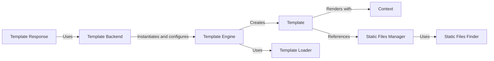

## Details

This analysis breaks down the Template Engine subsystem into its core components. Each component's purpose and key interactions are explained, providing a clear picture of how this part of the Django framework operates.

### Template Engine [[Expand]](./Template_Engine.md)
The central orchestrator of the template system. The Engine class is responsible for managing the configuration of the template system, including template directories, context processors, and template loaders. It provides the main API for loading and rendering templates.

**Related Classes/Methods**:

- <a href="https://github.com/django/django/blob/main/django/template/engine.py#L1-L1" target="_blank" rel="noopener noreferrer">`django/template/engine.py` (1:1)</a>

### Template
A compiled representation of a template file. The Template class takes the raw template code, parses it into a node tree, and provides a render() method to execute the template with a given context.

**Related Classes/Methods**:

- <a href="https://github.com/django/django/blob/main/django/template/base.py#L1-L1" target="_blank" rel="noopener noreferrer">`django/template/base.py` (1:1)</a>

### Template Backend
The integration logic for different template engines, such as the default Django Template Language (DTL) and Jinja2.

**Related Classes/Methods**:

- <a href="https://github.com/django/django/blob/main/django/template/backends/django.py#L1-L1" target="_blank" rel="noopener noreferrer">`django/template/backends/django.py` (1:1)</a>

### Template Loader
Responsible for locating and loading template source files from various sources, such as the filesystem or within Django apps.

**Related Classes/Methods**:

- <a href="https://github.com/django/django/blob/main/django/template/loaders/filesystem.py#L1-L1" target="_blank" rel="noopener noreferrer">`django/template/loaders/filesystem.py` (1:1)</a>
- <a href="https://github.com/django/django/blob/main/django/template/loaders/app_directories.py#L1-L1" target="_blank" rel="noopener noreferrer">`django/template/loaders/app_directories.py` (1:1)</a>

### Context
A dictionary-like object that holds the data to be injected into the template. It provides a stack-like structure for managing variable scopes.

**Related Classes/Methods**:

- <a href="https://github.com/django/django/blob/main/django/template/context.py#L1-L1" target="_blank" rel="noopener noreferrer">`django/template/context.py` (1:1)</a>

### Template Response
An HttpResponse subclass that takes a template and a context, and renders the template to produce the final HTML response.

**Related Classes/Methods**:

- <a href="https://github.com/django/django/blob/main/django/template/response.py#L1-L1" target="_blank" rel="noopener noreferrer">`django/template/response.py` (1:1)</a>

### Static Files Manager
Manages static assets like CSS, JavaScript, and images, which are typically referenced within templates. It can hash filenames for caching purposes and provides the URL for a given static file.

**Related Classes/Methods**:

- <a href="https://github.com/django/django/blob/main/django/contrib/staticfiles/storage.py#L1-L1" target="_blank" rel="noopener noreferrer">`django/contrib/staticfiles/storage.py` (1:1)</a>

### Static Files Finder
Locates static files in various locations, such as dedicated static folders in each app or in the global `STATICFILES_DIRS` setting.

**Related Classes/Methods**:

- <a href="https://github.com/django/django/blob/main/django/contrib/staticfiles/finders.py#L1-L1" target="_blank" rel="noopener noreferrer">`django/contrib/staticfiles/finders.py` (1:1)</a>

### [FAQ](https://github.com/CodeBoarding/GeneratedOnBoardings/tree/main?tab=readme-ov-file#faq)