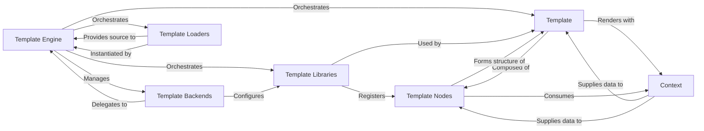

## Component Details

The Django Template Engine subsystem is a sophisticated architecture designed for efficient and flexible template processing. It orchestrates the entire lifecycle of a template, from its initial configuration and loading to its parsing, compilation, and final rendering with dynamic data.

### Template Engine
The central orchestrator for Django's template system. It is responsible for configuring template backends, managing template loaders and built-in/custom template libraries, and providing the primary interface for loading, parsing, and rendering templates. It acts as the core control flow for the entire template process.

**Related Classes/Methods**:

- <a href="https://github.com/django/django/blob/master/django/template/engine.py#L0-L0" target="_blank" rel="noopener noreferrer">`django.template.engine` (0:0)</a>

### Template Backends
Provides an abstract interface (`BaseEngine`) for different template languages and their specific loading and rendering mechanisms. `DjangoTemplates` is the concrete implementation for Django's default template language, acting as a wrapper around the core `Engine` to integrate it into Django's multi-backend system.

**Related Classes/Methods**:

- <a href="https://github.com/django/django/blob/master/django/template/backends/django.py#L0-L0" target="_blank" rel="noopener noreferrer">`django.template.backends.django.BaseEngine` (0:0)</a>
- <a href="https://github.com/django/django/blob/master/django/template/backends/django.py#L15-L89" target="_blank" rel="noopener noreferrer">`django.template.backends.django.DjangoTemplates` (15:89)</a>

### Template
Represents a compiled Django template. It holds the parsed structure (a `NodeList`) of the template and provides the `render` method to produce the final output by traversing its internal node structure with a given context. It also handles the parsing of the raw template string into nodes.

**Related Classes/Methods**:

- <a href="https://github.com/django/django/blob/master/django/template/base.py#L0-L0" target="_blank" rel="noopener noreferrer">`django.template.base.Template` (0:0)</a>
- <a href="https://github.com/django/django/blob/master/django/template/base.py#L0-L0" target="_blank" rel="noopener noreferrer">`django.template.base.NodeList` (0:0)</a>

### Context
A dictionary-like object that holds the variables and data available to a template during rendering. It manages a stack of dictionaries, allowing for variable scoping, inheritance, and the inclusion of context processors.

**Related Classes/Methods**:

- <a href="https://github.com/django/django/blob/master/django/template/context.py#L137-L172" target="_blank" rel="noopener noreferrer">`django.template.context.Context` (137:172)</a>

### Template Loaders
These components are responsible for locating and reading raw template source code from various configured sources (e.g., file system paths, installed application directories, or a cache). `BaseLoader` defines the interface, while concrete implementations like `FileSystemLoader` handle specific source types.

**Related Classes/Methods**:

- <a href="https://github.com/django/django/blob/master/django/template/loaders/base.py#L0-L0" target="_blank" rel="noopener noreferrer">`django.template.loaders.base.BaseLoader` (0:0)</a>
- <a href="https://github.com/django/django/blob/master/django/template/loaders/filesystem.py#L0-L0" target="_blank" rel="noopener noreferrer">`django.template.loaders.filesystem.FileSystemLoader` (0:0)</a>

### Template Libraries
Modules and classes (like `Library`) that define and register custom template tags and filters, extending the functionality of the Django template language. This includes both Django's built-in tags and filters, as well as user-defined extensions.

**Related Classes/Methods**:

- <a href="https://github.com/django/django/blob/master/django/template/library.py#L15-L287" target="_blank" rel="noopener noreferrer">`django.template.library.Library` (15:287)</a>

### Template Nodes
`Node` objects represent the individual elements (e.g., variables, tags, plain text) within a parsed template. A `NodeList` is a collection of `Node` objects, forming the tree structure (Abstract Syntax Tree) of a compiled template. These nodes encapsulate the specific rendering logic for each template construct.

**Related Classes/Methods**:

- <a href="https://github.com/django/django/blob/master/django/template/base.py#L0-L0" target="_blank" rel="noopener noreferrer">`django.template.base.Node` (0:0)</a>
- <a href="https://github.com/django/django/blob/master/django/template/base.py#L0-L0" target="_blank" rel="noopener noreferrer">`django.template.base.NodeList` (0:0)</a>

### [FAQ](https://github.com/CodeBoarding/GeneratedOnBoardings/tree/main?tab=readme-ov-file#faq)