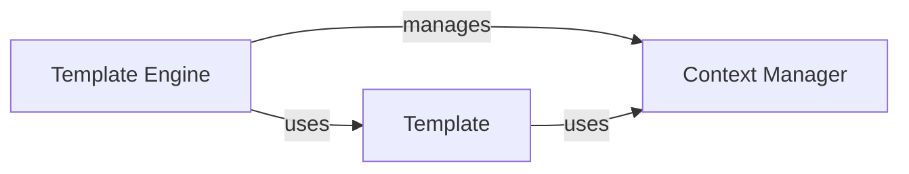

## Details

One paragraph explaining the functionality which is represented by this graph. What the main flow is and what is its purpose.

### Template Engine [[Expand]](./Template_Engine.md)
Central template engine component responsible for template configuration and rendering pipeline

**Related Classes/Methods**:

- <a href="https://github.com/django/django/blob/main/django/template/engine.py#L12-L213" target="_blank" rel="noopener noreferrer">`django.template.engine.Engine` (12:213)</a>

### Context Manager
Manages template context variables and scoping during rendering

**Related Classes/Methods**:

- <a href="https://github.com/django/django/blob/main/django/template/context.py#L140-L175" target="_blank" rel="noopener noreferrer">`django.template.context.Context` (140:175)</a>

### Template
Represents a compiled template with parsed node structure

**Related Classes/Methods**:

- <a href="https://github.com/django/django/blob/main/django/template/base.py#L30-L35" target="_blank" rel="noopener noreferrer">`django.template.base.Template` (30:35)</a>

### [FAQ](https://github.com/CodeBoarding/GeneratedOnBoardings/tree/main?tab=readme-ov-file#faq)