```mermaid
graph LR
    django_template_engine_Engine["django.template.engine.Engine"]
    django_template_base_Template["django.template.base.Template"]
    django_template_context_Context["django.template.context.Context"]
    django_template_library_Library["django.template.library.Library"]
    django_template_loaders_filesystem_Loader["django.template.loaders.filesystem.Loader"]
    django_template_base_Lexer["django.template.base.Lexer"]
    django_template_base_Parser["django.template.base.Parser"]
    django_template_base_Node["django.template.base.Node"]
    django_template_base_Token["django.template.base.Token"]
    django_template_backends_django_DjangoTemplates["django.template.backends.django.DjangoTemplates"]
    django_template_engine_Engine -- "configures and uses" --> django_template_loaders_filesystem_Loader
    django_template_engine_Engine -- "manages and compiles" --> django_template_base_Template
    django_template_engine_Engine -- "registers and loads" --> django_template_library_Library
    django_template_engine_Engine -- "creates" --> django_template_context_Context
    django_template_base_Template -- "uses" --> django_template_base_Lexer
    django_template_base_Template -- "uses" --> django_template_base_Parser
    django_template_base_Template -- "renders with" --> django_template_context_Context
    django_template_base_Template -- "contains" --> django_template_base_Node
    django_template_base_Node -- "renders using" --> django_template_context_Context
    django_template_base_Node -- "is defined by" --> django_template_library_Library
    django_template_base_Parser -- "consumes tags and filters from" --> django_template_library_Library
    django_template_loaders_filesystem_Loader -- "provides raw template content to" --> django_template_engine_Engine
    django_template_base_Lexer -- "generates" --> django_template_base_Token
    django_template_base_Parser -- "consumes" --> django_template_base_Token
    django_template_base_Parser -- "creates" --> django_template_base_Node
    django_template_backends_django_DjangoTemplates -- "initializes" --> django_template_engine_Engine
    django_template_backends_django_DjangoTemplates -- "exposes functionalities of" --> django_template_engine_Engine
    click django_template_engine_Engine href "https://github.com/CodeBoarding/GeneratedOnBoardings/blob/main//django/django_template_engine_Engine.md" "Details"
    click django_template_base_Template href "https://github.com/CodeBoarding/GeneratedOnBoardings/blob/main//django/django_template_base_Template.md" "Details"
    click django_template_context_Context href "https://github.com/CodeBoarding/GeneratedOnBoardings/blob/main//django/django_template_context_Context.md" "Details"
    click django_template_library_Library href "https://github.com/CodeBoarding/GeneratedOnBoardings/blob/main//django/django_template_library_Library.md" "Details"
    click django_template_loaders_filesystem_Loader href "https://github.com/CodeBoarding/GeneratedOnBoardings/blob/main//django/django_template_loaders_filesystem_Loader.md" "Details"
    click django_template_base_Lexer href "https://github.com/CodeBoarding/GeneratedOnBoardings/blob/main//django/django_template_base_Lexer.md" "Details"
    click django_template_base_Parser href "https://github.com/CodeBoarding/GeneratedOnBoardings/blob/main//django/django_template_base_Parser.md" "Details"
    click django_template_base_Node href "https://github.com/CodeBoarding/GeneratedOnBoardings/blob/main//django/django_template_base_Node.md" "Details"
    click django_template_base_Token href "https://github.com/CodeBoarding/GeneratedOnBoardings/blob/main//django/django_template_base_Token.md" "Details"
    click django_template_backends_django_DjangoTemplates href "https://github.com/CodeBoarding/GeneratedOnBoardings/blob/main//django/django_template_backends_django_DjangoTemplates.md" "Details"
```

## Component Details

The Django Template Engine is a crucial subsystem responsible for the presentation layer of Django applications. It facilitates the dynamic generation of HTML content by processing template files and combining them with data provided by views.

### django.template.engine.Engine
The central orchestrator of the template system. It manages configuration (loaders, built-ins, context processors), retrieves and compiles templates, and coordinates the rendering process. It acts as the primary interface for loading and rendering templates programmatically.

**Related Classes/Methods**:

- <a href="https://github.com/django/django/blob/master/django/template/engine.py#L12-L213" target="_blank" rel="noopener noreferrer">`django.template.engine.Engine` (12:213)</a>

### django.template.base.Template
Represents a compiled template. It holds the parsed structure (a `NodeList`) of the template and is responsible for the actual rendering process when given a `Context`. This object is the result of the parsing phase and is ready for execution.

**Related Classes/Methods**:

- <a href="https://github.com/django/django/blob/master/django/template/base.py#L1-L1" target="_blank" rel="noopener noreferrer">`django.template.base.Template` (1:1)</a>

### django.template.context.Context
A dictionary-like object that stores variables and data passed from views to templates. It provides a scope for template variable resolution during rendering, allowing templates to access dynamic data. `RequestContext` is a specialized subclass for web requests.

**Related Classes/Methods**:

- <a href="https://github.com/django/django/blob/master/django/template/context.py#L137-L172" target="_blank" rel="noopener noreferrer">`django.template.context.Context` (137:172)</a>

### django.template.library.Library
A registry for custom template tags and filters. Developers use this class to extend the template language with application-specific logic, making the template system highly extensible.

**Related Classes/Methods**:

- <a href="https://github.com/django/django/blob/master/django/template/library.py#L15-L287" target="_blank" rel="noopener noreferrer">`django.template.library.Library` (15:287)</a>

### django.template.loaders.filesystem.Loader
A concrete implementation of a template loader that finds template files in a predefined list of file system directories. It's representative of the various loader strategies (e.g., `app_directories.Loader`, `cached.Loader`) that abstract the process of locating template source code.

**Related Classes/Methods**:

- <a href="https://github.com/django/django/blob/master/django/template/loaders/filesystem.py#L1-L1" target="_blank" rel="noopener noreferrer">`django.template.loaders.filesystem.Loader` (1:1)</a>

### django.template.base.Lexer
Responsible for the first phase of template compilation: lexing (or tokenization). It breaks down the raw template string into a stream of `Token` objects, which are the basic building blocks for the parser.

**Related Classes/Methods**:

- <a href="https://github.com/django/django/blob/master/django/template/base.py#L1-L1" target="_blank" rel="noopener noreferrer">`django.template.base.Lexer` (1:1)</a>

### django.template.base.Parser
Performs the second phase of template compilation: parsing. It takes the stream of `Token` objects from the `Lexer` and builds a tree-like structure of `Node` objects (`NodeList`), representing the template's logical flow.

**Related Classes/Methods**:

- <a href="https://github.com/django/django/blob/master/django/template/base.py#L1-L1" target="_blank" rel="noopener noreferrer">`django.template.base.Parser` (1:1)</a>

### django.template.base.Node
The base class for all elements within a compiled template's structure. Each `Node` represents a specific part of the template (e.g., a variable, a tag, plain text) and knows how to render itself, contributing to the final output.

**Related Classes/Methods**:

- <a href="https://github.com/django/django/blob/master/django/template/base.py#L1-L1" target="_blank" rel="noopener noreferrer">`django.template.base.Node` (1:1)</a>

### django.template.base.Token
Represents a single, meaningful unit identified by the `Lexer` during the tokenization process (e.g., a variable, a tag, or plain text). These tokens are the intermediate representation between the raw template string and the parsed node structure.

**Related Classes/Methods**:

- <a href="https://github.com/django/django/blob/master/django/template/base.py#L1-L1" target="_blank" rel="noopener noreferrer">`django.template.base.Token` (1:1)</a>

### django.template.backends.django.DjangoTemplates
This class acts as the public interface for the Django template engine, configured via the `TEMPLATES` setting in Django projects. It wraps the `Engine` instance, providing a consistent API for interacting with the template system within a Django application.

**Related Classes/Methods**:

- <a href="https://github.com/django/django/blob/master/django/template/backends/django.py#L15-L89" target="_blank" rel="noopener noreferrer">`django.template.backends.django.DjangoTemplates` (15:89)</a>

### [FAQ](https://github.com/CodeBoarding/GeneratedOnBoardings/tree/main?tab=readme-ov-file#faq)