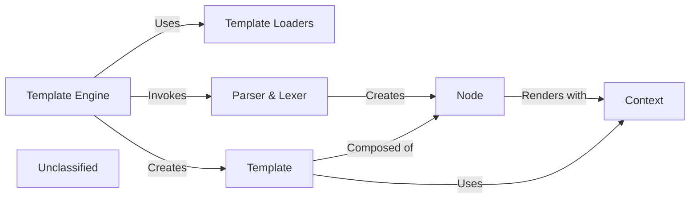

## Details

The Django template subsystem is a powerful engine for generating dynamic content. At its core, it works by parsing a template string and rendering it with a given context. The main entry point is the Engine, which is configured with a set of Template Loaders to find template files. When a template is requested, the Engine uses a Loader to retrieve the template string. This string is then passed to a Parser, which tokenizes the content and creates a tree of Node objects. This node tree is wrapped in a Template object. To render the template, the render method is called on the Template object, which in turn calls the render method on each Node in the tree, using a Context object to resolve variables.

### Template Engine [[Expand]](./Template_Engine.md)
The central orchestrator of the template system. It manages configuration and is responsible for loading and rendering templates.

**Related Classes/Methods**:

- <a href="https://github.com/django/django/blob/main/docs/conf.py" target="_blank" rel="noopener noreferrer">`Engine`</a>

### Template Loaders
Responsible for finding and loading template source code from various sources, such as the filesystem.

**Related Classes/Methods**:

- <a href="https://github.com/django/django/blob/main/django/core/management/commands/sqlmigrate.py" target="_blank" rel="noopener noreferrer">`Loader`</a>

### Parser & Lexer
This component is responsible for parsing the raw template string. It tokenizes the string and builds a node tree that represents the template's structure.

**Related Classes/Methods**:

- <a href="https://github.com/django/django/blob/main/django/templatetags/l10n.py" target="_blank" rel="noopener noreferrer">`Parser`</a>

### Template
Represents a compiled template. It holds the node tree created by the parser and has a render method to produce the final output.

**Related Classes/Methods**:

- <a href="https://github.com/django/django/blob/main/django/forms/renderers.py#L76-L77" target="_blank" rel="noopener noreferrer">`Template`:76-77</a>

### Node
A node in the template's syntax tree. Each node represents a piece of the template, such as a variable, a tag, or a block of static text.

**Related Classes/Methods**:

- <a href="https://github.com/django/django/blob/main/django/templatetags/l10n.py#L23-L36" target="_blank" rel="noopener noreferrer">`Node`:23-36</a>

### Context
A dictionary-like object that holds the data used to render the template. It provides the values for the variables in the template.

**Related Classes/Methods**:

- <a href="https://github.com/django/django/blob/main/django/templatetags/l10n.py" target="_blank" rel="noopener noreferrer">`Context`</a>

### Unclassified
Component for all unclassified files and utility functions (Utility functions/External Libraries/Dependencies)

**Related Classes/Methods**: _None_

### [FAQ](https://github.com/CodeBoarding/GeneratedOnBoardings/tree/main?tab=readme-ov-file#faq)