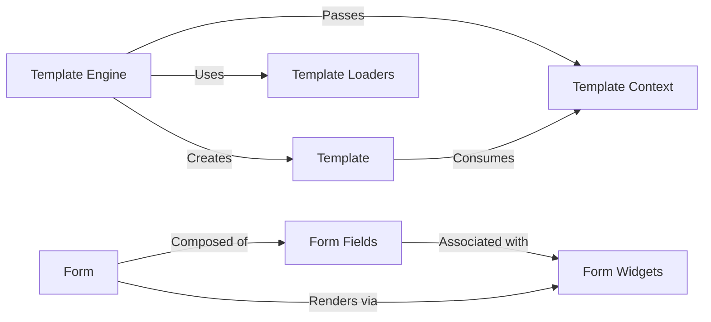

## Component Details

This component is responsible for the presentation and user input aspects of a web application within Django. It comprises two main subsystems: the Template Engine, which dynamically generates HTML by combining static templates with dynamic data, and the Forms system, which provides a robust way to define, validate, and render HTML forms, handling user input cleaning and error reporting.

### Template Engine
The central orchestrator for Django's template system. It is responsible for configuring template backends, loading templates, parsing them into a renderable structure, and rendering them with provided context data. It acts as the primary interface for developers to interact with the template system.

**Related Classes/Methods**:

- <a href="https://github.com/django/django/blob/master/django/template/engine.py#L12-L213" target="_blank" rel="noopener noreferrer">`django.template.engine.Engine` (12:213)</a>

### Template
Represents a compiled template. Once a template file is loaded and parsed by the `Template Engine`, it becomes a `Template` object, which can then be rendered multiple times with different contexts. It contains the parsed structure of the template, including nodes and variables.

**Related Classes/Methods**:

- <a href="https://github.com/django/django/blob/master/django/template/base.py#L1-L1" target="_blank" rel="noopener noreferrer">`django.template.base.Template` (1:1)</a>

### Template Context
A dictionary-like object that holds the data available to a template during rendering. `Context` is the basic class, while `RequestContext` is a specialized subclass that automatically includes request-specific variables (like `request`, `user`, `csrf_token`).

**Related Classes/Methods**:

- <a href="https://github.com/django/django/blob/master/django/template/context.py#L137-L172" target="_blank" rel="noopener noreferrer">`django.template.context.Context` (137:172)</a>
- <a href="https://github.com/django/django/blob/master/django/template/context.py#L219-L282" target="_blank" rel="noopener noreferrer">`django.template.context.RequestContext` (219:282)</a>

### Template Loaders
A set of classes responsible for locating and loading template files from various configured sources (e.g., file system, installed application directories, cached memory). They abstract away the physical storage of templates.

**Related Classes/Methods**:

- <a href="https://github.com/django/django/blob/master/django/template/loader.py#L1-L1" target="_blank" rel="noopener noreferrer">`django.template.loader.Loader` (1:1)</a>
- <a href="https://github.com/django/django/blob/master/django/template/backends/django.py#L1-L1" target="_blank" rel="noopener noreferrer">`django.template.loaders` (1:1)</a>

### Form
The fundamental class for defining a web form. It encapsulates the form's fields, their validation rules, and methods for processing submitted data, rendering the form, and handling errors. It's the primary interface for developers to create and manage user input.

**Related Classes/Methods**:

- <a href="https://github.com/django/django/blob/master/django/forms/forms.py#L1-L1" target="_blank" rel="noopener noreferrer">`django.forms.forms.Form` (1:1)</a>

### Form Fields
Abstract and concrete classes that represent different types of input data (e.g., `CharField`, `IntegerField`, `DateField`). They handle the conversion of raw input data into Python objects and perform initial data validation.

**Related Classes/Methods**:

- <a href="https://github.com/django/django/blob/master/django/forms/fields.py#L1-L1" target="_blank" rel="noopener noreferrer">`django.forms.fields.Field` (1:1)</a>

### Form Widgets
Classes responsible for rendering the HTML representation of a form field. They determine how a field appears in the browser (e.g., `<input type="text">`, `<select>`, `<textarea>`). Widgets also handle the conversion of Python values back into HTML-friendly strings.

**Related Classes/Methods**:

- <a href="https://github.com/django/django/blob/master/django/forms/widgets.py#L1-L1" target="_blank" rel="noopener noreferrer">`django.forms.widgets.Widget` (1:1)</a>

### [FAQ](https://github.com/CodeBoarding/GeneratedOnBoardings/tree/main?tab=readme-ov-file#faq)