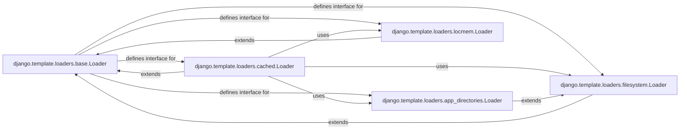

## Component Details

The `Template Loaders` subsystem in Django is responsible for abstracting the process of locating and loading template files from various sources. This design allows Django to support different template storage mechanisms (e.g., file system, installed applications, in-memory cache) while providing a consistent interface for the template engine. The core components are designed with extensibility and performance in mind.

### django.template.loaders.base.Loader
This is the abstract base class that defines the common interface and fundamental logic for all template loaders. It provides core methods such as `get_template` (to retrieve a `Template` object), `get_template_sources` (to find possible template paths), `get_contents` (to read template content), and `reset` (to clear internal state/caches). It's fundamental because it establishes the contract that all concrete loaders must adhere to, ensuring a unified approach to template loading.

**Related Classes/Methods**:

- <a href="https://github.com/django/django/blob/master/django/template/loaders/base.py#L7-L34" target="_blank" rel="noopener noreferrer">`django.template.loaders.base.Loader:get_template` (7:34)</a>
- <a href="https://github.com/django/django/blob/master/django/template/loaders/base.py#L36-L43" target="_blank" rel="noopener noreferrer">`django.template.loaders.base.Loader:get_template_sources` (36:43)</a>
- <a href="https://github.com/django/django/blob/master/django/template/loaders/base.py#L0-L0" target="_blank" rel="noopener noreferrer">`django.template.loaders.base.Loader:get_contents` (0:0)</a>
- <a href="https://github.com/django/django/blob/master/django/template/loaders/base.py#L45-L50" target="_blank" rel="noopener noreferrer">`django.template.loaders.base.Loader:reset` (45:50)</a>

### django.template.loaders.filesystem.Loader
A concrete implementation of `base.Loader` that retrieves templates from a predefined list of file system directories. These directories are typically configured in the `TEMPLATES` setting. It's fundamental for loading project-specific templates directly from the file system, which is a common and straightforward method of template management.

**Related Classes/Methods**: _None_

### django.template.loaders.app_directories.Loader
This loader extends `filesystem.Loader` and automatically discovers templates located in `templates` subdirectories within installed Django applications. This promotes modularity and reusability, allowing individual applications to ship with their own templates without requiring explicit configuration in the project settings. It's fundamental for Django's "reusable app" philosophy.

**Related Classes/Methods**: _None_

### django.template.loaders.cached.Loader
This loader acts as a wrapper around other loaders (e.g., `filesystem.Loader`, `app_directories.Loader`). Its primary purpose is to improve performance by caching loaded templates in memory, preventing redundant file system access for frequently requested templates. It manages a cache of `Template` objects and handles `TemplateDoesNotExist` exceptions efficiently. It's fundamental for optimizing template rendering performance in production environments.

**Related Classes/Methods**: _None_

### django.template.loaders.locmem.Loader
A loader that retrieves templates from a dictionary held entirely in memory. This is particularly useful for testing scenarios, dynamically generated templates, or when templates are not stored on the file system. It provides a simple, in-memory template storage mechanism. It's fundamental for flexibility in template sourcing, especially in non-standard or programmatic contexts.

**Related Classes/Methods**: _None_

### [FAQ](https://github.com/CodeBoarding/GeneratedOnBoardings/tree/main?tab=readme-ov-file#faq)