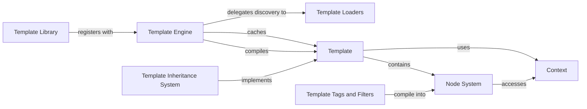

## Details

Django's Template System is a core component of its MVT (Model-View-Template) architecture, providing a powerful way to generate HTML dynamically. The system centers around the Template Engine which manages the entire template processing pipeline. Templates are compiled into a tree of Node objects that can be rendered with a Context containing variables. The system supports extensibility through Template Libraries that register custom tags and filters. Template Loaders handle discovering templates from various sources. The Template Inheritance System enables template reuse through parent-child relationships. This architecture separates presentation logic from business logic, allowing designers to work with templates while developers focus on Python code, following Django's philosophy of explicit design and component separation.

### Template Engine
The central component that manages template loading, compilation, and rendering. It serves as the entry point for template operations and coordinates the template processing pipeline.

**Related Classes/Methods**:

- <a href="https://github.com/django/django/blob/main/django/template/engine.py#L12-L213" target="_blank" rel="noopener noreferrer">`django.template.engine.Engine` (12:213)</a>

### Template
Represents a compiled template ready for rendering. Templates contain parsed nodes that can be rendered with a context.

**Related Classes/Methods**:

- `django.template.base.Template`

### Context
Contains the data that will be used during template rendering. Acts as a container for variables that templates can access.

**Related Classes/Methods**:

- <a href="https://github.com/django/django/blob/main/django/template/context.py#L137-L172" target="_blank" rel="noopener noreferrer">`django.template.context.Context` (137:172)</a>

### Node System
The foundation of template parsing and rendering. Nodes represent the elements of a template (text, variables, tags) in a tree structure.

**Related Classes/Methods**:

- `django.template.base.Node`

### Template Library
Registration system for custom template tags and filters, allowing for template language extension.

**Related Classes/Methods**:

- <a href="https://github.com/django/django/blob/main/django/template/library.py#L15-L287" target="_blank" rel="noopener noreferrer">`django.template.library.Library` (15:287)</a>

### Template Loaders
Components responsible for locating and loading template files from various sources.

**Related Classes/Methods**:

- `django.template.loaders`

### Template Tags and Filters
Built-in and custom extensions to the template language that provide additional functionality.

**Related Classes/Methods**:

- `django.template.defaulttags`
- `django.template.defaultfilters`

### Template Inheritance System
Mechanism that allows templates to extend other templates, enabling reusable layouts and components.

**Related Classes/Methods**:

- `django.template.loader_tags`

### [FAQ](https://github.com/CodeBoarding/GeneratedOnBoardings/tree/main?tab=readme-ov-file#faq)