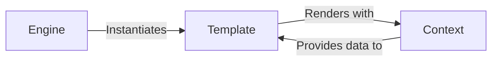

## Details

The `Templating Engine` subsystem in Django is responsible for the dynamic generation of content by combining data with predefined HTML structures. Its core functionality encompasses the loading, compiling, and rendering of templates, serving as the "Template" aspect within Django's Model-View-Template (MVT) architectural pattern.

### Engine [[Expand]](./Engine.md)
The `Engine` acts as the central orchestrator for the entire templating system. It is responsible for configuring template loaders, built-in tags and filters, and provides the primary interface for obtaining and rendering `Template` instances. It essentially serves as a factory for `Template` objects, managing the overall templating process.

**Related Classes/Methods**:

- <a href="https://github.com/django/django//blob/django/template/engine.py" target="_blank" rel="noopener noreferrer">`django.template.engine.Engine`</a>

### Template
The `Template` component represents a compiled template. It encapsulates the parsed nodes of the template structure and provides the `render()` method. This method takes a `Context` object, processes the template nodes with the provided data, and produces the final output string. It embodies the actual template structure and its rendering capability, directly fulfilling the "Template" role in MVT.

**Related Classes/Methods**:

- <a href="https://github.com/django/django//blob/django/template/base.py#L138-L288" target="_blank" rel="noopener noreferrer">`django.template.base.Template`:138-288</a>

### Context
The `Context` component manages the data (variables) that are accessible within a template during the rendering process. It behaves like a dictionary but supports layered scopes (pushing and popping contexts) and sophisticated variable lookup mechanisms (e.g., dot notation for object attributes). In the MVT pattern, `Context` serves as the bridge, delivering the "Model" data (prepared by the "View") to the "Template" for dynamic rendering.

**Related Classes/Methods**:

- <a href="https://github.com/django/django//blob/django/template/context.py#L141-L176" target="_blank" rel="noopener noreferrer">`django.template.context.Context`:141-176</a>

### [FAQ](https://github.com/CodeBoarding/GeneratedOnBoardings/tree/main?tab=readme-ov-file#faq)