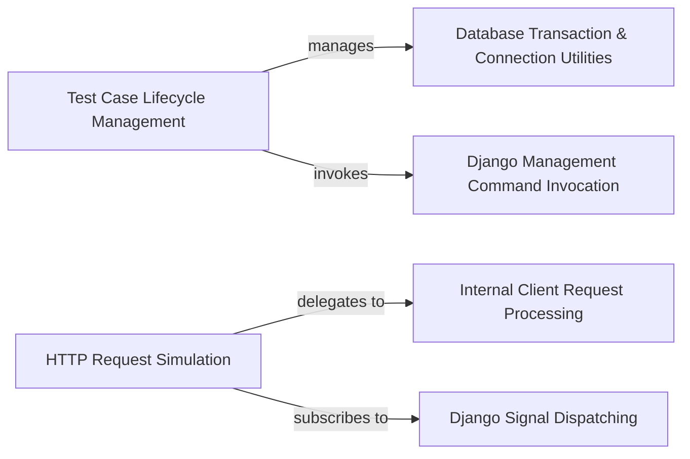

## Component Details

This overview details the core components of Django's testing framework, focusing on how it manages test case lifecycles, simulates HTTP requests, handles database transactions, executes management commands, and integrates with Django's signal system. The primary flow involves `TestCase` setting up and tearing down the test environment, often loading data via management commands and managing database state. The `Client` component simulates user interactions by generating HTTP requests, which are then processed by the `ClientHandler`, with various signals dispatched and handled throughout this process.

### Test Case Lifecycle Management
This component orchestrates the setup and teardown of test environments, including managing database transactions and loading test data fixtures, ensuring test isolation and proper resource cleanup for `TestCase` instances.

**Related Classes/Methods**:

- <a href="https://github.com/django/django/blob/master/django/test/testcases.py#L1336-L1498" target="_blank" rel="noopener noreferrer">`django.test.testcases.TestCase` (1336:1498)</a>
- <a href="https://github.com/django/django/blob/master/django/test/testcases.py#L1351-L1359" target="_blank" rel="noopener noreferrer">`django.test.testcases.TestCase._enter_atomics` (1351:1359)</a>
- <a href="https://github.com/django/django/blob/master/django/test/testcases.py#L1362-L1366" target="_blank" rel="noopener noreferrer">`django.test.testcases.TestCase._rollback_atomics` (1362:1366)</a>
- <a href="https://github.com/django/django/blob/master/django/test/testcases.py#L1369-L1370" target="_blank" rel="noopener noreferrer">`django.test.testcases.TestCase._databases_support_transactions` (1369:1370)</a>
- <a href="https://github.com/django/django/blob/master/django/test/testcases.py#L1373-L1374" target="_blank" rel="noopener noreferrer">`django.test.testcases.TestCase._databases_support_savepoints` (1373:1374)</a>
- <a href="https://github.com/django/django/blob/master/django/test/testcases.py#L1377-L1406" target="_blank" rel="noopener noreferrer">`django.test.testcases.TestCase.setUpClass` (1377:1406)</a>
- <a href="https://github.com/django/django/blob/master/django/test/testcases.py#L1409-L1417" target="_blank" rel="noopener noreferrer">`django.test.testcases.TestCase.tearDownClass` (1409:1417)</a>
- <a href="https://github.com/django/django/blob/master/django/test/testcases.py#L1424-L1427" target="_blank" rel="noopener noreferrer">`django.test.testcases.TestCase._should_reload_connections` (1424:1427)</a>
- <a href="https://github.com/django/django/blob/master/django/test/testcases.py#L1430-L1448" target="_blank" rel="noopener noreferrer">`django.test.testcases.TestCase._fixture_setup` (1430:1448)</a>
- <a href="https://github.com/django/django/blob/master/django/test/testcases.py#L1450-L1458" target="_blank" rel="noopener noreferrer">`django.test.testcases.TestCase._fixture_teardown` (1450:1458)</a>
- <a href="https://github.com/django/django/blob/master/django/test/testcases.py#L1460-L1465" target="_blank" rel="noopener noreferrer">`django.test.testcases.TestCase._should_check_constraints` (1460:1465)</a>
- <a href="https://github.com/django/django/blob/master/django/test/testcases.py#L1469-L1498" target="_blank" rel="noopener noreferrer">`django.test.testcases.TestCase.captureOnCommitCallbacks` (1469:1498)</a>

### HTTP Request Simulation
This component provides a programmatic interface for simulating HTTP requests against Django applications during testing, handling the request-response cycle, including signal dispatching and redirect management.

**Related Classes/Methods**:

- <a href="https://github.com/django/django/blob/master/django/test/client.py#L1027-L1393" target="_blank" rel="noopener noreferrer">`django.test.client.Client` (1027:1393)</a>
- <a href="https://github.com/django/django/blob/master/django/test/client.py#L1046-L1060" target="_blank" rel="noopener noreferrer">`django.test.client.Client.__init__` (1046:1060)</a>
- <a href="https://github.com/django/django/blob/master/django/test/client.py#L1062-L1107" target="_blank" rel="noopener noreferrer">`django.test.client.Client.request` (1062:1107)</a>
- <a href="https://github.com/django/django/blob/master/django/test/client.py#L1109-L1135" target="_blank" rel="noopener noreferrer">`django.test.client.Client.get` (1109:1135)</a>
- <a href="https://github.com/django/django/blob/master/django/test/client.py#L1137-L1170" target="_blank" rel="noopener noreferrer">`django.test.client.Client.post` (1137:1170)</a>
- <a href="https://github.com/django/django/blob/master/django/test/client.py#L1172-L1198" target="_blank" rel="noopener noreferrer">`django.test.client.Client.head` (1172:1198)</a>
- <a href="https://github.com/django/django/blob/master/django/test/client.py#L1200-L1233" target="_blank" rel="noopener noreferrer">`django.test.client.Client.options` (1200:1233)</a>
- <a href="https://github.com/django/django/blob/master/django/test/client.py#L1235-L1268" target="_blank" rel="noopener noreferrer">`django.test.client.Client.put` (1235:1268)</a>
- <a href="https://github.com/django/django/blob/master/django/test/client.py#L1270-L1303" target="_blank" rel="noopener noreferrer">`django.test.client.Client.patch` (1270:1303)</a>
- <a href="https://github.com/django/django/blob/master/django/test/client.py#L1305-L1338" target="_blank" rel="noopener noreferrer">`django.test.client.Client.delete` (1305:1338)</a>
- <a href="https://github.com/django/django/blob/master/django/test/client.py#L1340-L1366" target="_blank" rel="noopener noreferrer">`django.test.client.Client.trace` (1340:1366)</a>
- <a href="https://github.com/django/django/blob/master/django/test/client.py#L1368-L1393" target="_blank" rel="noopener noreferrer">`django.test.client.Client._handle_redirects` (1368:1393)</a>

### Database Transaction & Connection Utilities
This component provides utility functions and objects for managing database transactions and connections, including atomic operations, rollback, and checking connection capabilities, primarily used by the testing framework.

**Related Classes/Methods**:

- <a href="https://github.com/django/django/blob/master/django/db/transaction.py#L315-L322" target="_blank" rel="noopener noreferrer">`django.db.transaction.atomic` (315:322)</a>
- <a href="https://github.com/django/django/blob/master/django/db/transaction.py#L84-L96" target="_blank" rel="noopener noreferrer">`django.db.transaction.set_rollback` (84:96)</a>
- `django.test.utils.connections_support_transactions` (full file reference)
- `django.test.utils.connections_support_savepoints` (full file reference)
- `django.db.connections` (full file reference)

### Django Management Command Invocation
This component offers the functionality to programmatically execute Django management commands, particularly for tasks like loading data fixtures within the testing environment.

**Related Classes/Methods**:

- `django.core.management.call_command` (full file reference)

### Internal Client Request Processing
This component is responsible for the low-level processing of simulated client requests, acting as the core handler for the `HTTP Request Simulation` component.

**Related Classes/Methods**:

- <a href="https://github.com/django/django/blob/master/django/test/client.py#L157-L209" target="_blank" rel="noopener noreferrer">`django.test.client.ClientHandler` (157:209)</a>

### Django Signal Dispatching
This component handles the connection and disconnection of Django signals, enabling the testing framework to monitor and react to events such as template rendering and request exceptions.

**Related Classes/Methods**:

- `django.dispatch.signals.template_rendered` (full file reference)
- `django.core.signals.got_request_exception` (full file reference)

### [FAQ](https://github.com/CodeBoarding/GeneratedOnBoardings/tree/main?tab=readme-ov-file#faq)