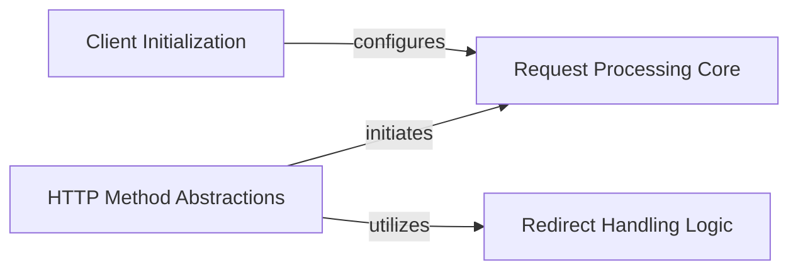

## Component Details

The Testing Utilities component, specifically the `django.test.client.Client` class, provides a robust framework for simulating HTTP requests and managing responses within Django test environments. It enables developers to programmatically interact with their Django application as a web client would, facilitating comprehensive testing of views, middleware, and URL routing. The core flow involves initializing the client, abstracting various HTTP methods for ease of use, processing the simulated requests through Django's internal handler, and intelligently managing redirects to ensure accurate test results.

### Client Initialization
This component handles the initial setup and configuration of the Django test client instance, preparing it for subsequent request simulations by setting up its internal state and dependencies, such as the request handler.

**Related Classes/Methods**:

- <a href="https://github.com/django/django/blob/master/django/test/client.py#L1046-L1060" target="_blank" rel="noopener noreferrer">`django.test.client.Client.__init__` (1046:1060)</a>

### HTTP Method Abstractions
This component provides a high-level, user-friendly interface for simulating various HTTP methods (GET, POST, PUT, DELETE, etc.). It acts as a facade, delegating the actual request processing and optionally invoking the Redirect Handling Logic based on the 'follow' parameter.

**Related Classes/Methods**:

- <a href="https://github.com/django/django/blob/master/django/test/client.py#L1109-L1135" target="_blank" rel="noopener noreferrer">`django.test.client.Client.get` (1109:1135)</a>
- <a href="https://github.com/django/django/blob/master/django/test/client.py#L1137-L1170" target="_blank" rel="noopener noreferrer">`django.test.client.Client.post` (1137:1170)</a>
- <a href="https://github.com/django/django/blob/master/django/test/client.py#L1172-L1198" target="_blank" rel="noopener noreferrer">`django.test.client.Client.head` (1172:1198)</a>
- <a href="https://github.com/django/django/blob/master/django/test/client.py#L1200-L1233" target="_blank" rel="noopener noreferrer">`django.test.client.Client.options` (1200:1233)</a>
- <a href="https://github.com/django/django/blob/master/django/test/client.py#L1235-L1268" target="_blank" rel="noopener noreferrer">`django.test.client.Client.put` (1235:1268)</a>
- <a href="https://github.com/django/django/blob/master/django/test/client.py#L1270-L1303" target="_blank" rel="noopener noreferrer">`django.test.client.Client.patch` (1270:1303)</a>
- <a href="https://github.com/django/django/blob/master/django/test/client.py#L1305-L1338" target="_blank" rel="noopener noreferrer">`django.test.client.Client.delete` (1305:1338)</a>
- <a href="https://github.com/django/django/blob/master/django/test/client.py#L1340-L1366" target="_blank" rel="noopener noreferrer">`django.test.client.Client.trace` (1340:1366)</a>

### Request Processing Core
This component is responsible for the fundamental handling of an HTTP request within the test client. It involves setting up the request environment, processing the request through the Django handler, managing template rendering signals, handling exceptions, and preparing the final response object with relevant details.

**Related Classes/Methods**:

- <a href="https://github.com/django/django/blob/master/django/test/client.py#L1062-L1107" target="_blank" rel="noopener noreferrer">`django.test.client.Client.request` (1062:1107)</a>

### Redirect Handling Logic
This component manages the automatic following of HTTP redirects. It iteratively requests new responses based on redirect headers and includes internal mechanisms to detect and prevent infinite redirect loops, ensuring a stable and predictable redirect chain.

**Related Classes/Methods**:

- <a href="https://github.com/django/django/blob/master/django/test/client.py#L1368-L1393" target="_blank" rel="noopener noreferrer">`django.test.client.Client._handle_redirects` (1368:1393)</a>

### [FAQ](https://github.com/CodeBoarding/GeneratedOnBoardings/tree/main?tab=readme-ov-file#faq)