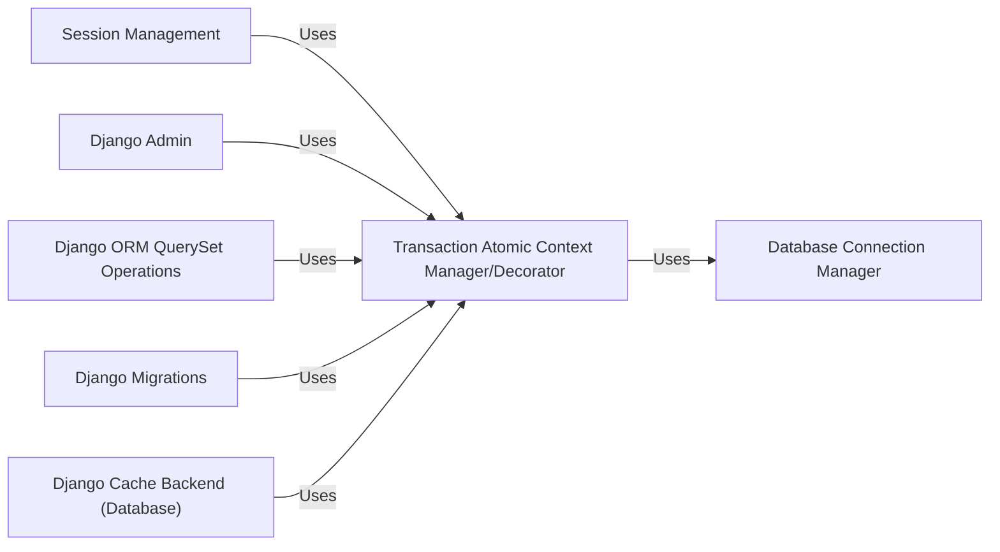

## Component Details

The `Transaction` module in Django is fundamental for ensuring data integrity by providing mechanisms to manage database transactions. It guarantees that a series of database operations are treated as a single, indivisible unit, either all succeeding (committed) or all failing (rolled back). This atomicity is crucial for maintaining the consistency and reliability of data within a Django application.

### Transaction Atomic Context Manager/Decorator
This is the primary entry point for transaction management in Django. The `atomic` function acts as a factory, returning an instance of the `Atomic` class. The `Atomic` class, being a `ContextDecorator`, allows for flexible usage as both a `with` statement context manager and a function decorator. It encapsulates the complex logic for initiating a transaction or savepoint upon entry (`__enter__`) and ensuring a commit or rollback upon exit (`__exit__`), depending on whether an exception occurred. It meticulously manages the database connection's autocommit state and savepoint identifiers, providing a high-level, declarative way to define atomic blocks of code.

**Related Classes/Methods**:

- <a href="https://github.com/django/django/blob/master/django/db/transaction.py#L315-L322" target="_blank" rel="noopener noreferrer">`django.db.transaction.atomic` (315:322)</a>
- <a href="https://github.com/django/django/blob/master/django/db/transaction.py#L141-L312" target="_blank" rel="noopener noreferrer">`django.db.transaction.Atomic` (141:312)</a>
- <a href="https://github.com/django/django/blob/master/django/db/transaction.py#L181-L221" target="_blank" rel="noopener noreferrer">`django.db.transaction.Atomic:__enter__` (181:221)</a>
- <a href="https://github.com/django/django/blob/master/django/db/transaction.py#L223-L312" target="_blank" rel="noopener noreferrer">`django.db.transaction.Atomic:__exit__` (223:312)</a>

### Database Connection Manager
This internal utility is responsible for retrieving and managing the active database connection object for a specified database alias (or the default one). All low-level transaction-related operations, such as setting autocommit, creating savepoints, committing, and rolling back, are performed directly on this connection object. It acts as the bridge between Django's high-level transaction logic and the specific database backend.

**Related Classes/Methods**:

- <a href="https://github.com/django/django/blob/master/django/db/transaction.py#L17-L24" target="_blank" rel="noopener noreferrer">`django.db.transaction.get_connection` (17:24)</a>

### Session Management
This component handles the persistence of user session data to the database. Its `save` and `asave` methods are designed to ensure that modifications to session data are performed atomically. This prevents scenarios where a session record might be partially updated or corrupted, which is vital for maintaining consistent user experiences and security.

**Related Classes/Methods**:

- <a href="https://github.com/django/django/blob/master/django/contrib/sessions/backends/db.py#L11-L197" target="_blank" rel="noopener noreferrer">`django.contrib.sessions.backends.db.SessionStore` (11:197)</a>
- <a href="https://github.com/django/django/blob/master/django/contrib/sessions/backends/db.py#L113-L136" target="_blank" rel="noopener noreferrer">`django.contrib.sessions.backends.db.SessionStore:save` (113:136)</a>
- <a href="https://github.com/django/django/blob/master/django/contrib/sessions/backends/db.py#L138-L166" target="_blank" rel="noopener noreferrer">`django.contrib.sessions.backends.db.SessionStore:asave` (138:166)</a>

### Django Admin
This component provides the backend logic for the Django administration interface. Key views like `changeform_view`, `changelist_view`, and `delete_view` wrap their database interactions within atomic blocks. This ensures that administrative actions, which often involve multiple database changes (e.g., saving a model with related objects, deleting an object and its dependencies), are treated as single, consistent operations, preventing data inconsistencies in the administrative backend.

**Related Classes/Methods**:

- <a href="https://github.com/django/django/blob/master/django/contrib/admin/options.py#L634-L2340" target="_blank" rel="noopener noreferrer">`django.contrib.admin.options.ModelAdmin` (634:2340)</a>
- <a href="https://github.com/django/django/blob/master/django/contrib/admin/options.py#L1795-L1800" target="_blank" rel="noopener noreferrer">`django.contrib.admin.options.ModelAdmin:changeform_view` (1795:1800)</a>
- <a href="https://github.com/django/django/blob/master/django/contrib/admin/options.py#L1970-L2149" target="_blank" rel="noopener noreferrer">`django.contrib.admin.options.ModelAdmin:changelist_view` (1970:2149)</a>
- <a href="https://github.com/django/django/blob/master/django/contrib/admin/options.py#L2159-L2164" target="_blank" rel="noopener noreferrer">`django.contrib.admin.options.ModelAdmin:delete_view` (2159:2164)</a>

### Django ORM QuerySet Operations
The `QuerySet` is the primary interface for interacting with the database via the Django ORM. Methods like `bulk_create`, `get_or_create`, and `update_or_create` inherently involve multiple steps (e.g., checking for existence, then creating or updating). These operations leverage atomic blocks to ensure that all steps are executed as a single, atomic unit. This is critical for maintaining data integrity and consistency when performing complex data manipulations through the ORM.

**Related Classes/Methods**:

- <a href="https://github.com/django/django/blob/master/django/db/models/query.py#L1-L1" target="_blank" rel="noopener noreferrer">`django.db.models.query.QuerySet` (1:1)</a>
- <a href="https://github.com/django/django/blob/master/django/db/models/query.py#L1-L1" target="_blank" rel="noopener noreferrer">`django.db.models.query.QuerySet:bulk_create` (1:1)</a>
- <a href="https://github.com/django/django/blob/master/django/db/models/query.py#L1-L1" target="_blank" rel="noopener noreferrer">`django.db.models.query.QuerySet:get_or_create` (1:1)</a>
- <a href="https://github.com/django/django/blob/master/django/db/models/query.py#L1-L1" target="_blank" rel="noopener noreferrer">`django.db.models.query.QuerySet:update_or_create` (1:1)</a>

### Django Migrations
This component manages database schema changes. The `apply` and `unapply` methods, which execute schema alterations (e.g., adding tables, modifying columns, running custom SQL), are wrapped in atomic blocks. This guarantees that a migration either fully completes or is entirely rolled back in case of an error, preventing a partially applied or inconsistent database schema, which could lead to severe application failures.

**Related Classes/Methods**:

- <a href="https://github.com/django/django/blob/master/django/db/migrations/migration.py#L8-L221" target="_blank" rel="noopener noreferrer">`django.db.migrations.migration.Migration` (8:221)</a>
- <a href="https://github.com/django/django/blob/master/django/db/migrations/migration.py#L93-L136" target="_blank" rel="noopener noreferrer">`django.db.migrations.migration.Migration:apply` (93:136)</a>
- <a href="https://github.com/django/django/blob/master/django/db/migrations/migration.py#L138-L197" target="_blank" rel="noopener noreferrer">`django.db.migrations.migration.Migration:unapply` (138:197)</a>

### Django Cache Backend (Database)
When the database is used as a cache backend, this component ensures that cache operations (setting, getting, deleting cache entries) are performed atomically. This prevents race conditions and ensures that the cache state remains consistent with the underlying database, especially in high-concurrency scenarios.

**Related Classes/Methods**:

- <a href="https://github.com/django/django/blob/master/django/core/cache/backends/db.py#L1-L1" target="_blank" rel="noopener noreferrer">`django.core.cache.backends.db` (1:1)</a>

### [FAQ](https://github.com/CodeBoarding/GeneratedOnBoardings/tree/main?tab=readme-ov-file#faq)