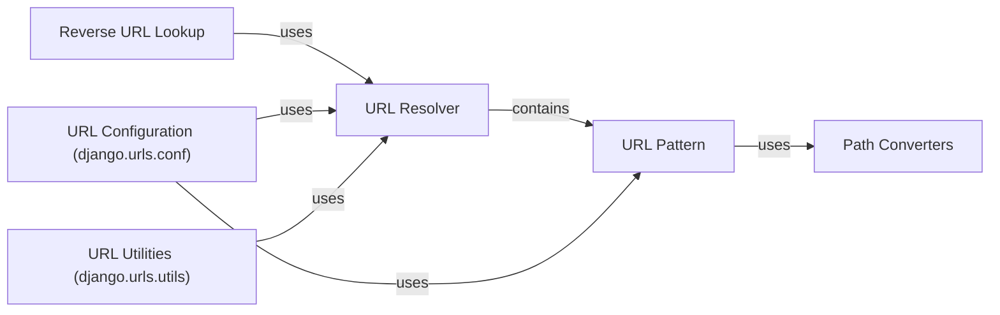

## Component Details

### URL Resolver
The URL resolver is responsible for mapping incoming URLs to the appropriate view functions. It recursively iterates through URL patterns to find a match for the URL path. It maintains a list of URL patterns and delegates the matching process to the URLPattern or other nested resolvers. The resolver also handles namespaces and includes.
- **Related Classes/Methods**: `django.urls.resolvers.URLResolver`

### URL Pattern
The URL pattern represents a single mapping between a URL regex and a view function. It compiles the regex upon initialization and executes the match against the URL path. If a match is found, it returns the corresponding view along with any captured arguments, which are then passed to the view function.
- **Related Classes/Methods**: `django.urls.resolvers.URLPattern`

### Path Converters
Path converters define how URL parameters are extracted from the URL path and converted into Python types. Django provides default converters (e.g., int, str, slug, uuid, path) and allows for custom converters to be registered. These converters are used by URL patterns to extract and validate parameters from the URL.
- **Related Classes/Methods**: `django.urls.converters`

### Reverse URL Lookup
Reverse URL lookup is the process of generating URLs from view names and parameters. The `reverse()` function uses the URL resolver to find the URL pattern associated with a given view and constructs the corresponding URL string. This allows developers to avoid hardcoding URLs in their templates and code.
- **Related Classes/Methods**: `django.urls.base.reverse`

### URL Configuration (django.urls.conf)
This module provides functions for including URL patterns from other modules and creating URL patterns. It defines the `include()` and `path()`/`re_path()` functions, which are used to define the URL patterns for a Django project. It essentially provides the API for defining URL patterns.
- **Related Classes/Methods**: `django.urls.conf`

### URL Utilities (django.urls.utils)
This module provides utility functions for working with URLs, such as `resolve` and `get_callable`. These utilities help in resolving URL paths to view functions and retrieving the corresponding callable objects. It provides helper functions for URL processing.
- **Related Classes/Methods**: `django.urls.utils`
