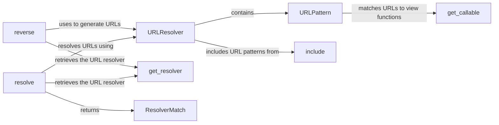

## Component Details

The URL routing and dispatching system in Django is responsible for mapping incoming URLs to the appropriate view functions or class-based views. It uses URL patterns defined in `urls.py` files to match URLs and extract parameters. The central component, `resolve`, takes a URL and finds the corresponding view. The `reverse` function performs the opposite, constructing a URL from a view name and parameters. `URLResolver` manages a collection of URL patterns, while `URLPattern` represents a single pattern. `include` allows for modularizing URL configurations. The system uses helper functions like `get_resolver` to retrieve URL resolvers and `get_callable` to dynamically load view functions. `ResolverMatch` represents the result of a successful URL resolution.

### resolve
The `resolve` function is the core of the URL resolution process. It takes a URL path and attempts to match it against the defined URL patterns. If a match is found, it returns a ResolverMatch object containing information about the matched view, arguments, and any captured parameters.
- **Related Classes/Methods**: `django.django.urls.base:resolve`

### reverse
The `reverse` function performs the opposite of URL resolution. It takes a view name and optional parameters and constructs a URL that maps to that view. This is useful for generating URLs dynamically in templates and views, ensuring that URLs are consistent and up-to-date even if the URL patterns change.
- **Related Classes/Methods**: `django.django.urls.base:reverse`

### URLResolver
The `URLResolver` class is responsible for managing a collection of URL patterns and resolving URLs against them. It maintains a list of URL patterns, which can include other `URLResolver` instances, allowing for nested URL structures. It also handles namespace and application name resolution.
- **Related Classes/Methods**: `django.django.urls.resolvers:URLResolver`

### URLPattern
The `URLPattern` class represents a single URL pattern. It stores the regular expression or path used to match URLs, the view function to be invoked when the pattern matches, and any additional parameters to be passed to the view.
- **Related Classes/Methods**: `django.django.urls.resolvers:URLPattern`

### include
The `include` function is used to include URL patterns from another URLconf file. This allows for modularizing URL definitions and reusing URL patterns across different parts of the application.
- **Related Classes/Methods**: `django.django.urls.conf:include`

### get_resolver
The `get_resolver` function retrieves the URL resolver for a given URLconf. It caches the resolver to improve performance and ensures that the resolver is properly initialized.
- **Related Classes/Methods**: `django.django.urls.resolvers:get_resolver`

### get_callable
The `get_callable` function resolves a string representation of a function to an actual callable object. It's used to dynamically load view functions based on their string names.
- **Related Classes/Methods**: `django.django.urls.utils:get_callable`

### ResolverMatch
The `ResolverMatch` class represents the result of a successful URL resolution. It contains information about the matched view, any captured arguments, and the matched URL pattern.
- **Related Classes/Methods**: `django.django.urls.resolvers:ResolverMatch`
