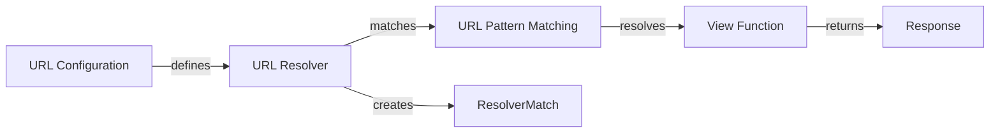

## Components Description:

**1. URL Configuration**
*Description*: Defines the structure of URLs for a Django project using URL patterns and resolvers. It acts as the entry point, specifying which URLs should be handled by which parts of the application.
*Related to*: Defines the URL patterns that the `URL Resolver` uses to match incoming requests.
*Source files*: `django.urls.conf.include`, `django.conf.urls.i18n.i18n_patterns`, `django.conf.urls.resolvers.get_resolver`, `django.conf.urls.resolvers.get_ns_resolver`, `django.urls.resolvers.URLResolver`, `django.urls.resolvers._get_cached_resolver`

**2. URL Resolver**
*Description*: Takes a URL and attempts to match it against a list of `URL Patterns`. If a match is found, it extracts any parameters and passes them to the associated view function.
*Related to*: Uses the `URL Configuration` to get the URL patterns, matches against `URL Pattern Matching`, and creates a `ResolverMatch` object.
*Source files*: `django.urls.resolvers.URLResolver`, `django.urls.resolvers.URLResolver.resolve`, `django.urls.resolvers.URLResolver.url_patterns`

**3. URL Pattern Matching**
*Description*: Represents a single URL pattern and its associated view. It uses regular expressions or route patterns to match against the URL.
*Related to*: Used by the `URL Resolver` to match against the URL. Resolves to a specific `View Function`.
*Source files*: `django.urls.resolvers.RegexPattern`, `django.urls.resolvers.RoutePattern`, `django.urls.resolvers.URLPattern.resolve`, `django.urls.resolvers.RegexPattern.match`, `django.urls.resolvers.RoutePattern.match`

**4. View Function**
*Description*: A callable that receives a request and returns a response. It processes the request and generates the appropriate output.
*Related to*: Called by the `URL Pattern Matching` when a match is found. Returns a `Response`.
*Source files*: (These are defined by the user in their Django project)

**5. ResolverMatch**
*Description*: Represents the result of a successful URL resolution, containing the view function, arguments, and URL name.
*Related to*: Created by the `URL Resolver` when a match is found. Used to call the `View Function`.
*Source files*: `django.urls.resolvers.ResolverMatch`

**6. Response**
*Description*: The output of the view function, which is sent back to the client.
*Related to*: Returned by the `View Function`.
*Source files*: `django.http.response.HttpResponse`
