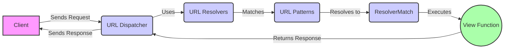

## URL Routing Component Overview

This diagram illustrates the flow of URL routing in Django, from the initial request to the view function execution.

```mermaid
graph LR
    Client[Client] -- Sends Request --> URLDispatcher(URL Dispatcher)
    URLDispatcher -- Uses --> URLResolvers(URL Resolvers)
    URLResolvers -- Matches --> URLPatterns(URL Patterns)
    URLPatterns -- Resolves to --> ResolverMatch(ResolverMatch)
    ResolverMatch -- Executes --> ViewFunction((View Function))
    ViewFunction -- Returns Response --> URLDispatcher
    URLDispatcher -- Sends Response --> Client

    style Client fill:#f9f,stroke:#333,stroke-width:2px
    style URLDispatcher fill:#ccf,stroke:#333,stroke-width:2px
    style URLResolvers fill:#ccf,stroke:#333,stroke-width:2px
    style URLPatterns fill:#ccf,stroke:#333,stroke-width:2px
    style ResolverMatch fill:#ccf,stroke:#333,stroke-width:2px
    style ViewFunction fill:#afa,stroke:#333,stroke-width:2px
```

## Components
