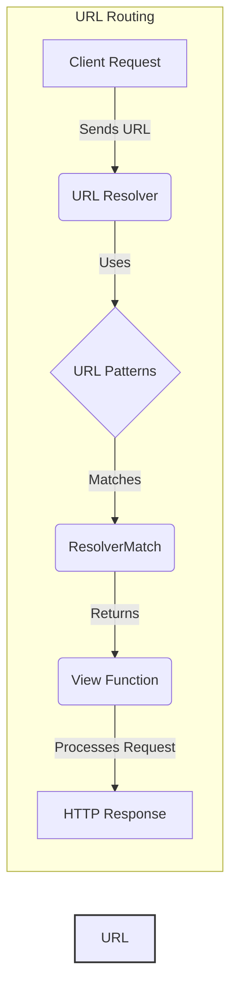

### Component Descriptions:

**1. Client Request**
   - *Description*: Represents the initial HTTP request from a client containing a URL.
   - *Functionality*: Initiates the URL resolution process by sending a URL to the URL resolver.
   - *Interaction*: Sends the URL to the `URL Resolver`.
   - *Relevant source files*: N/A

**2. URL Resolver**
   - *Description*: The central component that takes a URL path and returns a view, along with any arguments for that view. It uses cached resolvers for performance.
   - *Functionality*: Resolves the URL path against the available URL patterns.
   - *Interaction*: Receives the URL from the `Client Request`, uses `URL Patterns` to find a match, and returns a `ResolverMatch`.
   - *Relevant source files*: `django.urls.resolvers.URLResolver`, `django.urls.base.resolve`, `django.urls.resolvers._get_cached_resolver`

**3. URL Patterns**
   - *Description*: Represents a collection of URL patterns (regex or path) that the URL resolver uses to match against the URL path.
   - *Functionality*: Provides the patterns used for URL matching.
   - *Interaction*: Used by the `URL Resolver` to find a matching pattern for the URL.
   - *Relevant source files*: `django.urls.resolvers.URLPattern`, `django.urls.resolvers.RegexPattern`, `django.urls.conf.include`, `django.urls.resolvers.LocalePrefixPattern`

**4. ResolverMatch**
   - *Description*: A container for the result of a successful URL resolution, including the view function, arguments, and matched URL pattern.
   - *Functionality*: Holds the matched view function and any arguments extracted from the URL.
   - *Interaction*: Returned by the `URL Resolver` upon a successful match and passed to the `View Function`.
   - *Relevant source files*: `django.urls.resolvers.ResolverMatch`

**5. View Function**
   - *Description*: The callable that is executed when a URL matches its pattern. It processes the request and returns a response.
   - *Functionality*: Processes the request based on the matched URL and returns an HTTP response.
   - *Interaction*: Receives the `ResolverMatch` from the `URL Resolver`, processes the request, and returns an `HTTP Response`.
   - *Relevant source files*: N/A

**6. HTTP Response**
   - *Description*: The HTTP response generated by the view function.
   - *Functionality*: Represents the server's response to the client's request.
   - *Interaction*: Returned by the `View Function` to the client.
   - *Relevant source files*: N/A
