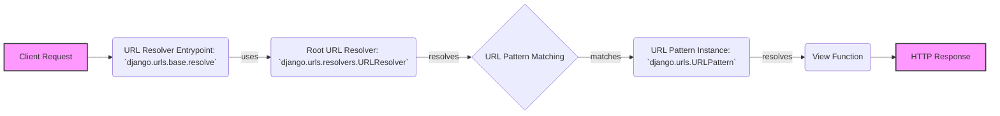

## URL Routing Overview

This diagram illustrates the flow of URL routing in Django, from the initial request to the execution of the appropriate view function.

### Components:

*   **Client Request:** Represents the incoming HTTP request from a user's browser or other client.

*   **URL Resolver Entrypoint:** (`django.urls.base.resolve`) This is the starting point for the URL resolution process. It takes a URL path and the URLconf to use.
    *   *Relevant source files*: `django.urls.base`

*   **Root URL Resolver:** (`django.urls.resolvers.URLResolver`) The top-level URL resolver. It contains a list of URL patterns and resolvers and starts the matching process.
    *   *Purpose*: Acts as the entry point for URL resolution, delegating to other resolvers and patterns.
    *   *Interaction*: Receives the initial URL and iterates through its URL patterns to find a match.
    *   *Relevant source files*: `django.urls.resolvers.URLResolver`

*   **URL Pattern Matching:** This component iterates through the URL patterns and attempts to match the requested URL path.

*   **URL Pattern Instance:** (`django.urls.URLPattern`) Represents a single URL pattern, associating a URL path (defined by a regex or route) with a specific view function.
    *   *Purpose*: Encapsulates a URL pattern and its associated view, providing the `resolve` method to check for a match.
    *   *Interaction*: Checks if the URL matches its pattern and, if so, returns a `ResolverMatch` object containing the view and any captured arguments.
    *   *Relevant source files*: `django.urls.URLPattern`

*   **View Function:** The function that is called to handle the request. It processes the request and returns an HTTP response.

*   **HTTP Response:** The response generated by the view function, which is sent back to the client.
