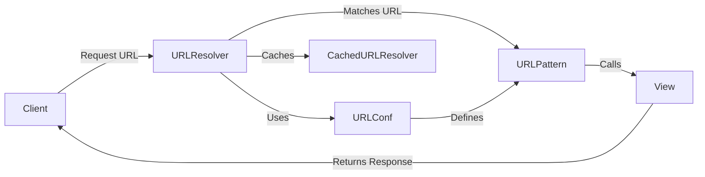

## URL Routing Component Overview

This document provides a high-level overview of the URL routing component in Django, including its structure, flow, and key components.

### Data Flow Diagram

### Component Descriptions

*   **Client**: Initiates the process by sending an HTTP request with a specific URL.
    *   *Interaction*: Sends the request to the `URLResolver`.
    *   *Relevant source files*: N/A
*   **URLResolver** (`django.urls.resolvers.URLResolver`):
    *   *Description*: The central component responsible for resolving URLs to their corresponding view functions. It iterates through the URL patterns defined in the URL configuration, attempting to find a match for the requested URL path.
    *   *Interaction*: Receives the request URL from the client, uses the `URLConf` to find matching `URLPattern` and calls the corresponding `View`.
    *   *Relevant source files*: `django.urls.resolvers.URLResolver`
*   **URLConf**: (`django.urls`):
    *   *Description*: Defines the set of URL patterns for the application. It's typically located in a `urls.py` file.
    *   *Interaction*: Provides the `URLResolver` with the URL patterns to match against the incoming URL.
    *   *Relevant source files*: `django.urls.conf`
*   **URLPattern** (`django.urls.resolvers.URLPattern`):
    *   *Description*: Represents a single URL pattern, mapping a URL path (defined using regular expressions or path syntax) to a specific view function. It also holds information about the view, default arguments, and the pattern name.
    *   *Interaction*: Receives the URL from `URLResolver`, matches it against its pattern, and calls the associated `View` if there is a match.
    *   *Relevant source files*: `django.urls.resolvers.URLPattern`
*   **View**: (`django.views`):
    *   *Description*: A callable that receives a request and returns a response. It processes the request and generates the appropriate output.
    *   *Interaction*: Receives the request from `URLPattern`, processes it, and returns a response to the client.
    *   *Relevant source files*: `django.views`
*   **CachedURLResolver** (`django.urls.resolvers._get_cached_resolver`):
    *   *Description*: Caches the compiled URL resolvers to improve performance.
    *   *Interaction*: The `URLResolver` uses the `CachedURLResolver` to retrieve the URL resolver, avoiding repeatedly parsing the URL patterns for each request.
    *   *Relevant source files*: `django.urls.resolvers`
